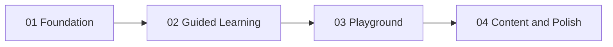

# CodeStep — Implementation Overview

This document is the single source of truth for the **JavaScript interactive learning app** (guided code walkthroughs + playground with in-browser tests). Work is delivered in **four sequential phases**; see [`01.md`](01.md), [`02.md`](02.md), [`03.md`](03.md), and [`04.md`](04.md).

---

## Goals

1. **Guided examples:** Curated step-by-step execution with highlighted lines *and* focused segments (e.g. only `i++` in a `for` header), variable/array/object visualization, educational console, explanations, sound cues, speed slider, play/pause, step forward/back, reset.
2. **Playground:** Per-topic exercises with problem statement (real-world framing), inputs, expected behavior, starter code; learners run code in the browser; tests validate correctness without requiring concepts they have not learned yet (e.g. variables-only tasks use **binding** checks, not `return`).
3. **UX:** Dark, readable UI; responsive layout; optional sound; keyboard shortcuts; accessibility basics.

---

## Tech Stack

| Piece | Choice |
|-------|--------|
| UI | React |
| Build | Vite |
| Package manager / scripts | Bun (`bun install`, `bun run dev`, etc.) |
| Language | TypeScript recommended |
| Styles | CSS modules or plain CSS with design tokens (`tokens.css`) |

Reference prototype: [`frontend/init_example.html`](../../frontend/init_example.html) (behavior to preserve conceptually; not the long-term entry point).

---

## High-Level Architecture

```
src/
  main.tsx, App.tsx
  components/     # layout, guided UI, playground UI, shared
  engine/         # playback, highlighting, sound, playground runner
  hooks/          # usePlayback, useSound, usePlaygroundRunner, ...
  workers/        # playground.worker.ts
  data/
    curriculum.ts
    examples/     # guided example definitions per topic
    playground/   # task definitions per topic
  types/
```

- **Guided mode:** Uses **curated step data** (not a general JS debugger). Each step references a line id and optional segment ids.
- **Playground mode:** Runs learner code in a **Web Worker** with timeout; captures `console.log`; runs assertions.

---

## Data Model (Summary)

### Guided example

- Topic → examples → `code` as structured lines/segments, `steps` with `lineId`, optional `focusSegmentIds`, `variables`, `changed`, `consoleOutput`, `explanation`, optional `visualFocus` (array index, object path).

### Playground task

- Modes: `bindings` (expected variables in scope), `console` (expected log lines), `function` (named function + test cases), optional `dom-mock` later.

---

## Topic Roadmap (Full Catalog)

Each topic eventually needs **2–4 guided examples** and **2–4 playground tasks**. Phases 01–03 establish the platform; **04** expands content and polish.

| # | Topic | Notes |
|---|--------|--------|
| 1 | Variables & data types | Binding-mode tasks before `return` |
| 2 | Operators | Arithmetic, comparison, logical |
| 3 | Conditionals | `if/else`, `switch` |
| 4 | Functions | Named functions, parameters, return |
| 5 | Arrays & methods | Index, loop, `map`/`filter`/`reduce` as introduced |
| 6 | Objects | Keys, nesting, optional immutability |
| 7 | Loops | `for`, `while`, `for...of`; lifecycle (init → condition → body → update) |
| 8 | DOM manipulation | Prefer mocked/sandboxed tasks first |
| 9 | Events | Clicks, input, submit |
| 10 | ES6+ | Destructuring, spread, template literals, arrow fns |
| 11 | Async | Promises, `async/await` |
| 12 | Error handling | `try/catch`, validation |
| 13 | Modules | `import`/`export` (may be simulated in editor) |
| 14 | Classes & OOP | Constructors, methods, inheritance Optional |

The table is the **navigation index**; the section below is the **pedagogical reference** (what it is, why it matters, syntax parts, short technical + everyday examples). The Learn tab mirrors the same structure with optional monospaced patterns and bullet breakdowns.

---

## Topic summaries (reference)

### 1. Variables & data types

| | |
|---|---|
| **What** | Names (`let`, `const`) bound to stored values—primitives (`string`, `number`, `boolean`), objects, arrays, `undefined`. Reassignment respects `const`; scope rules keep inner bindings hidden from outer scopes. |
| **Why** | Readable labels turn opaque memory into cart totals, feature flags, and timers—the substrate for every subsequent pattern. |

**Syntax (typical)**

```javascript
let lineTotal = unitPrice * quantity;
const sku = "NB-100";
```

- `let` / `const` — mutability toggle for the identifier.
- `lineTotal`, `sku` — identifiers referencing bindings in scope.
- `=` — evaluates the right side then stores in the binding.
- Right-hand side — literals or expressions.

**Technical:** `const rate = 0.08; let sub = 51; let tax = sub * rate;`  
**Everyday:** A kitchen tab—you jot subtotal once, multiply by the VAT note on the menu, jot what to collect.

---

### 2. Operators

| | |
|---|---|
| **What** | Symbols that combine operands: arithmetic (+ − * / %), comparison (`===`, `<`), logical (`&&`, `||`, `!`), assignment (`=`, `+=`). Precedence and parentheses shape evaluation order. |
| **Why** | Discounts, thresholds, entitlements, and permission checks are all operator trees on real data. |

**Syntax**

```javascript
eligible = score >= gate && !(blocked || dormant);
total = price * (1 - discount / 100);
```

- Comparisons produce booleans; logical operators combine them.
- Parentheses override default precedence.
- Ternary `cond ? a : b` selects one of two expressions.

**Technical:** `const fee = tier === "pro" ? 0 : base + pct * amt;`  
**Everyday:** Theme-park ride height bar—compare guest height to posted minimum, AND group must not be on the medical hold list.

---

### 3. Conditionals

| | |
|---|---|
| **What** | `if` runs a block when its condition is truthy; `else if` chains further tests; `else` covers the remainder. Ternary expressions inline the same idea for value selection. |
| **Why** | Regulations, regional rules, and fraud checks all route behavior through explicit predicates—safer than ad-hoc flags. |

**Syntax**

```javascript
if (score >= 90) {
  tier = "gold";
} else if (score >= 70) {
  tier = "silver";
} else {
  tier = "bronze";
}
```

**Technical:** `const label = qty > cap ? "bulk" : "std";`  
**Everyday:** Hotel elevator: rooftop floor needs badge + business hours; otherwise send guests to the lobby.

---

### 4. Functions

| | |
|---|---|
| **What** | Named callable units: parameters act like inner `let` bindings, `return` hands a value back (or `undefined`). Declarations hoist; arrow functions close over outer scope. |
| **Why** | One VAT helper invoked from checkout, invoices, and PDFs prevents math diverging across copies. |

**Syntax**

```javascript
function linePrice(unitCents, qty) {
  return unitCents * qty;
}
```

- `function` + name — defines the callable.
- Parameter list — slots filled by arguments at call time.
- `return` — optional single exit value to the caller.

**Technical:** `function iso(d) { return d.toISOString(); }`  
**Everyday:** Recipe scaling card—same procedure, different serving counts.

---

### 5. Arrays & methods

| | |
|---|---|
| **What** | Ordered, zero-indexed sequences with a live `length`. Elements can be any value; methods mutate or copy (`push`, `slice`, later `map`/`filter`). |
| **Why** | Cart rows, sensor buffers, and API lists are all arrays before UI charts or tables. |

**Syntax**

```javascript
let cart = [
  { sku: "A1", qty: 2 },
  { sku: "B9", qty: 1 },
];
```

- `[]` — literal constructor for the list.
- `cart[i]` — indexed access; `length` tracks size.

**Technical:** `rows.map((r) => r.price * r.qty)` (after higher-order helpers are introduced).  
**Everyday:** Airport baggage belt—scan positions in order until your tag appears.

---

### 6. Objects

| | |
|---|---|
| **What** | Key → value maps; keys are strings/Symbols, values nest infinitely. Dot vs bracket access (`user.plan` vs `user["plan"]`). |
| **Why** | JSON APIs, settings bundles, and form models are object-shaped; passing one value keeps related fields together. |

**Syntax**

```javascript
let ship = {
  id: "ord-771",
  to: { city: "Austin", tz: "US/Central" },
};
```

- `{ key: expr }` — property initializers.
- `ship.to.city` — chained reads through nested objects.

**Technical:** `const data = await res.json();` (object payload).  
**Everyday:** One shipping folder that holds address, contents list, and carrier metadata together.

---

### 7. Loops

| | |
|---|---|
| **What** | `for (init; test; bump)` runs while `test` stays truthy; `while`/`do..while` focus on predicates; `for..of` iterates values; `break`/`continue` adjust flow. |
| **Why** | Batch reconciliation, queue drains, and running totals are repeated bodies until a condition flips. |

**Syntax**

```javascript
for (let i = 0; i < items.length; i++) {
  sum += items[i].amount;
}
```

- `init` runs once; `test` gates each pass; `bump` runs after the body.

**Technical:** `while (queue.length) process(queue.shift());`  
**Everyday:** Assembly QA—inspect each unit until the bin is empty or defect cap hits.

---

### 8. DOM manipulation

| | |
|---|---|
| **What** | Live tree of `Element`/`Text` nodes mirroring HTML—`querySelector`, `textContent`, `classList`, layout-affecting attributes. |
| **Why** | Visibility, copy, and affordances all come from reading/writing node state after data arrives. |

**Syntax**

```javascript
const el = document.querySelector("#toast");
el.textContent = "Saved!";
el.classList.add("toast--show");
```

- `document` — entry to the connected tree.
- Selectors — CSS strings matching nodes.
- Property setters — update text and classes without big HTML string surgery.

**Technical:** `node.appendChild(fragment);`  
**Everyday:** Swapping one directory board card without rebuilding the whole wall.

---

### 9. Events

| | |
|---|---|
| **What** | Browser dispatches `Event` objects that bubble/capture; `addEventListener(type, handler)` registers reactions; `event.target` identifies source; `preventDefault` blocks UA defaults. |
| **Why** | Carts, editors, and approvals are all event-driven—no events, no app. |

**Syntax**

```javascript
button.addEventListener("click", (event) => {
  event.preventDefault();
  totals.refresh();
});
```

**Technical:** `form.addEventListener("submit", onSubmit);`  
**Everyday:** Doorbell wires to chime—the circuit “dispatches”; concierge logs arrival.

---

### 10. Modern JavaScript (ES6+)

| | |
|---|---|
| **What** | Template literals, destructuring, spread/rest (`...`), concise object syntax, arrows—mostly syntactic sugar over older patterns. |
| **Why** | Tooling stacks (bundlers, React, Node) standardized on terse, composable ergonomics years ago—reading modern codebases requires them. |

**Syntax**

```javascript
const { id, profile } = billing;
const msg = `Acct ${profile.plan}`;
```

**Technical:** `const next = { ...prev, qty: prev.qty + 1 };`  
**Everyday:** Fill-in gala invitation blanks instead of handwritten glue phrases.

---

### 11. Async JavaScript

| | |
|---|---|
| **What** | Promises represent future completion; `.then`/`.catch` compose; `async`/`await` linearizes awaits on microtasks—the event loop interleaves work without freezing paint. |
| **Why** | Networks and disks dwarf CPU time async keeps UX responsive lets fan-out calls merge results. |

**Syntax**

```javascript
async function load() {
  const rows = await fetch("/api/items");
  return rows.json();
}
```

**Technical:** `Promise.all([fetchA(), fetchB()]).then(merge);`  
**Everyday:** Order coffee, linger near pickup while brewing finishes—you aren’t blocking the doorway.

---

### 12. Error handling

| | |
|---|---|
| **What** | `try` guards statements; synchronous `throw` jumps to matching `catch`; `finally` always runs optional cleanup awaiting promises may reject into `.catch`. |
| **Why** | Bad packets ill-formed input remote outages funnel through handlers instead of white screens noisy logs-only. |

**Syntax**

```javascript
try {
  save(payload);
} catch (err) {
  logFailure(err);
} finally {
  hideSpinner();
}
```

**Technical:** `fetch(url).catch((e) => fallback(e));`  
**Everyday:** Kiosk swipe fails politely with instructions instead of powering down.

---

### 13. Modules

| | |
|---|---|
| **What** | Files export bindings (`export function`, `export default`); dependents `import { name } from "./path.js"` statically—bundlers treeshake unused graphs. |
| **Why** | Namespaces ownership mocking in tests chunked loading all depend explicit edges between files. |

**Syntax**

```javascript
import { formatMoney } from "./currency.js";
```

**Technical:**  
`export function sum(xs) { return xs.reduce((a, x) => a + x, 0); }`

**Everyday:** Library annex checks out atlas chapters without hauling every shelf wholesale.

---

### 14. Classes & OOP

| | |
|---|---|
| **What** | `class` sugar over prototypes—`constructor` seeds instances; methods live on prototypes; `extends`/`super()` wire inheritance. |
| **Why** | Domain models (subscriptions, simulations, dashboards) bundle data with behavior OO readers grasp quickly. |

**Syntax**

```javascript
class Row extends Record {
  constructor(id) {
    super();
    this.id = id;
  }
}
```

**Technical:** `const row = new Line("Desk", 199);`  
**Everyday:** Vehicle blueprint (class), your leased car instance trim package inherits chassis platform.

---

## Phase Map

| File | Scope |
|------|--------|
| [`01.md`](01.md) | Repo layout, Vite + React + Bun, shell UI, design tokens, topic navigation skeleton |
| [`02.md`](02.md) | Guided learning engine: types, data files, CodeViewer, playback, variables/console, sound, port core examples from prototype |
| [`03.md`](03.md) | Playground worker, task modes, Run/Tests UI, binding + console + function tasks for 1–2 topics |
| [`04.md`](04.md) | Curriculum expansion (14 topics), responsive/a11y polish, optional DOM playground, retire sole reliance on `init_example.html` |

---

## Dependencies Between Phases



---

## Acceptance (Global — All Phases Complete)

When **01–04** are done:

- App runs with `cd frontend && bun install && bun run dev`.
- Learners can use **Learn** mode with stepping, speed, sound toggle, explanations, highlighted lines/segments.
- Learners can use **Practice** mode with running code in-browser, captured console, and passing/failing tests.
- Variables-only tasks never require teaching `return` before it is taught (use binding mode or equivalent).
- Prototype parity for core loop/array/conditional flows is preserved or exceeded.
- `init_example.html` is documented as legacy / optional redirect, not primary entry.

---

## File Index

| Document | Purpose |
|----------|---------|
| [`overview.md`](overview.md) | This overview |
| [`01.md`](01.md) | Phase 01 — foundation |
| [`02.md`](02.md) | Phase 02 — guided learning |
| [`03.md`](03.md) | Phase 03 — playground |
| [`04.md`](04.md) | Phase 04 — content + polish |
