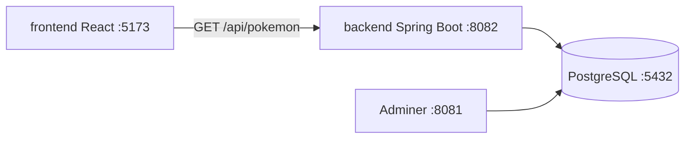

# Pokédex full stack

A beginner-friendly project with three parts:

| Folder | Tech | Purpose |
|--------|------|---------|
| [`db/`](db/) | PostgreSQL + Docker + Adminer | Store data and practice SQL in the browser |
| [`backend/`](backend/) | Java Spring Boot | REST API at `/api/pokemon` |
| [`frontend/`](frontend/) | React + TypeScript + Vite | Pokédex UI |

Data is seeded from the first **151** Kanto Pokémon (originally fetched from [PokeAPI](https://pokeapi.co/)).

---

## Ports used by this project

| Port | Service | URL / connection |
|------|---------|----------------|
| **5432** | PostgreSQL | `localhost:5432` — db `pokedex`, user `pokedex`, password `pokedex_dev` |
| **8081** | Adminer (SQL UI) | http://localhost:8081 |
| **8082** | Spring Boot API | http://localhost:8082/api/pokemon |
| **5173** | Vite dev server | http://localhost:5173 |

Port **8082** is used instead of 8080 because 8080 is often taken by other apps on a dev machine.

---

## Prerequisites

- [Docker](https://www.docker.com/) (for PostgreSQL + Adminer)
- [Node.js](https://nodejs.org/) 18+ and `npm` (for frontend and seed script)
- [Java 21](https://adoptium.net/) and Maven (or use `./mvnw` in `backend/`)

---

## Free ports before starting

From the `pokedex/` folder:

```bash
./scripts/stop-all.sh
./scripts/check-ports.sh
```

`check-ports.sh` exits with code `0` when all four ports are free, `1` if something is still running.

**Manual checks** (macOS / Linux):

```bash
lsof -i :5432 -sTCP:LISTEN   # PostgreSQL
lsof -i :8081 -sTCP:LISTEN   # Adminer
lsof -i :8082 -sTCP:LISTEN   # Spring Boot
lsof -i :5173 -sTCP:LISTEN   # Vite
```

**Stop only the database containers:**

```bash
cd db
docker compose down
```

**Stop a process on a specific port** (replace `8082` with the port you need):

```bash
kill $(lsof -ti :8082 -sTCP:LISTEN)
```

---

## How to start everything

Use **three separate terminals**. Start in this order: database → backend → frontend.

### Terminal 1 — Database

```bash
cd pokedex/db
cp .env.example .env    # optional; defaults match application.yml
docker compose up -d
```

Wait until Postgres is healthy (`docker compose ps` shows `healthy`).

- **Adminer:** http://localhost:8081 — login help in [db/exercises/README.md](db/exercises/README.md)
- **SQL exercises:** copy queries from [`db/exercises/`](db/exercises/) into Adminer

**First time only:** init scripts create tables and load 151 Pokémon.  
**Reset database** (wipes data, re-runs init):

```bash
cd pokedex/db
docker compose down -v
docker compose up -d
```

### Terminal 2 — Backend

```bash
cd pokedex/backend
./mvnw spring-boot:run
```

Wait for `Started PokedexApplication` in the log.

**Quick test:**

```bash
curl "http://localhost:8082/api/pokemon?limit=3"
curl "http://localhost:8082/api/pokemon/pikachu"
```

### Terminal 3 — Frontend

```bash
cd pokedex/frontend
npm install          # first time only
npm run dev
```

Open **http://localhost:5173**. The dev server proxies `/api` to `http://localhost:8082`, so the UI talks to your local API (not PokeAPI).

---

## Stop everything

```bash
cd pokedex
./scripts/stop-all.sh
```

Or per service:

| Service | Command |
|---------|---------|
| Frontend | `Ctrl+C` in the Vite terminal |
| Backend | `Ctrl+C` in the Spring Boot terminal |
| Database | `cd db && docker compose down` |

---

## Troubleshooting

| Problem | What to do |
|---------|------------|
| `check-ports.sh` shows BUSY | Run `./scripts/stop-all.sh` or kill the listed PID |
| Backend: `Connection refused` to Postgres | Start Terminal 1 first; check `docker compose ps` |
| Backend: `Port 8082 was already in use` | Free port 8082 (see above) |
| Frontend: empty list / network error | Ensure backend is running; test with `curl` above |
| Adminer cannot connect | System: PostgreSQL, Server: `postgres`, user/db/password from [db/.env.example](db/.env.example) |
| Wrong or empty data after schema change | `cd db && docker compose down -v && docker compose up -d` |

---

## Regenerate seed data

To refresh `db/init/02-seed.sql` from PokeAPI:

```bash
node pokedex/db/scripts/generate-seed.mjs
cd pokedex/db
docker compose down -v
docker compose up -d
```

---

## Project map



---

## Learn more

- SQL exercises: [`db/exercises/`](db/exercises/)
- Frontend: [`frontend/README.md`](frontend/README.md)
- Backend: [`backend/README.md`](backend/README.md)
