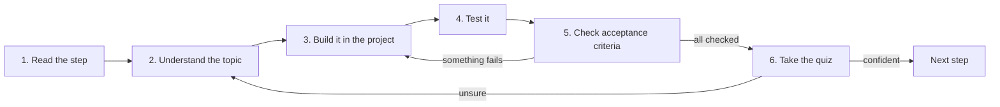

# ParcelPilot roadmap

This is your map. Walk it **one step at a time**, top to bottom.

Do not skip ahead. Each step creates the exact problem that the next step solves. If a word feels new, that is expected: the step that needs the word will teach it first.

## How every step works

Each step is a folder in [topics/](topics/). They all follow the same rhythm, so you always know what to do:

1. **Read the step**: open `topics/<step>/README.md`.
2. **Understand the new idea**: read the plain-language explanation until you can explain it in one sentence.
3. **Build it in the project**: follow the "Build it in ParcelPilot" checklist inside `applications/` (see [PROJECT-STORY.md](PROJECT-STORY.md) for where code lives).
4. **Prove it works**: follow the exact check in the step.
5. **Check acceptance criteria**: every box must be tickable. If one fails, go back to step 3.
6. **Take the quiz**: answer out loud in full sentences before revealing each answer. If you cannot, re-read before moving on.

## Before you start

Read [PROJECT-STORY.md](PROJECT-STORY.md) once. It explains the product you are building.

Then start with [Step 00](topics/00-start-here/README.md). That first step gets your computer ready and teaches the tool words before you use them.

You do **not** need to know Java yet. Step 01 starts from zero.

If you have never coded before, Step 01 also links to tiny beginner pages for syntax and data types. Read those when Step 01 sends you there.

The `references/` folder is not homework. It is a library. A step will link to a reference when it becomes useful.

## The 16 steps

| Step | Plain-language goal | ParcelPilot changes |
| --- | --- | --- |
| [00](topics/00-start-here/README.md) | Get ready to run lessons on your computer. | No product code yet. |
| [01](topics/01-java-basics/README.md) | Write your first tiny parcel program. | A parcel can be described and printed. |
| [02](topics/02-oop-and-composition/README.md) | Give parcels rules they must follow. | A parcel can change status only in allowed ways. |
| [03](topics/03-maven/README.md) | Make the project easy to build and check again. | The same checks can run whenever you change code. |
| [04](topics/04-first-spring-api/README.md) | Let another program create and read parcels. | ParcelPilot can answer requests from outside itself. |
| [05](topics/05-validation-and-inputs/README.md) | Reject missing or messy input politely. | Bad requests get helpful answers. |
| [06](topics/06-error-handling/README.md) | Make every failure answer look predictable. | Callers can understand what went wrong. |
| [07](topics/07-logging-and-observability-basics/README.md) | Leave useful notes while the app runs. | You can follow what happened during a request. |
| [08](topics/08-testing/README.md) | Turn manual checking into fast repeatable checks. | Important behavior is protected from accidental breakage. |
| [09](topics/09-docker/README.md) | Package the app so it runs the same way elsewhere. | ParcelPilot can be started from a ready-to-run package. |
| [10](topics/10-persistence/README.md) | Keep parcels after the app stops. | Parcel data survives a restart. |
| [11](topics/11-monolith/README.md) | Organize a growing app into clear parts. | Parcel and notification code are separated inside one app. |
| [12](topics/12-queues/README.md) | Let slow side work happen later. | Notifications no longer slow down the main parcel request. |
| [13](topics/13-split-services/README.md) | Move one clear responsibility into its own app. | Notifications become separate from parcel tracking. |
| [14](topics/14-compose-and-observe/README.md) | Start the whole local system together. | All local pieces can run as a group. |
| [15](topics/15-performance-and-safety/README.md) | Keep the system fast and safe under pressure. | Repeated reads, competing updates, and too many calls are handled better. |
| [16](topics/16-jwt-authentication/README.md) | Protect an operator-only action. | Some actions require proof that the caller is allowed. |

Later steps use more professional words because by then you will have earned them. Do not memorize future terms from this table. Open the next step and let it teach you.

## What "done with a step" means

- You can explain the new idea in one plain sentence.
- Every acceptance-criteria box is checked from a fresh run.
- You added **only** what the step asked for (no next-step abstractions).
- You can say what limitation the *next* step will fix.

Keep a short `NOTES.md` in your application folder: what you ran, what you saw, and one question. Type the code yourself before comparing to the examples.