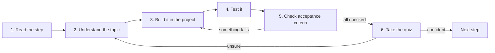

# ParcelPilot roadmap

This is your map. You walk it **one step at a time**, top to bottom. Do not skip ahead: each step creates the exact problem that the next step solves.

## How every step works

Each step is a folder in `[topics/](topics/)`. They all follow the same rhythm, so you always know what to do:




1. **Read the step**: open `topics/<step>/README.md`.
2. **Understand the topic**: read the "What is …?" section and the linked lab/reference until the idea makes sense. Do not memorize it. Aim to explain it in one sentence.
3. **Build it in the project**: follow the "Build it in ParcelPilot" checklist inside `applications/` (see [PROJECT-STORY.md](PROJECT-STORY.md) for where code lives).
4. **Test it**: run the exact commands under "Test it".
5. **Check acceptance criteria**: every box must be tickable. If one fails, go back to step 3.
6. **Take the quiz**: each step ends with a *Say it like a developer* section (how to talk about the concept) and a short *Quiz* with hidden answers. Answer the quiz out loud in full sentences before revealing each answer. If you can't, re-read before moving on. Only then go to the next step.

## Before you start

### Install (Ubuntu)

You need a **terminal**, a **code editor**, **JDK 21**, **Maven**, **Docker Engine** (with Compose), and `**curl`**. Optional: `**jq**` (pretty-prints JSON in the terminal).

You do **not** need to know Java yet — step 01 starts from zero.

#### Install everything

```bash
sudo apt update
sudo apt install -y curl jq openjdk-21-jdk maven docker.io docker-compose-v2

# Start Docker now and on boot
sudo systemctl enable --now docker

# Run docker without sudo (log out and back in, or run `newgrp docker`)
sudo usermod -aG docker "$USER"
```

> If `openjdk-21-jdk` is not found (older Ubuntu), install Temurin 21 from [adoptium.net](https://adoptium.net) or use [SDKMAN](https://sdkman.io): `sdk install java 21-tem`.

#### Check that everything works

Open a **new terminal** after `usermod`. Each command should print a version or status — not `command not found` or `permission denied`.

```bash
# Java & build
java -version          # → 21.x
javac -version         # → confirms full JDK (not JRE-only)
mvn -version           # → Maven 3.x using Java 21

# HTTP tools
curl --version
jq --version           # optional

# Docker daemon + Compose
docker --version
docker compose version
docker info            # → must succeed without sudo; proves the daemon is running
systemctl is-enabled docker   # → enabled
systemctl is-active docker    # → active
```

Quick smoke tests (same spirit as step 00):

```bash
docker run --rm hello-world
curl -s -o /dev/null -w "%{http_code}\n" https://example.com   # → 200
```


| Symptom                               | Fix                                                                               |
| ------------------------------------- | --------------------------------------------------------------------------------- |
| `docker: permission denied`           | Log out/in after `usermod`, or run `newgrp docker` in this shell                  |
| `Cannot connect to the Docker daemon` | `sudo systemctl start docker` and check `systemctl status docker`                 |
| `openjdk-21-jdk` not found            | Temurin 21 or SDKMAN (see note above)                                             |
| `mvn: command not found`              | Re-run `sudo apt install -y maven`, or see [Maven reference](references/maven.md) |


Read [PROJECT-STORY.md](PROJECT-STORY.md) once. It explains that you build **one** product (ParcelPilot, a parcel-tracking backend) that grows with every step.

**Never coded before?** Read [Java syntax basics](topics/01-java-basics/java-syntax-basics.md) first: variables, types, `if`/loops, printing, and how to compile and run, with tiny examples. Then [Java data types in detail](topics/01-java-basics/data-types.md) (primitives vs objects, ranges, casting, `String`, the money/overflow traps) and [general coding concepts](references/coding-concepts.md) (early return, guard clauses, DRY).

### Three references worth knowing exist (read as needed)

You don't read these cover-to-cover up front (steps link to them at the right moment), but knowing they exist helps you see the big picture:

- [Java best practices (and why)](references/java-best-practices.md): the habits ParcelPilot uses, each with the problem it prevents.
- [Code organization: from one file to a layered app](references/code-organization.md): how the project grows from one file → packages/imports → controllers/services → separate services, and *when* each stage is worth it.
- [System design & scaling](references/scaling-and-architecture.md): how backends scale (queues, caching, rate limiting, auth, statelessness), how each ParcelPilot step maps to a system-design idea, and the advanced topics to explore afterward.

## The 13 steps


| Step                                             | You will learn                                    | The project gains                        | You prove it by                         |
| ------------------------------------------------ | ------------------------------------------------- | ---------------------------------------- | --------------------------------------- |
| [00](topics/00-start-here/README.md)             | Terminal, HTTP, containers                        | Nothing yet, tools only                  | `curl` a throwaway container            |
| [01](topics/01-java-basics/README.md)            | Java values, classes, methods                     | A `Parcel` object you can print          | `java` prints a label                   |
| [02](topics/02-oop-and-composition/README.md)    | Objects, composition, singleton, builder, factory | Parcels change state by rules            | a test shows valid + blocked changes    |
| [03](topics/03-maven/README.md)                  | Maven and automated tests                         | A repeatable, testable build             | `mvn test` passes                       |
| [04](topics/04-first-spring-api/README.md)       | HTTP, REST, JSON, Spring Boot                     | Create/read parcels over the web         | `curl` gets JSON                        |
| [05](topics/05-docker/README.md)                 | Images and containers                             | The API runs as one portable image       | `docker run` serves the API             |
| [06](topics/06-persistence/README.md)            | Databases, volumes, locking                       | Parcels survive a restart                | recreate container, data remains        |
| [07](topics/07-monolith/README.md)               | Architecture of a monolith                        | Clean internal modules                   | tests pass, endpoints unchanged         |
| [08](topics/08-queues/README.md)                 | Queues and async work                             | Notifications happen *after* the request | response is fast while worker is paused |
| [09](topics/09-split-services/README.md)         | Microservices                                     | Notifications become a separate service  | two containers cooperate                |
| [10](topics/10-compose-and-observe/README.md)    | Docker Compose, health, logs                      | Whole system starts with one command     | `docker compose up` runs everything     |
| [11](topics/11-performance-and-safety/README.md) | Caching, locking, rate limiting                   | The API stays fast and safe under load   | cache hit, `409`, and `429` observed    |
| [12](topics/12-jwt-authentication/README.md)     | Passwords, hashing, JWT                           | A protected operator action              | login, then call with a token           |


The monolith (steps 04–07) is **not** a beginner mistake you fix later. It is the correct starting architecture. Microservices (step 09) only appear once the monolith reveals a real boundary.

## A note on design patterns and keywords

You will meet keywords like **singleton, builder, factory, adapter, decorator, facade, proxy, composite, observer, strategy, command, iterator, queue, cache, hashing, locking, rate limiting**. None are introduced as trivia. Each shows up in the exact step where it solves a visible ParcelPilot problem, with a plain-language definition first. The full catalog lives in [references/design-patterns.md](references/design-patterns.md), but read it only when a step links to it.

## Checkpoint commands you will reuse

```bash
mvn test                         # compile + run tests
mvn package                      # build a runnable JAR
docker build -t parcelpilot .    # build an image
docker run --rm -p 8080:8080 parcelpilot   # run the image
curl -i http://localhost:8080/parcels/1    # call an endpoint
docker compose up --build        # run the whole system (later steps)
```

## What "done with a step" means

- You can explain the topic in one plain sentence.
- Every acceptance-criteria box is checked from a clean terminal.
- You added **only** what the step asked for (no next-step abstractions).
- You can say what limitation the *next* step will fix.

Keep a short `NOTES.md` in your application folder: the command you ran, what you saw, and one question. Type the code yourself before comparing to the examples.