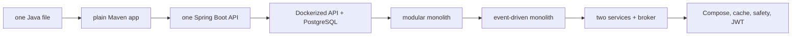

# The ParcelPilot project story

You do not build twelve unrelated demo apps. You evolve the same product and keep seeing why the next concept is needed.



## Where code lives

Keep one codebase during the monolith path:

```text
applications/
└── parcelpilot/                  # steps 01–08: one evolving application
    ├── pom.xml
    ├── src/
    ├── Dockerfile
    └── notes/
```

At step 09, preserve the final monolith as a tagged Git commit or a `checkpoints/08-event-driven-monolith` copy, then reshape the project:

```text
applications/
└── parcelpilot-services/         # steps 09–12: one evolving local system
    ├── parcel-service/
    ├── notification-service/
    └── compose.yaml
```

`applications/` is intentionally empty now. Create these only when the guide tells you to. No starter framework structure is hidden from you.

## The product’s growing behavior

1. A parcel is a Java object with valid states.
2. Maven makes that object testable and repeatable.
3. Spring Boot lets `curl` create and read parcels.
4. Docker makes the API portable. PostgreSQL keeps data after a restart.
5. The modular monolith separates parcel and notification responsibilities without network complexity.
6. A queue lets notification work happen after the parcel request finishes.
7. Only then does notification become a separate service.
8. Compose runs the real local system. Cache, rate limits, and JWT make its boundaries safer.

Every topic answers three questions: **what problem exists now, what small change solves it, and how can I watch that change happen locally?**
