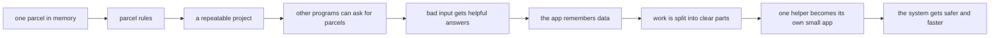

# The ParcelPilot project story

You do not build sixteen unrelated demo apps. You evolve the same product and keep seeing why the next concept is needed.



## Where your code lives

The `applications/` folder is empty on purpose. You create files only when a step tells you to.

For the first part of the course, you grow one project:

```text
applications/
└── parcelpilot/
```

Much later, one part of ParcelPilot becomes separate enough to live beside the first project:

```text
applications/
└── parcelpilot-services/
    ├── parcel-service/
    └── notification-service/
```

Do not create the later folders early. The step that needs them will explain why they exist.

## The product’s growing behavior

1. A parcel has a label and a status.
2. The parcel is only allowed to move through sensible statuses.
3. The project becomes easy to run again and again.
4. Another program can create and read parcels.
5. Wrong requests get clear, helpful answers.
6. You can see what happened when something breaks.
7. The app proves its own behavior with checks.
8. Parcels survive after the app stops and starts again.
9. The code is split into clear parts as it grows.
10. Slow side work happens after the main request is done.
11. One helper becomes its own small app.
12. The final system gets safer, faster, and easier to start.

Every topic answers three questions: **what problem exists now, what small change solves it, and how can I watch that change happen locally?**
