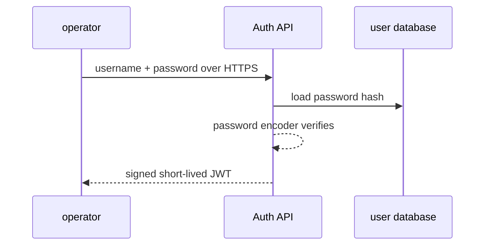

# Password authentication and JWT

This is intentionally the last core topic. Authentication is security-sensitive, so do not invent your own protocol or password storage scheme.

## Terms

- **Authentication**: prove who the caller is.
- **Authorization**: decide what an authenticated caller may do.
- **Password hash**: slow, salted one-way password storage.
- **JWT**: a signed token carrying claims. It is not automatically encrypted.

## Passwords

Never store, log, or return plaintext passwords. Delegate password hashing and verification to Spring Security’s `PasswordEncoder`, using Argon2id or bcrypt. A salt prevents identical passwords from producing matching hashes. The algorithm’s work factor makes guessing expensive.

## JWT lifecycle

1. `POST /auth/login` verifies username and password.
2. Server creates a short-lived signed access token with minimal claims, such as subject and role.
3. Client sends `Authorization: Bearer <token>` on protected requests.
4. The API verifies signature, expiration, issuer, and audience before authorizing.

Do not put passwords, secrets, or sensitive personal data in JWT claims. Signed JWT contents are usually readable by anyone holding the token.

## Limits

JWT revocation and logout require design: short expiration plus refresh-token storage/revocation is common. For this learning path, implement only short-lived access tokens and document that limitation. Production systems additionally need HTTPS, secret rotation, brute-force protections, CSRF considerations for browser cookies, audit logs, and a reviewed identity design.
