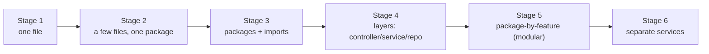
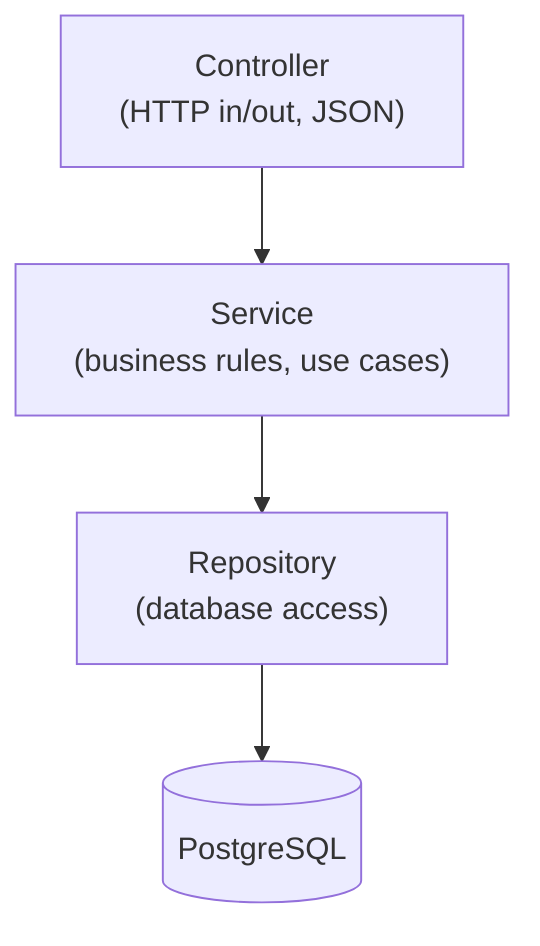

# Code organization: from one file to a layered app

One of the most confusing things for beginners is *how much structure* a project should have. The honest answer: **it depends on the project's size and age.** ParcelPilot deliberately starts with almost none and adds structure only when the code gets big enough to need it. This page shows that whole journey in one place so you always know *where you are* and *why*.

> **The golden rule:** structure is a cost you pay to manage complexity. Add it when complexity appears, not before. A tiny program with folders-for-everything is as wrong as a huge program crammed into one file.



---

## Stage 1: Everything in one file (Step 01)

When you're learning or prototyping, one file is *correct*. No packages, no build tool, no folders.

```java
// Main.java: everything here
public class Main {
    public static void main(String[] args) {
        Parcel p = new Parcel("P-1", "Ava");
        System.out.println(p.label());
    }
}

class Parcel {                 // a second class in the same file (allowed, not public)
    private final String id;
    private final String recipient;
    Parcel(String id, String recipient) { this.id = id; this.recipient = recipient; }
    String label() { return id + " -> " + recipient; }
}
```

**Why it's fine here:** there is one concept and no reuse. Structure would add friction with zero benefit.
**What forces the next stage:** more than one *public* class (Java requires one public class per file, named after the file), and classes you want to reuse.

## Stage 2: A few files, still one folder (Step 01 → 02)

Give each class its own file. This is what Step 01 and 02 do: `Parcel.java`, `Status.java`, `Clock.java`, `ParcelTracker.java`, `Main.java`, all loose in `applications/parcelpilot/`.

```text
applications/parcelpilot/
├── Parcel.java
├── Status.java
├── Clock.java
├── SystemClock.java
├── TrackingEvent.java
├── ParcelTracker.java
└── Main.java
```

Classes in the **same folder with no package** can see each other automatically, so no `import` is needed yet.

```bash
javac *.java   # compile all files together
java Main
```

**Why:** one class per file is a best practice (easy to find, smaller diffs). But a pile of loose files doesn't scale, and you're still compiling by hand.
**What forces the next stage:** you want automated builds/tests, external libraries, and a way to group classes as they multiply.

## Stage 3: Packages and imports (Step 03)

Now you adopt Maven's standard layout and give files a **package**. A package is a namespace that groups related classes and prevents name clashes. See [Packages, imports, and structure](../topics/03-maven/packages-imports-structure.md).

```text
applications/parcelpilot/
├── pom.xml
└── src/
    ├── main/java/com/parcelpilot/     # package com.parcelpilot;
    │   ├── Parcel.java
    │   ├── Status.java
    │   └── ParcelTracker.java
    └── test/java/com/parcelpilot/     # tests mirror the packages
        └── ParcelTrackerTest.java
```

```java
package com.parcelpilot;          // first line: which package this class belongs to

import java.time.Instant;         // needed: Instant is in a DIFFERENT package (java.time)
import java.util.List;            // needed: List is in java.util

public record TrackingEvent(String parcelId, Status newStatus, Instant when) {}
// Status needs no import, it's in the SAME package (com.parcelpilot)
```

**When you need an `import`:** to use a class from a *different* package. You never import classes in the same package, nor `java.lang` classes (`String`, `System`, `Integer`) which are always available.

**Why:** packages organize a growing codebase and avoid clashes (your `Status` vs a library's `Status`). Maven's layout lets one command build, test, and package everything.
**What forces the next stage:** the app now talks HTTP and a database, so it has clearly different *kinds* of code (web handling vs business rules vs storage) mixed together.

## Stage 4: Layers: controller, service, repository (Step 04 → 10)

When the app does HTTP + rules + persistence, separate those responsibilities so each has one job. This is the classic three-layer shape.



| Layer | Job | ParcelPilot example |
|---|---|---|
| **Controller** | Translate HTTP ↔ Java, no business logic. | `ParcelController` maps `POST /parcels`. |
| **Service** | The actual use cases and rules. | `ParcelService.markDelivered(id)`. |
| **Repository** | Read/write data, no rules. | `ParcelRepository extends JpaRepository`. |
| **Domain/DTO** | The core objects + API-shaped data. | `Parcel` (rules), `ParcelResponse` (API). |

```java
@RestController
class ParcelController {
    private final ParcelService service;              // controller depends on service
    ParcelController(ParcelService service) { this.service = service; }

    @PostMapping("/parcels")
    ParcelResponse create(@RequestBody CreateParcelRequest req) {
        return service.create(req.id(), req.recipient());   // delegates; no rules here
    }
}

@Service
class ParcelService {
    private final ParcelRepository repository;         // service depends on repository
    ParcelService(ParcelRepository repository) { this.repository = repository; }
    // ... business rules live here ...
}
```

**Why:** each layer changes for one reason. You can swap the database (repository) without touching HTTP (controller), and test the service without starting a web server. Notice dependencies point **inward** (controller → service → repository), and each is **injected** via the constructor.

> **Don't over-do it early.** In Step 04 it's fine that one controller class holds the data and endpoints. You split into layers in Step 10/11 *once there's something to separate*. Layering an app that does almost nothing is just ceremony.

**What forces the next stage:** several features (parcel, notification) each spanning all three layers, tangled together.

## Stage 5: Package by feature (modular monolith, Step 11)

Instead of top-level `controllers/`, `services/`, `repositories/` folders (which scatter one feature across three places), group by **feature**. Each feature has its own layers inside.

```text
com/parcelpilot/
├── parcel/
│   ├── Parcel.java                 # domain (rules)
│   ├── ParcelService.java          # application/use cases
│   ├── ParcelController.java       # HTTP adapter
│   └── ParcelRepository.java       # persistence adapter
└── notification/
    ├── Notifier.java               # interface the parcel module depends on
    └── LoggingNotifier.java        # implementation
```

The parcel module talks to notifications through a **small interface** (`Notifier`), not by reaching into its internals.

**Why:** a change to "parcels" touches one folder. Features stay cohesive and loosely coupled, which is exactly what makes the next stage cheap. See [Step 11](../topics/11-monolith/README.md).
**What forces the next stage:** a feature needs to deploy, scale, or fail **independently**.

## Stage 6: Separate services (Step 13+)

Only now, with a proven boundary, do you split a module into its own deployable service with its own database, communicating over a broker.

```text
applications/parcelpilot-services/
├── parcel-service/          # own pom.xml, Dockerfile, database
├── notification-service/    # own pom.xml, Dockerfile, database
└── compose.yaml
```

**Why:** independent deploy/scale/failure, at the cost of network calls, more infrastructure, and eventual consistency. See [Step 13](../topics/13-split-services/README.md) and [monolith vs microservices](monolith-and-microservices.md).

---

## How to know which stage you need

Ask: **"What is the smallest structure that keeps this codebase understandable and changeable right now?"**

- One idea, learning → **one file**.
- A handful of classes → **one file each, one folder**.
- Growing app, needs a build/tests → **packages + Maven**.
- HTTP + rules + storage mixed → **layers**.
- Multiple features → **package by feature**.
- A feature must scale/deploy alone → **separate service**.

Moving up a stage too early adds cost with no benefit. Moving up too late makes change painful. ParcelPilot moves up exactly when a step reveals the need, and that timing *is* the lesson.

## See also

- [Java best practices (and why)](java-best-practices.md)
- [Packages, imports, and structure](../topics/03-maven/packages-imports-structure.md)
- [Monolith and microservices](monolith-and-microservices.md)
- [PROJECT-STORY.md](../PROJECT-STORY.md): the same journey from the product's point of view
