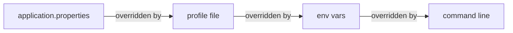

# Configuration

Configuration is every value your application needs that is **not code**: which port to listen on, where the database is, how chatty the logs are. Spring Boot reads these values at startup so you can change behavior **without recompiling**. This matters more with every step: at step 04 you only care about a port, by step 14 the same JAR must run on your laptop *and* inside Docker Compose with different settings.

## Key words

| Word | Beginner meaning |
|---|---|
| **Property** | One named setting, like `server.port=8080`. A key and a value. |
| **`application.properties`** | The default file where Spring Boot looks for properties. |
| **Environment variable** | A setting that lives in the shell/container, outside any file. |
| **Profile** | A named set of extra properties you can switch on, like `local`. |
| **Externalized config** | Keeping settings outside the compiled code so one build runs anywhere. |
| **Precedence** | The rule deciding which value wins when the same key is set twice. |

## `application.properties`

The file lives at `src/main/resources/application.properties` inside your project. Maven copies it into the JAR, and Spring Boot reads it automatically at startup — no code needed.

```text
applications/parcelpilot/
├── pom.xml
└── src/
    └── main/
        ├── java/...
        └── resources/
            └── application.properties   ← here
```

Each line is `key=value`. These are the keys this course actually uses:

```properties
# Which port the embedded web server listens on (step 04)
server.port=8080

# How much log output you want, per package (step 07)
logging.level.root=INFO
logging.level.com.parcelpilot=DEBUG

# Where the database is and how to log in (step 10)
spring.datasource.url=jdbc:postgresql://localhost:5432/parcelpilot
spring.datasource.username=parcelpilot
spring.datasource.password=change-me
```

You do not need to memorize keys. Each step introduces the ones it needs; this page is where you come back to when you forget what a key means.

## Properties vs YAML

Spring Boot also accepts an `application.yml` file with the same keys in indented YAML form. Both work; **this course uses `.properties`** because one flat `key=value` line has no indentation rules to get wrong. If you see YAML examples online, know that `spring.datasource.url=...` and the nested YAML version mean exactly the same thing.

## Environment variables and relaxed binding

An environment variable is a value set in the shell (or container) that a program can read, like `PATH`. Spring Boot maps environment variables onto property keys with a simple rule called **relaxed binding**: uppercase the key and replace dots with underscores.

| Property key | Environment variable |
|---|---|
| `server.port` | `SERVER_PORT` |
| `spring.datasource.url` | `SPRING_DATASOURCE_URL` |
| `spring.datasource.password` | `SPRING_DATASOURCE_PASSWORD` |

So these two commands configure the same thing:

```bash
# via the properties file: server.port=9090, then
java -jar target/parcelpilot.jar

# via an environment variable, no file change:
SERVER_PORT=9090 java -jar target/parcelpilot.jar
```

**Why this matters for Docker (step 09 and later).** A Docker image is frozen — you should not rebuild it just to point it at a different database. Environment variables let the *same* image run anywhere:

```bash
docker run --rm -p 8080:8080 \
  -e SPRING_DATASOURCE_URL=jdbc:postgresql://parcelpilot-db:5432/parcelpilot \
  parcelpilot-api:dev
```

By step 14, Docker Compose sets these in `compose.yaml` instead of on the command line:

```yaml
services:
  parcel-service:
    build: ./parcel-service
    environment:
      SPRING_DATASOURCE_URL: jdbc:postgresql://parcel-db:5432/parcelpilot
      SPRING_RABBITMQ_HOST: rabbitmq
```

Note the host names: inside Compose, the database is `parcel-db` and the broker is `rabbitmq` — service names, never `localhost` (see [when-things-break.md](when-things-break.md)).

## Profiles

A **profile** is a named add-on file: `application-local.properties` is only read when the `local` profile is active. Activate it with a property (which, per relaxed binding, can also be an env var):

```bash
SPRING_PROFILES_ACTIVE=local java -jar target/parcelpilot.jar
```

Values in the active profile file **override** the same keys in `application.properties`.

### When to use what: a decision guide

| Situation | Use |
|---|---|
| A default that is true almost everywhere (`server.port=8080`) | `application.properties` |
| A value that differs between your laptop and Docker (`spring.datasource.url`) | Default in `application.properties`, override with an **env var** in Docker |
| A whole *set* of laptop-only settings (verbose logging + local DB) | A `local` **profile** |
| A one-off experiment (“what if port 9090?”) | **Command line**: `java -jar app.jar --server.port=9090` |

In this course you can get all the way to step 14 with just `application.properties` plus env vars. Profiles are worth knowing because you will meet them in every real Spring project.

## Precedence: which value wins

When the same key is set in several places, Spring Boot has a long official ordering; this simplified version covers everything in this course. Higher rows win.

| Priority | Source | Example |
|---|---|---|
| 1 (highest) | Command-line argument | `--server.port=9090` |
| 2 | Environment variable | `SERVER_PORT=9090` |
| 3 | Active profile file | `application-local.properties` |
| 4 (lowest) | `application.properties` | `server.port=8080` |



A useful mental model: the closer a source is to *this particular run*, the more it wins.

## Secrets do not go in Git

`spring.datasource.password=change-me` in a committed file is fine for a local learning database, and terrible for anything real. A properties file committed to Git is **published forever** in the repository history — deleting the line later does not remove old commits. The habit to build now:

- Real passwords, tokens, and keys are injected as **environment variables** at run time.
- Committed files hold only harmless local defaults or placeholders.

See [what not to commit in git-for-this-course.md](git-for-this-course.md) for the Git side of this rule.

## Why externalize config? Pros and cons

**Pros:** one build runs everywhere (laptop, Docker, Compose); no recompile to change a port or database; secrets can stay out of the codebase; differences between environments are visible in one place instead of buried in code.

**Cons:** the value that actually applies is no longer obvious from reading the code — you have to know the precedence order; a typo in an env var name (`SPRING_DATASOURCE_ULR`) fails *silently* by falling back to the default; more places to look when something is misconfigured.

The cons are the price of the pros. The precedence table above is the antidote to most confusion.

## ParcelPilot: configuration at each stage

| Step | What you configure | How |
|---|---|---|
| [04 – first Spring API](../topics/04-first-spring-api/README.md) | The port, if 8080 is busy | `server.port=8081` in `application.properties` |
| [07 – logging](../topics/07-logging-and-observability-basics/README.md) | Log verbosity per package | `logging.level.com.parcelpilot=DEBUG` |
| [10 – persistence](../topics/10-persistence/README.md) | Where PostgreSQL is | `spring.datasource.*` keys |
| [09 / 13 – Docker](../topics/09-docker/README.md) | Same image, different DB host | `-e SPRING_DATASOURCE_URL=...` on `docker run` |
| [14 – Compose](../topics/14-compose-and-observe/README.md) | Every service's settings in one file | `environment:` blocks in `compose.yaml` |
