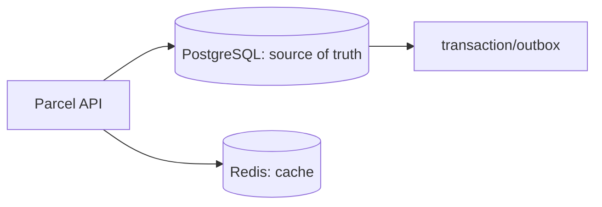

# Databases, caching, hashing, and locking

## Database

PostgreSQL is the source of truth for ParcelPilot. A relational database stores rows with constraints and transactions. Run it locally in Docker with a named volume, so restarting its container does not delete data.

Use migrations (such as Flyway) to version schema changes. Database schema is application code: review and test it.

## Caching

A cache stores a copy so repeated reads avoid slower work. Redis is a common network cache and also runs easily in Docker.

Cache-aside flow:

1. read Redis by parcel ID
2. on a miss, read PostgreSQL
3. write the result to Redis with a TTL
4. on an update, invalidate or refresh that cache key

Pros: faster reads and less database load. Cons: stale data, cache invalidation complexity, new dependency. Never make cache the only source for important parcel state.

## Hashing

Hashing turns input into a fixed-size, one-way digest. It is useful for password storage and keys/checksums, not reversible encryption.

- Use **Argon2id**, bcrypt, or scrypt for passwords: deliberately slow and salted.
- Use SHA-256 for integrity/fingerprints, not passwords.
- Encoding (Base64) is not hashing or encryption.
- Encryption is reversible with a key. Hashing is not.

## Locking

Two operators may try to update the same parcel concurrently. Without protection, the last write can silently overwrite the first.

- **Optimistic locking** adds a version column. The update succeeds only if the version still matches. Otherwise return `409 Conflict` and retry/reload.
- **Pessimistic locking** locks a database row while a transaction runs. It can protect critical short updates, but reduces concurrency and can deadlock.

Start with optimistic locking for ordinary REST updates. Keep database transactions short.
