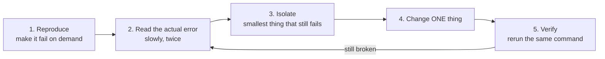

# Debugging and troubleshooting

Errors are not interruptions to the course — they *are* the course. Every message below will probably greet you at least once. This page teaches you to read errors calmly and gives problem → cause → fix tables for the four areas where things break: Java, Spring Boot startup, Maven, and Docker.

For instant one-symptom fixes, see the FAQ companion [when-things-break.md](when-things-break.md). This page is the deeper "why".

## How to read a Java stack trace

A **stack trace** is Java telling you exactly where a program died: which line, called from which line, called from which line. It looks scary because it is long, but you only ever need three things from it.

```text
Exception in thread "main" java.lang.NullPointerException:            ← ① what went wrong
        Cannot invoke "String.length()" because "recipient" is null
    at com.parcelpilot.Parcel.label(Parcel.java:24)                   ← ② where it died (top frame)
    at com.parcelpilot.Main.main(Main.java:9)                         ← ③ who called it
```

1. **The first line** names the exception type and (usually) a human-readable reason. Read it slowly — modern Java messages like *"because `recipient` is null"* often solve the case on their own.
2. **The top frame** (`at ...` line closest to the message) is where execution stopped: file `Parcel.java`, line 24.
3. **The frames below** show the chain of calls that led there, newest first.

### Your frames vs framework frames

Once Spring is involved, stack traces grow to dozens of frames. Almost all of them are framework internals. Scan for the frames that start with **your package** (`com.parcelpilot...`) — that is where your bug almost always is:

```text
    at org.springframework.web.method.support.InvocableHandlerMethod.invoke(...)   ← framework, skip
    at org.springframework.web.servlet.DispatcherServlet.doDispatch(...)           ← framework, skip
    at com.parcelpilot.api.ParcelController.getParcel(ParcelController.java:31)    ← YOURS, look here
```

### `Caused by`

When one exception triggers another, the trace shows a chain. The **last `Caused by:` block is the real root cause** — start reading from the bottom:

```text
org.springframework.beans.factory.BeanCreationException: Error creating bean 'dataSource'
    ...
Caused by: org.postgresql.util.PSQLException:                          ← the actual problem
        Connection to localhost:5432 refused. Check that the hostname and port are correct...
```

Here the bean error is just packaging; the story is "could not reach PostgreSQL on port 5432".

## Spring Boot startup failures

When the app dies during startup, Spring Boot usually prints an `APPLICATION FAILED TO START` box with a **Description** and an **Action**. Read those two paragraphs before anything else.

| You see | Likely cause | Fix |
|---|---|---|
| `Web server failed to start. Port 8080 was already in use.` | Another process (often your own previous run or a forgotten container) holds the port | See the [full port-8080 recipe](#the-port-8080-already-in-use-recipe) below |
| `Error creating bean with name 'dataSource'` + `Connection ... refused` | Database not running, or wrong `spring.datasource.url` | Start PostgreSQL (`docker ps` to check), verify the URL in [configuration](configuration.md) |
| `Parameter 0 of constructor in ... required a bean of type '...' that could not be found.` | Spring cannot find a class to inject — usually a missing `@Service`/`@Repository` annotation, or the class sits outside the main package | Annotate the class; keep all code under the application's base package |
| `java.lang.ClassNotFoundException` / `NoClassDefFoundError` | A dependency your code uses is not in `pom.xml` | Add the dependency (or starter) to `pom.xml`, rerun `mvn package` |

Real-looking example of the friendly startup box:

```text
***************************
APPLICATION FAILED TO START
***************************

Description:

Web server failed to start. Port 8080 was already in use.

Action:

Identify and stop the process that's listening on port 8080 or configure
this application to listen on another port.
```

Spring literally tells you the two possible fixes. Most startup failures are this readable once you find the Description/Action block in the scroll.

## Maven failures

Maven output ends with `BUILD SUCCESS` or `BUILD FAILURE`. On failure, the *kind* of failure tells you where to look. Three kinds cover nearly everything:

| Output contains | Kind of failure | What it means / fix |
|---|---|---|
| `COMPILATION ERROR` with `[ERROR] /path/File.java:[12,8] cannot find symbol` (or `';' expected`) | **Compilation error** | Your Java code is invalid — a typo, missing import, wrong name. Open the exact file and line Maven printed. The code never ran. |
| `Tests run: 5, Failures: 1` and `There are test failures.` | **Test failure** | The code compiles and runs, but a test's expectation was not met. Scroll up to the named test; it prints expected vs actual values. |
| `Could not resolve dependencies` / `Could not find artifact com.example:foo:jar:1.0` | **Dependency resolution** | Maven cannot download a library: a typo in `pom.xml` coordinates, a made-up version, or no network. Check the `<dependency>` block, then retry. |

How to tell them apart at a glance: **compilation** errors mention `.java` files with `[line,column]` positions; **test** failures mention `Tests run:` counts; **dependency** problems mention downloading, artifacts, and repository URLs.

## Docker issues

| You see | Likely cause | Fix |
|---|---|---|
| `Unable to find image 'parcelpilot:latest' locally` then a pull error | You ran an image name you never built, or a typo | `docker images` to list what exists; `docker build -t parcelpilot .` first; check spelling |
| `Bind for 0.0.0.0:8080 failed: port is already allocated` | Another **container** already publishes 8080 | `docker ps` to find it, `docker stop <name>`, or publish differently: `-p 8081:8080` |
| Container exits immediately after `docker run` | The process inside crashed at startup (often a Spring startup failure) | `docker logs <container>` — the container's stdout holds the same stack trace you would see locally. This command is the single most important Docker debugging habit. |
| `permission denied while trying to connect to the Docker daemon socket` (Linux) | Your user is not in the `docker` group | `sudo usermod -aG docker "$USER"`, then log out/in or `newgrp docker` — see the [install section of the GUIDE](../GUIDE.md#install-ubuntu) |

The mental shift: a container failing is not a new category of problem. It is usually your normal app failing, *hidden* inside a box — and `docker logs` opens the box.

## The "port 8080 already in use" recipe

This one earns its own section because it bites at nearly every step from [04](../topics/04-first-spring-api/README.md) on.

**Cause:** exactly one process may listen on a port. A previous run of your app (still running in another terminal), or a container with `-p 8080:8080`, is holding it.

```bash
# 1. Find who owns the port
lsof -i :8080
# COMMAND   PID        USER   ...  NAME
# java    41712  kevin.voss   ...  *:8080 (LISTEN)

# 2a. If it's a stray java process: stop it
kill 41712              # use the PID from step 1

# 2b. If it's a container: stop that instead
docker ps               # look for 0.0.0.0:8080->8080
docker stop <container>
```

Or sidestep it: change your app's port with `server.port=8081` in `application.properties` (see [configuration.md](configuration.md)) — then remember to `curl` port 8081.

## A general debugging method

When you have no idea what is wrong, work this loop instead of changing things at random:



1. **Reproduce.** Find the exact command that makes it fail every time. A bug you can trigger on demand is already half-solved.
2. **Read the actual error.** Not the vibe of it — the words. Which exception? Which file and line? What does the `Caused by` at the bottom say?
3. **Isolate.** Shrink the failing case: does it fail with one parcel instead of ten? Outside Docker? With the database ruled out?
4. **Change one thing.** If you change three things and it works, you learned nothing and probably kept two mistakes.
5. **Verify.** Rerun the *same* command from step 1. If you use Git, `git diff` shows precisely what you changed since it last worked ([git-for-this-course.md](git-for-this-course.md)).

**Print/log vs debugger:** adding a `System.out.println` (later, a log line) to see a value is a legitimate, professional technique — fast and good enough for most bugs in this course. A **debugger** (pausing the program and inspecting variables in the IDE) is stronger when the logic is tangled. Step 01 walks you through both on a real bug: [debugging your first program](../topics/01-java-basics/debugging-your-first-program.md).

## When to ask for help

Ask when you have looped through the method twice and are still stuck — that is not failure, it is normal. But *how* you ask decides whether help is possible. Include:

1. **The exact command you ran** (copy-paste, not from memory).
2. **The full error output** — the whole stack trace or Maven/Docker output, not a screenshot of half of it.
3. **What you already tried** and what happened each time.
4. Your environment when relevant: OS, `java -version`, `mvn -version`, `docker --version`.

A question with those four things usually gets answered in minutes. "It doesn't work" gets you four rounds of the other person asking for the list above.
