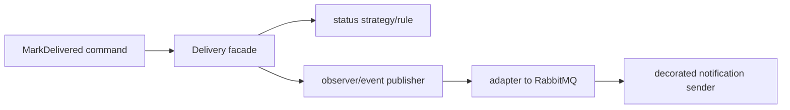

# Java design patterns: use names after seeing the problem

Patterns are vocabulary for recurring trade-offs, not folders to create in advance. Each has a useful ParcelPilot-sized example.

## Object creation

**Singleton**: one shared stateless instance, such as a system clock. Avoid global mutable state.

**Builder**: construct an object with many optional fields readably.

```java
Parcel parcel = Parcel.builder()
    .id("P-1").recipient("Ava").priority(true).build();
```

**Factory method**: centralize a construction decision. `NotificationSenderFactory.forChannel(SMS)` can choose an SMS sender without callers knowing its implementation.

## Structural patterns

**Adapter** converts one interface to another. A `SendGridEmailAdapter` can implement the app’s `NotificationSender` interface around a vendor SDK.

**Decorator** adds behavior around another object: `LoggingNotificationSender` delegates to a sender and records the outcome.

**Facade** offers a small entry point over several subsystems: `DeliveryFacade.markDelivered()` can coordinate a parcel update, event recording, and publication.

**Proxy** stands in for another object, often to add lazy loading, caching, authorization, or remote access. A cache proxy can check Redis before calling a parcel repository.

**Composite** lets a group and a single item share an interface. A `NotificationBatch` and a `SingleNotification` can both be `Dispatchable`.

## Behavioral patterns

**Observer**: interested parties react to an event. In-process Spring event listeners are observers; RabbitMQ consumers extend that idea across processes.

**Strategy**: swap an algorithm. A rate limiter can choose fixed-window or token-bucket strategy.

**Command**: package a request as an object, such as `MarkParcelDeliveredCommand`. It supports validation, queues, logging, and retries.

**Iterator**: traverse a collection without exposing its representation. Java’s `for (Parcel parcel : parcels)` uses this pattern already.



## Selection rule

Use a pattern when it removes a concrete conditional, hides an external dependency, or makes a behavior independently testable. Reject it when it merely adds indirection. A `ParcelBuilderFactoryDecorator` with no problem is worse than direct code.
