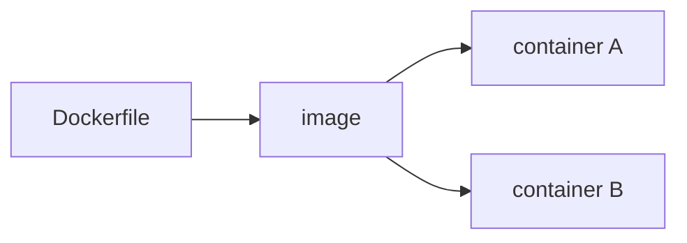

# Docker

Docker uses an **image** (a packaged filesystem plus startup command) to create a **container** (a running instance). An image is reusable; a container is disposable.



## Essential commands

```bash
docker build -t parcelpilot-api:dev .
docker run --rm -p 8080:8080 parcelpilot-api:dev
docker ps
docker logs <container>
docker stop <container>
```

`-p 8080:8080` maps host port 8080 to container port 8080. Inside a Compose network, services reach each other by service name, not `localhost`.

## A multi-stage Java Dockerfile

The first stage needs Maven and a JDK; the running application needs only a JRE. Copying the JAR into the smaller runtime image produces a leaner, safer result.

```dockerfile
FROM maven:3-eclipse-temurin-21 AS build
WORKDIR /app
COPY pom.xml .
COPY src src
RUN mvn -q -DskipTests package

FROM eclipse-temurin:21-jre
WORKDIR /app
COPY --from=build /app/target/*.jar app.jar
EXPOSE 8080
ENTRYPOINT ["java", "-jar", "app.jar"]
```

This example should evolve for dependency caching and a non-root user, but it is intentionally readable first.

## Volumes and networks

A volume persists data beyond one container. Containers on the same Docker network can communicate privately. Docker Compose declares both in `compose.yaml`, along with the app configuration needed to start the system.
