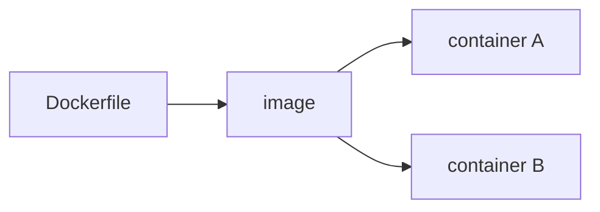

# Docker

Docker uses an **image** (a packaged filesystem plus startup command) to create a **container** (a running instance). An image is reusable. A container is disposable.



## Essential commands

```bash
docker build -t parcelpilot-api:dev .
docker run --rm -p 8080:8080 parcelpilot-api:dev
docker ps
docker logs <container>
docker stop <container>
```

`-p 8080:8080` maps host port 8080 to container port 8080. Inside a Compose network, services reach each other by service name, not `localhost`.

## Single-stage vs multi-stage builds

A **single-stage** Dockerfile has one `FROM`: everything needed to build the app (Maven, a full JDK, sources, downloaded dependencies) stays in the final image. A **multi-stage** Dockerfile has two or more `FROM` blocks: a big build stage produces the JAR, and a small runtime stage copies in only that JAR.

A single-stage Maven build looks like this:

```dockerfile
FROM maven:3-eclipse-temurin-21
WORKDIR /app
COPY pom.xml .
COPY src src
RUN mvn -q -DskipTests package
EXPOSE 8080
ENTRYPOINT ["java", "-jar", "target/parcelpilot-0.0.1-SNAPSHOT.jar"]
```

It works and is the simplest possible recipe, but the image ships Maven, the JDK, your source code, and the whole local Maven repository to anyone who runs it. The multi-stage version below fixes that.

| | Single-stage | Multi-stage |
|---|---|---|
| Image size | large (JDK + Maven + sources + dependency cache) | small (JRE + one JAR) |
| Build simplicity | one block, nothing new to learn | two stages and `COPY --from` to understand |
| Cache behavior | same layer-cache rules apply | same, plus the runtime stage almost never invalidates |
| Debuggability inside the container | full toolbox (Maven, JDK, shell utilities) | leaner image, fewer tools available |
| Ship to others / production | ships build tools you don't want in prod | runtime only, smaller attack surface |

**When single-stage is fine:** learning what images and layers even are, quick local experiments, and throwaway prototypes. The moment an image is shared or deployed, prefer multi-stage. Step 09 walks the course's multi-stage Dockerfile instruction by instruction in [dockerfile-line-by-line.md](../topics/09-docker/dockerfile-line-by-line.md).

## A multi-stage Java Dockerfile

The first stage needs Maven and a JDK. The running application needs only a JRE. Copying the JAR into the smaller runtime image produces a leaner, safer result.

```dockerfile
FROM maven:3-eclipse-temurin-21 AS build
WORKDIR /app
COPY pom.xml .
COPY src src
RUN mvn -q -DskipTests package

FROM eclipse-temurin:21-jre
WORKDIR /app
COPY --from=build /app/target/*.jar app.jar
EXPOSE 8080
ENTRYPOINT ["java", "-jar", "app.jar"]
```

This example should evolve for dependency caching and a non-root user, but it is intentionally readable first.

## Volumes and networks

A volume persists data beyond one container. Containers on the same Docker network can communicate privately. Docker Compose declares both in `compose.yaml`, along with the app configuration needed to start the system.
