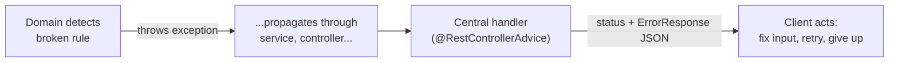
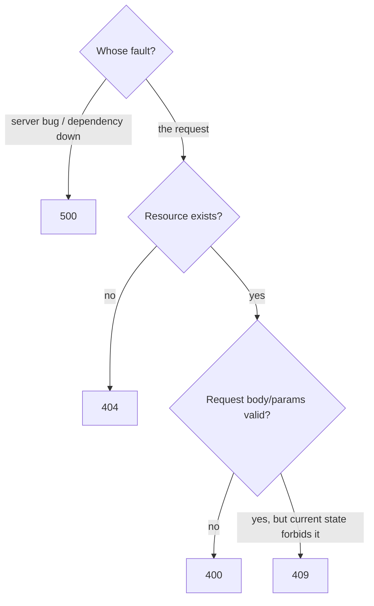

# Error handling and HTTP statuses

How a backend turns "something went wrong in the code" into "a response a client can act on". This is the deep-dive companion to [Step 06](../topics/06-error-handling/README.md); come back to it whenever you're deciding *which status* or *what error shape* a new failure deserves.

## Exceptions as control-flow signals

An exception is a **signal**, not a punishment: it says "this operation cannot continue from here" and carries the evidence (type, message, stack trace) up the call chain until a level that can respond meaningfully. That design has one big consequence for web apps: the place that *detects* a problem (the domain: "you can't deliver a parcel that was never picked up") and the place that *responds* to it (the HTTP layer: "that's a 409") can be far apart, and that's fine. The domain throws; a central handler translates.

Two disciplines make this work (details and hierarchy in [Exceptions in Java](../topics/06-error-handling/exceptions-in-java.md)):

- **Throw specifically.** `IllegalStateException` for a rule the current state breaks, `IllegalArgumentException` for bad input, a custom class (`ParcelNotFoundException`) when a handler must treat the case distinctly. A generic `throw new Exception("error")` gives the handler nothing to map on.
- **Catch only where you can respond.** Intermediate layers that catch "just in case" break the signal before it reaches the translator.

**ParcelPilot tie-in:** `Parcel.changeStatus` throws `IllegalStateException` at the exact line the lifecycle rule breaks; nothing between it and `GlobalErrorHandler` touches the exception.

## Mapping domain errors to HTTP statuses

The status code is the first thing every client, cache, proxy, and monitor reads. The families: **2xx** success, **4xx** "the client's request can't be fulfilled as-is", **5xx** "the server failed". (Quick list of common statuses: [Spring and HTTP](spring-and-http.md).) The hard part is choosing *within* 4xx:

| Ask yourself | Status | ParcelPilot example |
|---|---|---|
| Is the request itself malformed or failing validation? | **400 Bad Request** | `POST /parcels` with a blank `recipient` |
| Is the requested resource missing? | **404 Not Found** | `GET /parcels/NOPE` |
| Is the request fine, but it conflicts with the resource's *current state*? | **409 Conflict** | `PATCH` CREATED → DELIVERED (must be PICKED_UP first) |
| Is the request well-formed but semantically unprocessable? | **422 Unprocessable Content** (mention) | Some APIs use 422 for validation instead of 400; ParcelPilot keeps validation at 400 for simplicity — just recognize 422 when you meet it |
| Did *our* code fail unexpectedly? | **500 Internal Server Error** | Any uncaught exception (the catch-all handler) |

Decision flow for a failed request:

The most common confusion is **400 vs 409**: 400 means "your request would never work" (fix the request); 409 means "your request would work, just not *now*, given the resource's state" (re-read the resource, then decide). A blank recipient is always wrong → 400. Delivering a never-picked-up parcel is wrong *today* → 409.

## `@ControllerAdvice` vs `@RestControllerAdvice`

Both mark a class whose `@ExceptionHandler` methods apply across all controllers. The difference mirrors `@Controller` vs `@RestController`: `@RestControllerAdvice` = `@ControllerAdvice` + `@ResponseBody`, meaning **return values are serialized straight to JSON**. In a JSON API you always want `@RestControllerAdvice`; plain `@ControllerAdvice` is for server-rendered HTML apps where a handler returns a view name (an error *page*). Two rules of precedence worth knowing:

- A local `@ExceptionHandler` **inside a controller** beats the advice for that controller — which is why step 06 *deletes* the local validation handler rather than leaving both.
- Among matching handlers, Spring picks the **most specific exception type**, so a catch-all `Exception` handler never shadows your `ParcelNotFoundException` handler.

## ProblemDetail and RFC 7807, in one paragraph

There is a standardized answer to "what shape should error bodies have": **RFC 7807 "Problem Details for HTTP APIs"**, which defines a JSON format with fields like `type`, `title`, `status`, `detail`, and `instance`, and Spring ships first-class support via the `ProblemDetail` class (return one from a handler, or flip on `spring.mvc.problemdetails.enabled`). It's a fine choice for production APIs, and you should recognize its `application/problem+json` content type in the wild. On the learning path we use our own simpler `ErrorResponse` record instead, because designing the shape yourself — and feeling *why* each field earns its place — teaches more than adopting a standard whose fields you haven't needed yet.

## Designing an error shape

Whatever shape you pick, four principles hold:

1. **One shape everywhere.** The value of an error contract is that clients write the parsing code once. A single exception to the rule (one endpoint with a bare string body) reintroduces per-endpoint handling.
2. **Machine part + human part.** A stable `code` for programs to switch on; a `message` for humans, free to be reworded. Clients that parse messages break on every rewording (see the [lab's stretch section](../topics/06-error-handling/controller-advice-lab.md#stretch-an-error-code-catalog)).
3. **Structured details where fields matter.** Validation errors are *about* fields, so a `details` map (`field → problem`) beats one concatenated sentence. Keep it an empty map otherwise, so the shape never varies.
4. **Say nothing internal.** No stack traces, exception class names, SQL, or file paths — those help attackers and confuse clients. The generic-message-for-500 rule is the sharpest instance of this.

ParcelPilot's contract checks all four with four fields: `code`, `message`, `details`, `path`.

## Anti-patterns: swallowing and disguising errors

| Anti-pattern | What it looks like | Why it hurts |
|---|---|---|
| **Catch-and-ignore** | `catch (Exception e) {}` | The failure still happened; now it surfaces later, far from its cause, with no evidence. ([Best practice §6](java-best-practices.md#6-fail-loudly-and-specifically-with-exceptions)) |
| **Catch-and-print-and-continue** | `catch (Exception e) { e.printStackTrace(); }` then proceed | The code continues in a state the author never reasoned about; the printout scrolls away unstructured (step 07 fixes *where* evidence goes, not the continuing) |
| **200-with-error-flag** | `200 OK` + `{"success": false}` | Lies to every layer that reads statuses: caches store failures, monitors see green, retry logic never fires, and every client must parse every body |
| **Over-broad mapping** | one handler for `RuntimeException` → 400 | Collapses genuinely different failures (bug vs bad input vs conflict) into one status; real bugs hide as client errors |
| **Blame-shifting 4xx** | returning 400 when a dependency timed out | Clients "fix" requests that were never broken; your real failure rate disappears from 5xx dashboards |

The common thread: every anti-pattern trades a moment of convenience for lost information, and lost information is exactly what you'll need at debugging time.

## Which errors may a client retry?

The status code also answers a question you'll care about from step 12 on: **is retrying this request sensible?**

| Status | Retry? | Why |
|---|---|---|
| 400, 404, 409, 422 | **No** (as-is) | The same request will fail the same way; something must change first (fix the input, re-check the state) |
| 500 | Cautiously | Might be transient, might be a bug; blind retries can hammer a struggling server |
| 502, 503, 504 | **Yes, with backoff** | "Temporarily unavailable" is the definition; wait, then retry |
| 429 | Yes, **after waiting** | You were told to slow down (rate limiting, step 15) |

Retrying safely also depends on the method being **idempotent** (see [HTTP methods](../topics/04-first-spring-api/http-methods.md)) — retrying a `POST` can create duplicates. This becomes central in [step 12 (queues)](../topics/12-queues/README.md), where a message consumer *automatically* retries failed work and must know which failures are worth retrying.

## ParcelPilot tie-ins at a glance

| Concept | Where it lives in ParcelPilot |
|---|---|
| Specific domain exceptions | `IllegalStateException` from `Parcel.changeStatus`, `IllegalArgumentException` from constructors (steps 02–04) |
| Custom exception → distinct status | `ParcelNotFoundException` → 404 (step 06) |
| One error contract | the `ErrorResponse` record (step 06) |
| Central translation | `GlobalErrorHandler` `@RestControllerAdvice` (step 06) |
| Validation errors in `details` | re-homed `MethodArgumentNotValidException` handler (steps [05](../topics/05-validation-and-inputs/README.md) → 06) |
| Stack traces belong in logs | catch-all 500 handler + [step 07](../topics/07-logging-and-observability-basics/README.md) |
| Retry-aware failure handling | queue consumers ([step 12](../topics/12-queues/README.md)) |

## See also

- [Step 06: Error handling & HTTP error contracts](../topics/06-error-handling/README.md) — build it
- [Exceptions in Java, from scratch](../topics/06-error-handling/exceptions-in-java.md) — the language mechanics
- [Controller advice lab](../topics/06-error-handling/controller-advice-lab.md) — prove every mapping with `curl`
- [Validation and API contracts](validation-and-api-contracts.md) — the 400s *before* the domain is reached
- [Logging](logging.md) — where the details the client never sees must go
- [Spring and HTTP](spring-and-http.md) — methods, statuses, and controller basics
