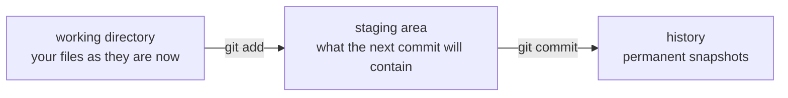

# Git for this course

Git is a **version control system**: a tool that records snapshots of your project so you can look back, compare, and restore any earlier state. This page teaches the *small* slice of Git this course needs — nothing more.

## Why you need it before step 13

At [step 13](../topics/13-split-services/README.md) you split the ParcelPilot monolith into two services. That reshapes the whole project, and [PROJECT-STORY.md](../PROJECT-STORY.md) asks you to **preserve the final monolith as a tagged commit first** — a permanent, named snapshot you can always return to or show someone ("this is what the app looked like before microservices"). Without version control, "preserve" means copy-pasting folders and hoping. With Git, it is one command.

Step 13 has a short companion walkthrough for exactly that moment: [git-tag-checkpoint.md](../topics/13-split-services/git-tag-checkpoint.md). This page is the background reading that makes the walkthrough obvious.

## Key words

| Word | Beginner meaning |
|---|---|
| **Repository (repo)** | A project folder that Git tracks. The history lives in a hidden `.git/` subfolder. |
| **Commit** | One saved snapshot of the project, with a message and a timestamp. |
| **Staging area** | The "shopping cart": files you have marked to go into the *next* commit. |
| **Tag** | A permanent human-readable name pinned to one commit, like `v-step-12-monolith`. |
| **Diff** | The line-by-line difference between two versions of your files. |
| **`.gitignore`** | A file listing what Git should never track (build output, IDE files). |



You edit files in the **working directory**, choose what to snapshot with `git add` (staging), and make the snapshot permanent with `git commit`. Three areas, two commands between them — that is most of Git.

## The minimal command set

All examples run inside your application folder:

```bash
cd applications/parcelpilot
```

### One-time setup: `git init` and `.gitignore`

```bash
git init          # turns this folder into a repository
```

Before the first commit, create a `.gitignore` file **in the same folder** so Git never tracks generated or machine-specific files. A good one for Java + Maven:

```gitignore
# Maven build output — regenerated by every build, never commit
target/

# IDE and editor files — personal, not part of the project
.idea/
*.iml
.vscode/
.settings/
.project
.classpath

# OS noise
.DS_Store
```

### The everyday loop: status, add, commit

```bash
git status                       # what changed since the last commit?
git add .                        # stage everything changed (respects .gitignore)
git commit -m "Step 04: first Spring API returns a parcel as JSON"
```

`git status` is the command you can never overuse. It tells you what is modified, what is staged, and what is untracked — run it before and after every other Git command until the flow feels natural.

### Looking back: log and diff

```bash
git log --oneline                # one line per commit, newest first
git diff                         # what did I change since the last commit?
```

`git diff` is quietly one of the best debugging tools you have: when something worked ten minutes ago and is broken now, the diff shows *exactly* what you changed in between.

### The step-13 moment: tag and show

```bash
git tag v-step-12-monolith       # pin a permanent name to the current commit
git show v-step-12-monolith      # display that commit any time later
git tag                          # list all tags
```

A tag never moves. However much the project changes afterwards, `v-step-12-monolith` will always point at your finished monolith.

## A habit worth building: commit at every green checklist

Every step ends with an acceptance-criteria checklist. The moment every box is ticked, commit:

```bash
git add .
git commit -m "Step 10: parcels survive a container restart"
```

This gives you a clean history where every commit is a *working* state. If step 11 goes sideways, `git diff` shows what you changed since the last known-good snapshot, and you can never lose more than one step of work.

## What NOT to commit

| Never commit | Why |
|---|---|
| `target/` | Build output; regenerated by `mvn package`; huge and noisy in diffs. |
| Secrets (real passwords, tokens, keys) | Git history is forever — deleting the file later does not delete old commits. See [configuration.md](configuration.md) for keeping secrets in environment variables instead. |
| IDE folders (`.idea/`, `.vscode/`) | Personal machine settings, not the project. |

The `.gitignore` above handles the first and third automatically. Secrets are on you: local placeholder values like `change-me` are fine to commit; anything real is not.

## What this page deliberately skips

Git can also do **branches** (parallel lines of work) and **remotes** (synchronizing with a server like GitHub, using `push` and `pull`). Real teams live in those features, and they are worth learning right after this course. For ParcelPilot they are pure overhead: you are one person, on one machine, moving forward one step at a time — a straight line of commits plus one tag is exactly enough.
