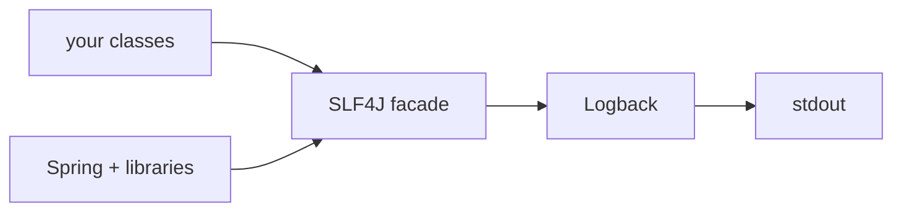

# Logging

Reference deep dive. The hands-on path is [Step 07](../topics/07-logging-and-observability-basics/README.md) with its [level guide](../topics/07-logging-and-observability-basics/slf4j-and-log-levels.md) and [lab](../topics/07-logging-and-observability-basics/logging-lab.md); come here for the fuller picture.

## Why logs exist

A running backend is invisible. Requests arrive, code branches, exceptions fire — and unless the app writes it down, that history is gone the instant it happens. A log exists to answer three questions after the fact:

1. **What happened?** — "parcel P-7 was created", "the catch-all handler caught an `IllegalStateException`".
2. **When?** — timestamps down to the millisecond, so you can match a user's "it broke around 6 pm" to the exact event.
3. **In what order?** — the create came *before* the failed status change; the timeout happened *after* the retry. Ordering is often the whole diagnosis.

Everything else on this page — levels, structure, IDs, retention — is machinery for answering those three questions faster.

## Architecture: SLF4J over Logback

Java code logs through **SLF4J**, a facade (one small stable API), while an implementation — **Logback** in Spring Boot — does the actual formatting and writing. Your code and every library you use share the same funnel, so all output lands in one stream with one format, and the implementation can change without touching code.



```java
private static final Logger log = LoggerFactory.getLogger(ParcelController.class);
log.info("Created parcel {}", id);
```

Conventions that matter: one logger per class, named after the class (pass the class, not a string); levels set in configuration (`logging.level.com.parcelpilot=DEBUG` in `application.properties`), not code. Full walkthrough with the facade diagram and per-level decision table: [SLF4J and log levels](../topics/07-logging-and-observability-basics/slf4j-and-log-levels.md).

## Levels in one table

| Level | One-line rule | ParcelPilot example |
|---|---|---|
| `TRACE` | Step-by-step internals; almost never in app code. | Entering/leaving helper methods |
| `DEBUG` | Developer detail, off in normal operation. | "Filter matched 3 of 12 parcels" |
| `INFO` | The business diary; readable as "what the app did today". | "Created parcel P-7" |
| `WARN` | Handled trouble; the app kept going. | "Rejected DELIVERED → CREATED" |
| `ERROR` | Unexpected failure; a human should look. | Catch-all handler fired, stack trace attached |

Levels are thresholds: at `INFO`, `DEBUG` and `TRACE` lines are dropped before they're formatted.

## Parameterized logging

Always placeholders, never concatenation:

```java
log.info("Created parcel {} for recipient {}", id, recipient);  // built only if the line will be written
log.info("Created parcel " + id);                                // built even when the level is disabled
```

And the stack-trace rule: an exception passed as the **last argument with no `{}`** gets its full stack trace printed; give it a placeholder and the trace is silently lost.

```java
log.error("Unhandled error on {} {}", method, path, e);  // trace printed
log.error("Unhandled error: {}", e);                     // trace LOST
```

## Structured logging (JSON logs)

Everything so far produces lines *for humans*. At scale, logs are read mostly by *machines* — search engines, alerting tools — and machines prefer key-value data. **Structured logging** emits each event as JSON instead of formatted text:

```json
{"timestamp":"2026-07-14T18:22:31.512Z","level":"INFO","logger":"com.parcelpilot.ParcelController","message":"Created parcel","parcelId":"P-7","requestId":"b4f2a91c"}
```

Same event, but now `parcelId` is a *field* you can query exactly ("all events for P-7"), not a substring you hope to grep. Spring Boot 3.4+ can switch to JSON output with a property (`logging.structured.format.console=ecs`); earlier versions use a Logback encoder library.

| Human-readable lines | Structured (JSON) |
|---|---|
| Instantly readable in a terminal | Painful to read raw; needs tooling |
| Fields are conventions, parsed with regex (fragile) | Fields are explicit; exact queries, reliable parsing |
| Fine for local dev and small systems | The default once logs are shipped to a central system |
| Zero setup in Spring Boot | Extra configuration, larger output per line |

Sensible path (and ParcelPilot's): human-readable while developing locally, structured when logs start being collected centrally. Don't switch before you have a tool that benefits.

## MDC and correlation IDs

A busy server interleaves lines from many concurrent requests. The **MDC** (Mapped Diagnostic Context) is a per-thread map of key-values that Logback attaches to every line the thread writes; put a **request ID** in it when a request starts, and every line of that request is stamped:

```java
MDC.put("requestId", requestId);   // in a OncePerRequestFilter, at the start
try {
    chain.doFilter(request, response);
} finally {
    MDC.remove("requestId");       // threads are reused — always clean up
}
```

With the console pattern including `%X{requestId}`, grepping for one ID yields one request's complete story. Step 07's [stretch exercise](../topics/07-logging-and-observability-basics/README.md#build-it-in-parcelpilot) builds exactly this. The idea scales up: once ParcelPilot is split into services (step 13), the same ID must travel *between* services in headers so one story spans processes — that's a **correlation ID**, covered in [step 14's correlation IDs guide](../topics/14-compose-and-observe/correlation-ids.md).

## Log security

Logs are stored longer, copied further, and read by more people than any database table — with none of the access control. Assume everything you log will eventually be seen by someone it wasn't meant for.

| Never log | Consequence if leaked |
|---|---|
| Passwords (including failed attempts) | Account takeover — typos are near-misses of the real password |
| Tokens, JWTs, API keys, session cookies, `Authorization` headers | Anyone with the log can impersonate the caller |
| Full personal data: home addresses, emails, phone numbers, ID numbers | Privacy breach; under GDPR, personal data in logs is regulated data with real legal consequences |
| Full request/response bodies "for debugging" | All of the above, eventually |

Safe habit: log **identifiers** (parcel ID, order number) and look up the sensitive details in the system of record when needed. In ParcelPilot terms: log `parcelId`, never a recipient's street address.

## Log to stdout: the container-era default

Old habit: apps write to log *files* they manage themselves (paths, rotation, permissions). Modern habit, codified by the [twelve-factor app](https://12factor.net/logs) methodology: the app writes to **standard output** and treats logs as an event stream; *the environment* decides where the stream goes. Docker captures container stdout automatically (`docker logs`, see [Docker reference](docker.md)), and platforms forward it to central collectors — all with zero logging code in the app.

Spring Boot's default is already stdout, so ParcelPilot is container-ready without changes: the same lines you read in `mvn spring-boot:run` show up in `docker logs` in [step 09](../topics/09-docker/README.md) and in `docker compose logs` in [step 14](../topics/14-compose-and-observe/README.md). Don't add file appenders inside a container.

## Retention and volume cost

Logs are not free. Every line costs disk (or a per-GB bill from a log service), network to ship, and — the cost people forget — **attention**: a needle is harder to find in a bigger haystack. Real systems set a **retention** policy (keep 7–30 days hot, archive or delete after) and watch volume per service.

The lever you control as a developer is *what you emit*: INFO that reads like a business diary, DEBUG off by default, no per-item lines inside loops (log the summary: "returned 10000 parcels", not 10000 lines). If you need counts and rates, that's a **metric**, not a log — cheaper by orders of magnitude (step 14).

## Anti-patterns

- **Log-and-rethrow.** Catch, `log.error(...)`, then `throw` again — the final handler logs it too, and every failure appears twice (or more), making it look like two incidents. Log an exception at exactly one place: where it is *finally handled*. In ParcelPilot, that's `GlobalErrorHandler`.
- **Swallowing with a log line.** `catch (Exception e) { log.warn("oops"); }` and carrying on — no stack trace, no rethrow, and the app continues in a possibly broken state. If you can't handle it, let it propagate to the handler that can.
- **INFO noise.** Logging every method entry, every layer, every loop pass at INFO. When everything is INFO, operators stop reading — and the one line that mattered scrolls past unseen. Boundary and decision points only.
- **The `{}`-eats-the-exception bug.** `log.error("Failed: {}", e)` — one flat line, stack trace gone. Exception last, no placeholder.
- **Same event logged in every layer.** Controller, domain, and repository each announcing "creating parcel P-7" turns one event into three lines. Pick the boundary.
- **Secrets "just while debugging".** Temporary lines have a way of reaching production. The never-log table has no local-only exception.

## ParcelPilot tie-ins

| Step | What logging does there |
|---|---|
| [07](../topics/07-logging-and-observability-basics/README.md) | INFO at business moments, ERROR + stack trace in `GlobalErrorHandler`, request-ID stretch |
| [08](../topics/08-testing/README.md) | Test failures print alongside app logs, so a red test comes with its story |
| [09](../topics/09-docker/README.md) | stdout logging pays off: `docker logs` shows the same lines with zero config |
| [13](../topics/13-split-services/README.md) | Two services, two log streams — the reason correlation IDs must cross process boundaries |
| [14](../topics/14-compose-and-observe/README.md) | `docker compose logs`, correlation IDs across services, and metrics for the questions logs can't answer |

See also: [Production thinking](production-thinking.md) for where logs sit among health checks, metrics, and traces.
