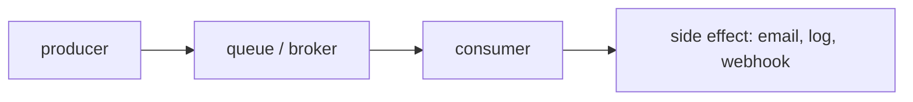

# Messaging and queues

A queue accepts messages from producers and delivers them to consumers later. It decouples the time of the request from the time of slow work.

## Why queue?

For a delivery update, the API needs to save the parcel. It does not need to wait for an email provider. A queue absorbs bursts and lets notification work retry separately.

## Reliability vocabulary

- **At-most-once**: never duplicate, but a message can be lost.
- **At-least-once**: retries can duplicate a message, so your consumer must be idempotent.
- **Exactly-once**: usually a narrow, costly guarantee. Do not assume it across a full distributed workflow.
- **Idempotent**: repeating an operation gives the same final result.
- **Dead-letter queue (DLQ)**: holds messages that repeatedly fail processing.

## RabbitMQ, Kafka, and AWS SQS

**RabbitMQ** is a general broker with queues, routing, acknowledgements, and a simple local Docker experience. Use it first to learn worker and queue mechanics.

**Kafka** is a durable, partitioned event log. Consumers track offsets and can replay events. It fits high-throughput streams, multiple independent consumers, and event retention, but brings more operational and conceptual overhead.

**AWS SQS** is a managed cloud queue. It reduces broker operations and integrates with AWS, but uses polling/visibility-timeout semantics and does not act like Kafka’s replayable log.

### Decision guide: which one, and why

| Broker | Pick it when | Avoid it when |
|---|---|---|
| **RabbitMQ** | you want task queues, routing, easy local setup, and clear ack/retry semantics | you need long event retention/replay of a huge stream |
| **Kafka** | very high throughput, multiple independent consumers, event replay/history | you just need a simple task queue (it's heavier to run and learn) |
| **AWS SQS** | you're on AWS and want zero broker operations | you need Kafka-style replay, or you're not on AWS |

**Why ParcelPilot uses RabbitMQ:** notification delivery is a classic **task queue** (send later, retry on failure), we want to *watch* queues/acks/retries while learning, and it runs in Docker with one command. Kafka's replayable log and SQS's managed cloud model are excellent, just not the simplest fit for this learning goal.

Choose from requirements, not popularity: throughput, ordering scope, replay, delivery semantics, operations budget, and cloud ecosystem.

## The dual-write problem

If code writes “delivered” to the database, then tries to publish an event, a crash between those actions creates inconsistent reality. The **transactional outbox** pattern writes an event record in the same database transaction. A separate publisher then sends that record reliably afterward. Learn the basic queue first, then add this pattern.
