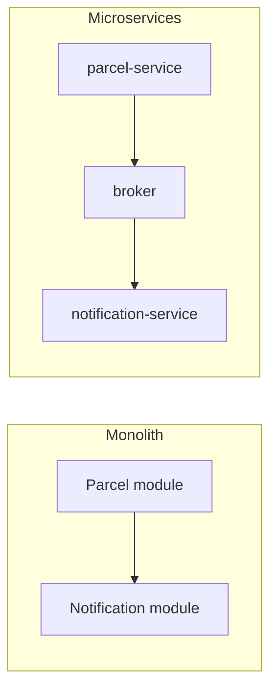

# Monoliths and microservices

## Monolith

A monolith is one deployable application. It can still have clean modules and boundaries.

Benefits:

- one process to run and debug
- no network call between internal features
- simpler local setup, deployment, and data consistency
- easier refactoring early in a product

Costs emerge when unrelated parts need different scaling, deployment frequency, reliability boundaries, or ownership.

## Microservices

Microservices are independently deployed services that communicate over a network or broker.

Benefits:

- deploy and scale an isolated capability
- contain some failures
- allow independent technology or ownership choices

Costs:

- network timeouts and retries
- eventual consistency
- distributed logs, metrics, tracing, and security
- more images, configuration, databases, and deployments

## Extraction rule

Do not split because “microservices are modern.” Extract a capability when it has a clear business boundary and a concrete reason to operate independently. In ParcelPilot, notification delivery is a good first candidate because it is slow, failure-prone, and not required to return a parcel status to the client.

Each service owns its data. Sharing one database creates hidden coupling and prevents independent schema changes.
