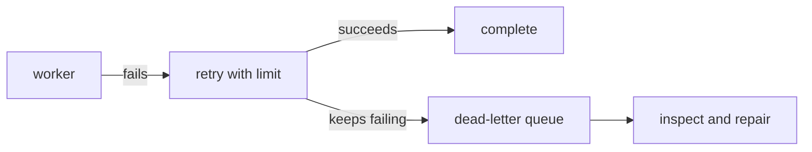

# Production thinking

Running locally is the beginning of operational design, not the end.

## Signals

Every service needs enough evidence to answer:

- Is it alive? **health check**
- Is it getting slower or failing? **metrics**
- What did it do? **structured logs**
- Where did one request travel? **trace / correlation ID**

Spring Boot Actuator gives useful health endpoints. Logs should go to standard output so Docker or a platform can collect them.

## Failure is normal

Networks fail, dependencies restart, and messages arrive more than once. Design explicit behavior:

Never retry forever without delay. It can overload a broken dependency. Set timeouts on network calls. A health check should report a service’s readiness honestly, but should not itself create cascading failure.

## Safe next improvements

After Compose works:

1. add a unique event ID and idempotent consumer storage
2. implement an outbox
3. add metrics and request IDs
4. protect endpoints with authentication
5. document API contracts
6. add integration tests using disposable containers
7. deploy one service at a time to a non-production environment

Production is not “more Docker files.” It is the ability to understand, change, and recover the system safely.
