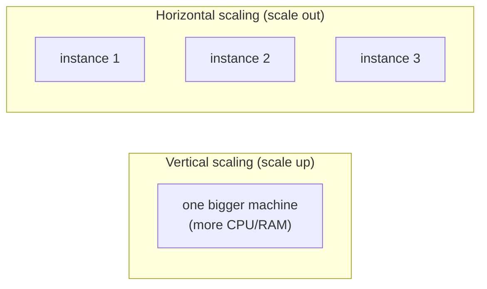
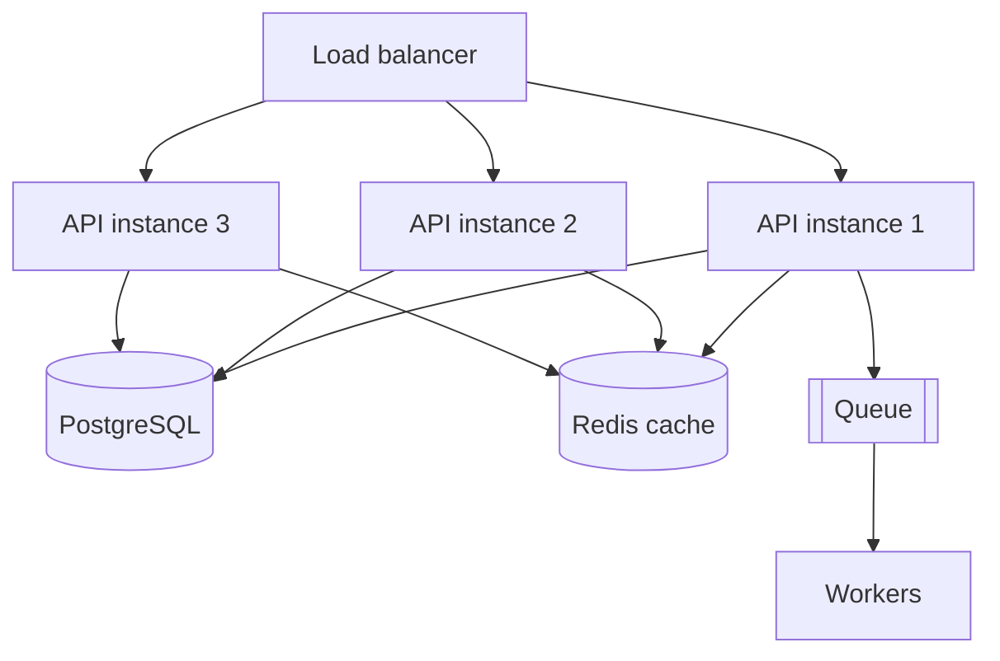

# System design & scaling: the big picture

ParcelPilot is small on purpose, but every step is a real system-design lesson in miniature. This page zooms out: it explains **how backends scale**, ties each ParcelPilot step to the system-design idea behind it, and lists the **advanced topics** to explore after the roadmap. Read it early for orientation, and again at the end when it all connects.

> **Core idea of scaling:** a system scales when you can handle more load *without* rewriting it, by adding resources or moving work around. Good architecture is mostly about keeping the option to do that cheaply.

## Two ways to scale

- **Vertical (scale up):** give one machine more power. Simple, but there's a ceiling and it's a single point of failure.
- **Horizontal (scale out):** run **many copies** behind a load balancer. Nearly unlimited and resilient, but only works if your app is **stateless** (see below). This is what modern systems rely on.

## The property that makes scaling possible: statelessness

If a request's outcome depends on data stored *in one server's memory*, you can't freely add servers, because the next request might hit a different one that doesn't have that data.

**The fix:** keep servers stateless and push state to shared services:

- session/identity → a **JWT** the client carries (Step 16), or a shared session store
- data → the **database** (Step 10)
- cached data → **Redis** (Step 15)
- work to do later → a **queue** (Step 12)

ParcelPilot became stateless the moment parcels moved from an in-memory `Map` into PostgreSQL. That single change is what would let you run ten API instances behind a load balancer.

## The scaling toolkit (and where ParcelPilot meets each)

| Technique | Problem it solves | ParcelPilot step | One-line why |
|---|---|---|---|
| **Stateless app + load balancer** | Handle more traffic, survive an instance dying | 06 (statelessness) | Add identical instances behind one address. |
| **Caching** (Redis) | Repeated reads overload the DB | 11 | Serve hot data from memory, DB stays source of truth. |
| **Asynchronous queues** | Slow work makes requests slow/fragile | 08 | Answer now, do slow work in a worker later. |
| **Rate limiting** | One client floods and starves others | 11 | Cap requests per client, return `429`. |
| **Optimistic locking** | Two writers overwrite each other | 06 / 11 | A `version` check turns a lost update into a `409`. |
| **Database indexing** | Queries slow down as data grows | (advanced) | An index makes lookups fast instead of full scans. |
| **Read replicas** | Read traffic outgrows one DB | (advanced) | Copies serve reads, primary takes writes. |
| **Sharding / partitioning** | Data too big for one DB | (advanced) | Split data across databases by key. |
| **Splitting services** | One part must scale/deploy alone | 09 | Independent scaling and failure isolation. |
| **Idempotency** | Retries/duplicates cause double effects | 08 | Doing it twice equals doing it once. |
| **Observability** | You can't fix what you can't see | 10 | Health, logs, metrics, traces. |
| **Authentication/authorization** | Anyone can call anything | 12 | Prove who you are and what you may do. |

## Reliability: assume everything fails

At scale, failure is normal: networks drop, dependencies restart, messages arrive twice. Design for it:

- **Timeouts** on every network call, so one slow dependency doesn't hang everything.
- **Retries with backoff** (never retry instantly forever, or you'll hammer a struggling service).
- **Dead-letter queues** for messages that keep failing, so they can be inspected, not lost.
- **Circuit breakers** to stop calling a dependency that's clearly down, and recover gracefully.
- **Idempotent** operations so a safe retry can't cause harm.
- **Graceful degradation**: a cached/partial answer beats a hard failure when a non-critical dependency is down.

See [Production thinking](production-thinking.md) for the operational side.

## The data-consistency trade-off (CAP, in plain words)

When data is spread across services/databases, you can't have perfect consistency *and* full availability during a network partition. Most business systems choose **availability + eventual consistency**: services stay up and reconcile shortly after (e.g. the notification service catches up to a delivered parcel via the queue). Know this trade-off exists so you choose it deliberately, not by accident.

## A sensible order to add scale (don't do it all at once)

**Measure first.** Most performance problems are a missing index or an uncached hot read, not "we need microservices". Splitting services to fix a speed problem usually makes it worse.

## Advanced topics (explore after the roadmap)

You'll be ready for these once ParcelPilot is complete. Each solves a specific pressure that appears at larger scale:

**Data & consistency**
- **Transactional outbox**: reliably publish an event *and* commit the DB change together (fixes the dual-write problem from Step 12).
- **CQRS**: separate the write model from optimized read models.
- **Event sourcing**: store the sequence of events as the source of truth.
- **Sagas**: coordinate a multi-service workflow without a distributed transaction.

**Messaging & throughput**
- **Kafka**: high-throughput, replayable event streaming (vs RabbitMQ's task-queue model).
- **Backpressure & consumer groups**: control flow and parallelism for consumers.

**Traffic & resilience**
- **API gateway**: one entry point for auth, routing, and rate limiting across services.
- **Circuit breakers / bulkheads** (e.g. Resilience4j): contain failures.
- **Distributed rate limiting**: a shared counter (Redis) so limits hold across many instances.

**Operations & delivery**
- **Kubernetes**: orchestrate containers across many machines (beyond local Compose).
- **CI/CD pipelines**: build, test, and deploy one service at a time safely.
- **Distributed tracing + correlation IDs**: follow one request across services.
- **Blue-green / canary deploys**: release with a safe rollback.

**Security & contracts**
- **Refresh tokens + revocation**, secret rotation, HTTPS everywhere.
- **API versioning** and contract testing so services evolve without breaking clients.

## See also

- [Monolith and microservices](monolith-and-microservices.md)
- [Messaging and queues](messaging-and-queues.md)
- [Databases, caching, and locking](databases-caching-and-locking.md)
- [Authentication](authentication.md)
- [Production thinking](production-thinking.md)
- [Code organization](code-organization.md)
