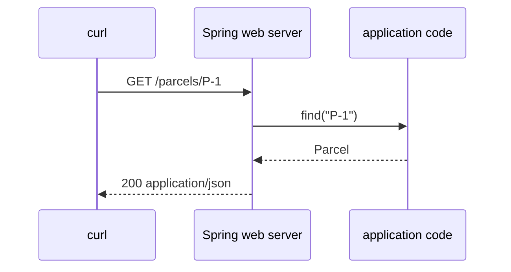

# Spring Boot and HTTP

Spring Boot starts a Java process with an embedded web server. A controller maps an HTTP request to Java code and serializes a Java result as JSON.



## HTTP essentials

| Method | Meaning | Example |
|---|---|---|
| `GET` | read a resource | `GET /parcels/P-1` |
| `POST` | create or command | `POST /parcels` |
| `PUT` | replace a resource | `PUT /parcels/P-1` |
| `PATCH` | partially change | `PATCH /parcels/P-1` |
| `DELETE` | remove | `DELETE /parcels/P-1` |

Useful statuses: `200 OK`, `201 Created`, `204 No Content`, `400 Bad Request`, `404 Not Found`, `409 Conflict`, and `500 Internal Server Error`.

Query parameters are the part after `?`, for example `GET /parcels?status=CREATED`. They filter or shape a read. Do not confuse them with the newer `QUERY` **HTTP method**, which carries complex filter criteria in a request body while staying safe and idempotent — see [HTTP methods explained](../topics/04-first-spring-api/http-methods.md). See also the step 04 [REST API lab](../topics/04-first-spring-api/rest-api.md) for hands-on requests and API trade-offs.

## Dependency injection

Spring creates objects (beans) and supplies declared dependencies. Prefer constructor injection:

```java
class ParcelApplication {
  private final ParcelRepository repository;
  ParcelApplication(ParcelRepository repository) {
    this.repository = repository;
  }
}
```

This is ordinary composition with framework assistance. Avoid field injection because it hides required dependencies and complicates tests.

## Start simple

In the first API, one endpoint class may own an in-memory map. Split into HTTP adapter, use case, domain object, and repository only when their jobs differ. Architecture should clarify behavior, not make a tiny app look enterprise-sized.
