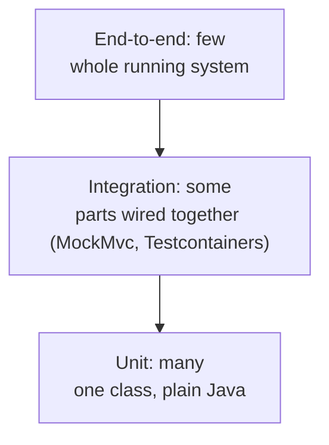

# Testing

Deep-dive reference for automated testing in Java and Spring Boot. Introduced step by step in [topic 03](../topics/03-maven/README.md) (first unit tests) and [topic 08](../topics/08-testing/README.md) (test pyramid, MockMvc, slices). This page is the fuller catalog to return to.

## The test pyramid

A guideline for how many tests of each kind to write. Tests get slower, more fragile, and vaguer in their failures as they cover more of the system — so put most tests at the bottom.



| Level | ParcelPilot example | Question it answers |
|---|---|---|
| Unit | `ParcelTrackerTest` (fake `Clock`, `assertThrows`) | Is this rule correct? |
| Integration | `ParcelControllerTest` (`@WebMvcTest`), `ParcelRepositoryTest` (Testcontainers, after topic 10) | Do the parts connect and honor the contract? |
| E2E | A `curl` create-then-read against the running app/image | Does the assembled system work at all? |

Write each test at the **lowest** level that can catch the bug you're worried about. The inverted shape (many E2E, few unit — the "ice cream cone") is dissected in [unit vs integration vs E2E](../topics/08-testing/unit-vs-integration-vs-e2e.md).

## JUnit 5 essentials

JUnit runs any method annotated `@Test` and reports pass/fail based on assertions. It arrives via the `junit-jupiter` dependency (topic 03) or bundled inside `spring-boot-starter-test` (topic 04 onward).

### Lifecycle annotations

```java
class ParcelTrackerTest {

    @BeforeAll  static void onceBeforeEverything() {}  // e.g. start something expensive (must be static)
    @BeforeEach void beforeEveryTest() {}              // fresh setup per test -> tests stay independent
    @Test       void a_behavior_is_checked() {}
    @AfterEach  void afterEveryTest() {}               // cleanup per test
    @AfterAll   static void onceAfterEverything() {}
}
```

Prefer `@BeforeEach` for creating the objects under test: each test gets a fresh world, which kills a whole family of order-dependence bugs. Reach for `@BeforeAll` only for genuinely expensive shared things (like a Testcontainers database).

### Assertions

```java
assertEquals(Status.DELIVERED, parcel.status());          // expected first, actual second
assertTrue(list.isEmpty());
assertNotNull(found);
assertThrows(IllegalStateException.class,                  // the action MUST throw
        () -> tracker.deliver(parcel));
assertEquals(2, tracker.events().size(),
        "each transition should record one event");        // message shown on failure
```

Every assertion answers: *if this is false, what promise broke?* If you can't answer that, the assertion probably shouldn't be there.

### Parameterized tests (one-pager)

When the same check applies to many inputs, don't copy-paste test methods — feed the inputs in:

```java
@ParameterizedTest
@ValueSource(strings = {"", "   "})
void createParcel_withBlankId_isRejected(String badId) {
    assertThrows(IllegalArgumentException.class, () -> new Parcel(badId, "Ava"));
}

@ParameterizedTest
@CsvSource({
    "CREATED,   DELIVERED, false",   // skipping pickup: illegal
    "CREATED,   PICKED_UP, true",
    "PICKED_UP, DELIVERED, true",
})
void transition_isAllowedOnlyPerTheRules(Status from, Status to, boolean allowed) {
    // one test method, the whole transition table covered
}
```

Requires the `junit-jupiter-params` artifact (included in `junit-jupiter` and in `spring-boot-starter-test`). Each parameter set shows up as its own pass/fail line, so a failure still points at the exact broken case.

## Naming and Given-When-Then

A test name should carry three facts: **what** is exercised, **under which condition**, **what must happen**. Pattern: `method_condition_expectedOutcome`.

```text
createParcel_withBlankRecipient_returns400
getParcel_thatDoesNotExist_returns404WithErrorResponse
deliver_beforePickup_throwsIllegalState
```

If you prefer sentences, `@DisplayName("POST /parcels with a blank recipient returns 400")` on the method does the same job in reports.

Inside the test, keep the **Given-When-Then** order visible: *given* a starting situation, *when* one action runs, *then* assert the outcomes. One action per test — if a test has two "when"s, it's usually two tests. The payoff comes at failure time: a well-named Given-When-Then test that goes red is a bug report that writes itself.

## MockMvc and test slices

A **slice** test loads only part of the Spring application, keeping startup fast while still exercising real Spring wiring.

### `@WebMvcTest` — the web slice

Loads: the named controller(s), every `@RestControllerAdvice`, validation, JSON conversion, and a `MockMvc` instance. Skips: `@Service`/`@Repository` beans and database configuration.

```java
@WebMvcTest(ParcelController.class)
class ParcelControllerTest {

    @Autowired
    private MockMvc mockMvc;

    @Test
    void getParcel_thatDoesNotExist_returns404WithErrorResponse() throws Exception {
        mockMvc.perform(get("/parcels/does-not-exist"))
                .andExpect(status().isNotFound())
                .andExpect(jsonPath("$.code").value("PARCEL_NOT_FOUND"));
    }
}
```

MockMvc performs a *simulated* HTTP request: no port and no real network, but routing, `@Valid`, Jackson, and the error handler all genuinely run. Debug tip: chain `.andDo(print())` to dump the full request/response. Full walk-through: the [MockMvc lab](../topics/08-testing/mockmvc-lab.md).

### `@DataJpaTest` — the persistence slice (from topic 10 on)

Loads: entities, repositories, and a database connection. Skips: controllers and the web layer. By default it swaps in an embedded database — override that with Testcontainers (below) to test against real PostgreSQL.

### Providing missing beans: `@MockBean`

Once ParcelPilot has a `ParcelRepository` (topic 10), a `@WebMvcTest` will fail to start: the controller needs a repository bean and the web slice doesn't create one. `@MockBean` fills the hole with a Mockito mock:

```java
@WebMvcTest(ParcelController.class)
class ParcelControllerTest {

    @Autowired
    private MockMvc mockMvc;

    @MockBean
    private ParcelRepository repository;   // fake repository injected into the slice

    @Test
    void getParcel_thatDoesNotExist_returns404() throws Exception {
        when(repository.findById("nope")).thenReturn(Optional.empty());  // script the fake

        mockMvc.perform(get("/parcels/nope"))
                .andExpect(status().isNotFound());
    }
}
```

## Mockito in one section

**Mockito** (bundled in `spring-boot-starter-test`) creates stand-in objects you can script and inspect:

```java
ParcelRepository repository = mock(ParcelRepository.class);

when(repository.findById("P-1"))                       // scripting: "when asked X, answer Y"
        .thenReturn(Optional.of(someParcel));

verify(repository).save(any(ParcelEntity.class));      // inspecting: "was save(...) called?"
```

Mock what is **slow, external, or not yet built** — a database in a web-slice test, a remote service, a clock. **Over-mocking warning:** never mock the thing the test claims to verify, and be suspicious of tests where every collaborator is a mock — they verify your scripting, not your code, and stay green while the real wiring is broken. A concrete bad-example/good-example pair is in [unit vs integration vs E2E](../topics/08-testing/unit-vs-integration-vs-e2e.md). Note also that ParcelPilot's `FixedClock` from topic 02 needed no Mockito: a tiny hand-written fake of a one-method interface is often simpler and clearer than a mock.

## `@SpringBootTest`

Loads the **entire** application context — every bean, every configuration — optionally on a real port:

```java
@SpringBootTest(webEnvironment = SpringBootTest.WebEnvironment.RANDOM_PORT)
class ApplicationSmokeTest {

    @Test
    void contextLoads() {}   // fails if any bean/config is broken -> a cheap whole-app check
}
```

Use it sparingly: each distinct context configuration costs a full application startup. Good uses: one `contextLoads` smoke test, and a small number of whole-app flows that genuinely span layers. Bad use: as the default annotation on every test class — that's how a suite drifts from seconds to minutes and stops being run.

## Testcontainers

Starts real infrastructure (for us: PostgreSQL) in throwaway Docker containers per test run, so repository tests hit the same engine as production instead of an in-memory imitation like H2 whose SQL dialect differs. Requires Docker (topic 09) and a database to test (topic 10).

Key pieces: `@Testcontainers` + a `@Container PostgreSQLContainer` field to manage the container's lifecycle, `@DynamicPropertySource` to hand Spring the container's random port and credentials, and `Replace.NONE` on `@DataJpaTest` so Spring doesn't swap the container out for an embedded database. Full code, proof commands, and the H2-lies-to-you argument: the [Testcontainers lab](../topics/08-testing/testcontainers-lab.md).

## Flaky tests: causes and avoidance

A **flaky** test passes and fails without any code change. Flaky tests are poison: once "just re-run it" becomes normal, red stops meaning anything. The usual causes:

| Cause | Example | Avoidance |
|---|---|---|
| Real time | Asserting on `Instant.now()`, or code behaving differently at midnight | Inject a `Clock` and use a fixed fake (topic 02's design exists for this) |
| Order dependence | Test B only passes because test A created a parcel first | Each test creates its own data; never assume execution order |
| Shared mutable state | Two tests reuse parcel id `P-1` in the controller's map | Unique ids per test; fresh objects in `@BeforeEach` |
| `Thread.sleep` waits | "Sleep 500 ms and hope the async work finished" | Wait for a *condition* (e.g. poll with a timeout via a library like Awaitility), never a fixed duration |
| Environment leakage | Test depends on a locally running database or a hard-coded port | Testcontainers for infrastructure; random ports |

When a flaky test appears, fix it or delete it the same day. Quarantining flakiness "for later" trains the team to ignore failures.

## What NOT to test

- **The framework.** Spring routes requests, parses JSON, and injects beans; JUnit runs tests. Millions of projects verify this daily — your suite shouldn't.
- **Trivial code.** Getters, setters, and `record` accessors with no logic.
- **Private methods directly.** Test the public behavior; private helpers are covered through it. Wanting to test a private method directly is usually a hint the logic deserves its own class.
- **The same fact at multiple levels.** The transition table is exhaustively unit-tested; the HTTP layer needs *one* test that an illegal transition becomes a `409`, not the whole table again.
- **Every case as E2E.** Once MockMvc pins the contract, duplicate E2E checks add runtime, flakiness, and no information.

## CI: tests that run without being asked

Continuous Integration (mentioned since topic 03) is a server that runs `mvn test` automatically on every push, so "it passed on my machine" stops being the last word — the suite runs on a neutral machine, every time, and a red build blocks the change from merging. Everything on this page feeds that: fast pyramids keep CI feedback in minutes, Testcontainers gives CI a real database (the CI machine only needs Docker), and zero tolerance for flakiness keeps a red build meaningful.

## ParcelPilot tie-ins

| Topic | What it added to testing |
|---|---|
| [02](../topics/02-oop-and-composition/README.md) | The injectable `Clock` — the design decision that makes time testable |
| [03](../topics/03-maven/README.md) | First unit tests, `assertThrows`, `mvn test` as the single command |
| [08](../topics/08-testing/README.md) | The pyramid, Given-When-Then naming, MockMvc contract tests for 201/400/404/409 |
| 10 (persistence) | A real database — and with it the [Testcontainers lab](../topics/08-testing/testcontainers-lab.md) |
| 11 (monolith) | The refactor that the topic 08 suite makes safe: green tests = unchanged API behavior |
