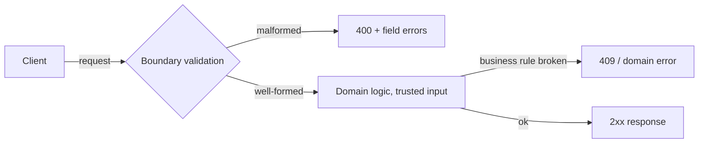

# Validation and API contracts

An API contract is the agreement between an API and its clients: which requests are valid, what responses look like, and what happens when rules are broken. Validation is how the server *enforces* its side of that contract — and how it tells clients, precisely and kindly, when they broke theirs.



## What is an API contract?

Everything a client must know to use your API correctly: paths and methods, required fields and their formats, response shapes, and the meaning of each status code. Some of it is written down (docs, examples), and some is only enforced in code — but it all *is* the contract, because clients build against observed behavior. If `POST /parcels` accepts a blank recipient today and rejects it tomorrow, you changed the contract, whether or not any document said so.

Two practical consequences:

- **Validation rules are part of the contract.** Adding `@NotBlank` is a contract change; think of it that way when you tighten rules on a live API.
- **Error messages are part of the contract too.** Clients parse them, display them, sometimes branch on them. Design them deliberately (see below), don't leave them to framework defaults.

## Boundary validation: validate at the edges, trust inside

The core philosophy: check external input **once**, at the point where it enters your system — the HTTP endpoints — and let everything behind that checkpoint work with trusted data.

- **At the edge**, be strict and helpful: reject malformed requests with `400` and field-level messages. This is where mistakes are cheapest to catch and easiest to explain.
- **Inside**, don't re-check the same shape rules at every layer. A service method that re-validates "recipient not blank" after the controller already did is noise, and the two copies will eventually disagree.
- **The exception that proves the rule:** invariants that must hold *no matter who calls* — like "a `Parcel` never exists without an id" or "status transitions follow CREATED → PICKED_UP → DELIVERED" — belong in the domain object itself, because HTTP is not the only entry (tests, schedulers, and later message consumers all construct domain objects).

So it's not "validate once, period" — it's *shape checks at the boundary, invariants in the domain, nothing duplicated in between*.

For service-to-service calls inside a system you own, the same logic applies: the *original* external boundary validates; internal hops can trust the sender. Re-validating everything on every hop buys little and costs consistency.

## Bean Validation in one screen

Java's standard for declaring field rules (`jakarta.validation`, implemented by Hibernate Validator, pulled in via `spring-boot-starter-validation`):

```java
public record CreateParcelRequest(
        @NotBlank @Pattern(regexp = "P-\\d+") String id,
        @NotBlank @Size(max = 100) String recipient
) {}
```

```java
@PostMapping
ResponseEntity<ParcelResponse> create(@Valid @RequestBody CreateParcelRequest req) { ... }
```

Constraints live on the DTO; `@Valid` on the `@RequestBody` makes Spring run them after JSON parsing and before your method. Failures throw `MethodArgumentNotValidException`, which you translate into a `400` with field errors. The full walkthrough (lifecycle diagram, constraint tour, custom constraints) is in [Bean Validation explained](../topics/05-validation-and-inputs/bean-validation-explained.md); the hands-on build is [Step 05](../topics/05-validation-and-inputs/README.md).

## Designing good error messages

When validation fails, the response is a product surface: a developer on the other end will read it at 2 a.m. and decide whether your API is pleasant or maddening. Aim for all four qualities at once:

| Quality | Meaning | Example |
|---|---|---|
| **Field-level** | Name every bad field, not just "invalid request" | `{"recipient": "...", "id": "..."}` |
| **Machine-readable** | Stable structure a program can parse and map to form fields | consistent JSON keys, one schema everywhere |
| **Human-readable** | A sentence a person can act on, ideally with a valid example | `"id must look like P-1, P-42, ..."` |
| **No internals leaked** | No stack traces, class names, SQL, or file paths | never `"IllegalArgumentException in ParcelValidator.java:42"` |

Leaking internals is worse than unhelpful — stack traces and query fragments hand attackers a map of your system. The client needs to know what to *fix*, never how your server is built.

And report **all** failures in one response. A client that fixes the id, resubmits, and only then learns the recipient was also bad will resent every round-trip. Bean Validation collects all violations in one pass for exactly this reason.

## DTO validation vs domain validation

Two kinds of rules, two homes:

| | Boundary (DTO) | Domain (entity/object) |
|---|---|---|
| **Question** | "Is this request well-formed?" | "Is this operation ever allowed?" |
| **Example** | recipient not blank, id matches `P-\d+` | no `DELIVERED` before `PICKED_UP` |
| **Knows about** | one request, in isolation | the object's current state |
| **Failure becomes** | `400` + field errors | domain exception → e.g. `409 Conflict` |
| **Protects against** | careless clients | *every* caller, including your own code |

One firm rule: **never validate a persistence entity from HTTP directly.** A JPA entity (databases arrive in [Step 10](../topics/10-persistence/README.md)) models how data is *stored*; a DTO models what clients *send*. Hanging HTTP validation on the entity welds the API contract to the database schema — then every storage refactor is silently an API change, and every API rule constrains your storage. Keep a DTO in between; it looks like duplication and is actually decoupling.

## Consistency of messages

Rules and wording drift when they're scattered. Cheap habits that prevent it:

- One phrasing pattern for one kind of rule, everywhere: if blank recipients get `"recipient must not be blank"`, blank ids get `"id must not be blank"` — not `"missing id"` on one endpoint and `"id is required"` on another.
- If the same rule appears in several DTOs, give it one home: a shared constant for the regex, or a custom constraint like `@ValidParcelId` that carries its own message.
- One error *schema* for the whole API — the same JSON shape for validation failures, missing resources, and conflicts. Getting there is [Step 06](../topics/06-error-handling/README.md)'s job, and the status-code side of the story is in [Error handling and HTTP statuses](error-handling-and-http-statuses.md).

## Pros and cons

| Pros | Cons |
|---|---|
| Bad input fails fast, at the cheapest place to fix | Boundary and domain rules can drift apart if unmanaged |
| Clients get actionable, field-level feedback | Message wording becomes a compatibility concern |
| Domain and storage stay free of garbage | Annotations can't express cross-field or stateful rules |
| Declarative rules are readable and hard to forget | Another dependency, another concept for the team |

## ParcelPilot tie-in

At [Step 05](../topics/05-validation-and-inputs/README.md), ParcelPilot's boundary is `POST /parcels` and `PATCH /parcels/{id}/status`. Constraints on `CreateParcelRequest` turn `{}` into a `400` naming both fields instead of a `500` from the `Parcel` constructor; the constructor keeps its own checks as the domain's last line of defense; and the transition rule (`409` on illegal status change) stays in `Parcel`, because it needs the parcel's current state. Later steps raise the stakes: persistence ([Step 10](../topics/10-persistence/README.md)) makes stored garbage permanent, and splitting into services ([Step 13](../topics/13-split-services/README.md)) makes "which boundary validates?" a real architectural question.

## Where to go

- Build it: [Step 05: validation and trustworthy inputs](../topics/05-validation-and-inputs/README.md) · [validation lab](../topics/05-validation-and-inputs/validation-lab.md)
- Mechanics: [Bean Validation explained](../topics/05-validation-and-inputs/bean-validation-explained.md)
- What happens when things go wrong anyway: [Error handling and HTTP statuses](error-handling-and-http-statuses.md)
