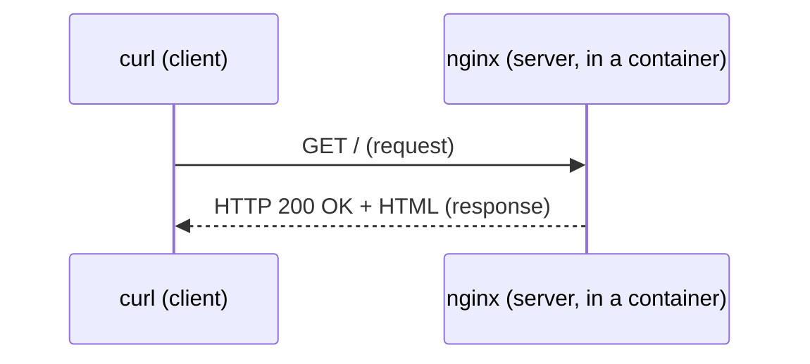

# Step 00: Your tools (no Java yet)

> In this step: prove you can run a server, talk to it, and stop it. ~20 minutes. Zero code.

## The problem right now

You have an empty `applications/` folder and, maybe, zero programming experience. Before writing Java, you need to be comfortable with the three tools you will use in *every* later step. If these feel like magic, everything after will feel like magic too.

## Key words

| Word | Beginner meaning |
|---|---|
| **Terminal** | A text window where you type commands instead of clicking buttons. |
| **Command** | One instruction you type and run, e.g. `curl ...`. |
| **Server** | A program that waits for requests and sends back responses. |
| **Client** | Anything that sends a request to a server (here: `curl`). |
| **HTTP** | The language clients and servers use to talk over a network. |
| **Request / Response** | You ask (request), and the server answers (response). |
| **Port** | A numbered "door" on a computer, e.g. `8080`, so traffic reaches the right program. |
| **Image** | A frozen, ready-to-run package of a program (like an app installer). |
| **Container** | A running copy of an image, isolated from the rest of your machine. |
| **Docker** | The tool that downloads images and runs them as containers. |

## What is HTTP (in one picture)?

When you open a website, your browser sends an HTTP **request** ("give me this page") and the server sends an HTTP **response** (the page + a status code like `200 OK`). `curl` does the same thing as a browser, but in the terminal so you can see the raw result.



## Why use Docker at all?

**The problem it solves:** software normally needs installation, correct versions, and matching settings. That breaks with "works on my machine" surprises. Docker packages a program + everything it needs into an **image**, so it runs the same anywhere.

**Pros:** same behavior on every machine, nothing permanently installed, and easy to throw away and retry.
**Cons:** an extra tool to learn, images take disk space, and a running container disappears (including any data inside it) unless you plan for that. That last fact matters a lot at step 06.

**Real-world example:** a company runs the exact same database image on a laptop, in tests, and in production. No one has to install the database by hand three times.

## First: check your tools are installed

Run each command. Each should print a version (exact numbers may differ). If one says "command not found", install that tool before continuing.

```bash
java -version      # need Java (JDK) 21+   -> see GUIDE.md Install (Ubuntu)
mvn -version       # need Maven            -> sudo apt install -y maven
docker --version   # need Docker Engine    -> sudo apt install -y docker.io docker-compose-v2
curl --version     # need curl             -> preinstalled on Ubuntu
```

Optional but handy: `jq --version` (formats JSON nicely in the terminal).

## Build it in ParcelPilot

Nothing to build yet. Just operate the tools.

1. Start a throwaway web server (Docker downloads `nginx` the first time):

```bash
docker run --rm -p 8080:80 nginx:alpine
```

`-p 8080:80` connects your machine's port `8080` to port `80` inside the container. `--rm` deletes the container when it stops.

2. Open a **second** terminal and call it:

```bash
curl -i http://localhost:8080
```

3. Go back to the first terminal and press `Ctrl+C` to stop the server. Run `curl` again and watch it fail. The server is gone.

## Test it

Run the `curl` command while the container is up.

## Acceptance criteria

- [ ] `java -version`, `mvn -version`, `docker --version`, and `curl --version` all print a version.
- [ ] `docker run ...` starts and stays running in terminal 1.
- [ ] `curl -i http://localhost:8080` prints a first line containing `HTTP/1.1 200`.
- [ ] After `Ctrl+C`, `curl` fails to connect (proving the response only exists while the container runs).
- [ ] You can explain, in one sentence, the difference between an **image** and a **container**.

## Say it like a developer

Practice phrasing these the way engineers do:

- "I sent a **GET request** to `localhost:8080` and got back a **200 OK response**."
- "Docker pulled the **image** and ran it as a **container**."
- "I **mapped** host port `8080` to the container's port `80` with `-p 8080:80`."
- "`curl` is the **client**, and nginx is the **server**."
- "When I stopped the container, the server was gone. The response only exists **while the container runs**."

## Quiz: check yourself

Answer out loud before opening each toggle.

1. What is the difference between an **image** and a **container**?

<details><summary>Show answer</summary>

An image is the **frozen, ready-to-run package** on disk (like an app installer). A container is **one running copy** of that image. You can start many containers from the same image.

</details>

2. In `curl -i http://localhost:8080`, who is the **client** and who is the **server**?

<details><summary>Show answer</summary>

`curl` is the client (it sends the request). The program inside the container (nginx) is the server (it sends back the response).

</details>

3. What does the `-p 8080:80` flag do?

<details><summary>Show answer</summary>

It maps port `8080` on your machine to port `80` inside the container, so traffic you send to `localhost:8080` reaches the program listening on `80` in the container.

</details>

4. What problem does Docker solve?

<details><summary>Show answer</summary>

The "works on my machine" problem. Docker packages a program plus everything it needs into an image, so it runs the same way on any machine that has Docker, with no manual install of matching versions and settings.

</details>

5. Why did `curl` fail after you pressed `Ctrl+C`?

<details><summary>Show answer</summary>

`Ctrl+C` stopped the container, so the server no longer exists. A response only exists while something is running and listening on that port.

</details>

## Reflect

You never installed nginx on your computer. Docker fetched an image and ran it. Notice that when the container stops, *everything* about it is gone. Hold that thought for step 06.

## Next

[Step 01](../01-java-basics/README.md): write your first Java so ParcelPilot can describe a single parcel.
