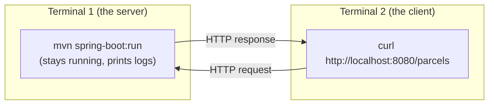

# Editor and terminal setup

> Two decisions before you write any code: which editor to use, and how to run the two-terminal workflow this whole course is built on. ~15 minutes.

## The problem

You need somewhere to *write* code and somewhere to *run* it. Beginners often blur the two: they write in an IDE, press its green Run button, and never learn what actually happens. Then the first time something must run without the IDE — in Docker, on a server, in CI — they're lost.

## The solution

Pick **one editor** (either option below is genuinely fine) and do all *running* in the **terminal**. The course never requires an IDE run-button: every build, run, and test is a shell command you could type on any machine.

## Key words

| Word | Beginner meaning |
|---|---|
| **Editor** | The program you type code into (with helpers like syntax coloring). |
| **IDE** | "Integrated Development Environment": an editor plus built-in build/run/debug tools. |
| **Extension / plugin** | An add-on that teaches an editor a new language or skill. |
| **Tab / pane** | A second terminal inside the same window, so you can see both at once. |
| **Working directory** | The folder your terminal is currently "standing in" — commands run relative to it. |

## Choosing an editor

Both options below understand Java, flag errors as you type, and have a debugger. Pick one and move on — the editor matters far less than the code you write in it.

| | IntelliJ IDEA Community (recommended) | VS Code + "Extension Pack for Java" |
|---|---|---|
| What it is | A full Java IDE, free Community edition | A lightweight editor with Java added via extensions |
| Java smarts | Best-in-class: refactoring, quick-fixes, deep Maven support | Very good, slightly less polished for Java |
| Weight | Heavier install, more memory | Light, fast to start |
| Also good for | Mostly JVM languages | Everything (great if you already use it) |
| Setup | Install, open the project folder, done | Install VS Code, add the **Extension Pack for Java** |
| Pick it if… | Java is your focus and your machine can spare the RAM | You want one editor for many languages, or a lighter tool |

Downloads: [IntelliJ IDEA Community](https://www.jetbrains.com/idea/download/) · [VS Code](https://code.visualstudio.com/) (then install the *Extension Pack for Java* from the Extensions panel).

> **On Windows with WSL2?** Open the project *through* WSL: in VS Code use the "WSL" remote extension (an Ubuntu terminal tab, `cd` to your project, `code .`); IntelliJ can open `\\wsl$\Ubuntu\home\you\projects\...` paths. Your files stay in the fast Linux filesystem (see [Install on Windows](install-windows.md)).

## The two-terminal workflow (you'll use this every single step)

Almost every step of this course has the same shape: **terminal 1 runs a server, terminal 2 talks to it.** A server *occupies* its terminal — while it's running, that terminal shows logs and won't accept new commands. So you need a second one.



You already did exactly this in [step 00](README.md): `docker run` in terminal 1, `curl` in terminal 2. From step 04 onward terminal 1 usually runs `mvn spring-boot:run`.

### How to open a second terminal

| Where you are | How |
|---|---|
| macOS Terminal.app | `Cmd+T` for a new tab |
| iTerm2 (macOS) | `Cmd+T` tab, or `Cmd+D` to split the window |
| Windows Terminal | `Ctrl+Shift+T` new tab (make sure it's an **Ubuntu** tab), or `Alt+Shift+D` to split |
| GNOME Terminal (Ubuntu) | `Ctrl+Shift+T` for a new tab |
| IntelliJ built-in terminal | View → Tool Windows → Terminal, then the `+` for a second tab |
| VS Code built-in terminal | `` Ctrl+` `` to open, then the `+` (or split icon) for a second one |

Using the editor's built-in terminal is completely fine — it's a real terminal. The only rule: both terminals should be in the project folder (`cd` there in each).

## Terminal survival kit (recap)

You met these in step 00; here they are in one place:

```bash
pwd            # print which folder I'm standing in
ls             # list what's in this folder (ls -la shows more)
cd myfolder    # move into a folder;  cd ..  moves up one;  cd ~  goes home
mkdir -p a/b   # create folders (with parents)
cat file.txt   # print a file's contents
```

And the three habits that matter most:

- **`Ctrl+C` stops the running program** in that terminal (that's how you stop a server). It does not "copy" in the terminal.
- **Arrow keys `↑`/`↓` scroll through your command history** — retype nothing. `history` shows the full list.
- **`Tab` auto-completes** file and folder names. Type `cd par` + `Tab` instead of spelling out `parcelpilot`.

## Why the course never requires IDE run-buttons

The green Run button works — until it doesn't. It hides *what* is actually executed, its configuration lives inside your IDE (invisible to teammates, servers, and Docker), and "it runs in my IDE" is not reproducible.

Everything in this course is a shell command (`javac`/`java`, later `mvn test`, `mvn spring-boot:run`, `docker run`, `docker compose up`) because:

- **Reproducible**: the same command works on any machine — including the Docker containers and CI pipelines of later steps, where there *is* no IDE.
- **Understandable**: you see the real tool being invoked, not a button labeled with magic.
- **Debuggable**: when a command fails, the error is right there in the terminal.

Use the IDE for what it's great at — writing, navigating, refactoring, and (from [debugging your first program](../01-java-basics/debugging-your-first-program.md)) its debugger. Run things in the terminal.

## Pros and cons

| Choice | Pros | Cons |
|---|---|---|
| IntelliJ Community | Strongest Java assistance, great debugger | Heavier, one more tool to learn |
| VS Code + Java pack | Light, universal, good enough | Slightly weaker Java refactoring |
| Terminal-first running | Reproducible anywhere, no hidden config | Feels slower than a button for the first week |

## Next

Back to [Step 00](README.md) if you haven't finished it, then on to [Step 01](../01-java-basics/README.md) to write your first Java. Install help: [macOS](install-macos.md) · [Windows](install-windows.md) · Ubuntu is in [GUIDE.md](../../GUIDE.md).
