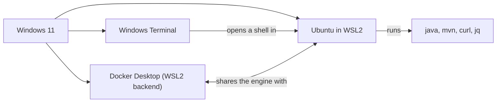

# Install on Windows (WSL2 recommended)

> Read this instead of the Ubuntu install section in [GUIDE.md](../../GUIDE.md) if you're on Windows. The recommended path gives you a real Ubuntu inside Windows, so every command in this course works exactly as written. ~30–45 minutes including one reboot.

## The problem

This course is written for a Linux-style terminal: `apt`, `bash`, the way Docker networking behaves, the exact `curl` flags. Native Windows *can* run Java and Docker, but you'd be constantly translating commands and fighting small differences. There's a better way.

## The solution: WSL2 (Windows Subsystem for Linux)

**WSL2** runs a genuine Ubuntu Linux inside Windows, with its own terminal, filesystem, and package manager — no dual-boot, no separate machine. You then follow the course's Ubuntu instructions **unchanged**.



## Key words

| Word | Beginner meaning |
|---|---|
| **WSL2** | "Windows Subsystem for Linux": a real Linux kernel running inside Windows. |
| **Distro** | The Linux flavor you install into WSL — here, **Ubuntu**. |
| **Windows Terminal** | Microsoft's modern terminal app with tabs; the nicest way to open Ubuntu shells. |
| **Virtualization** | The CPU feature that lets one OS host another. WSL2 needs it enabled. |
| **Line endings** | Windows ends text lines with `CRLF`, Linux with `LF`. Mixing them breaks scripts. |

## Step 1: install WSL2 + Ubuntu

Open **PowerShell as Administrator** (right-click the Start button → "Terminal (Admin)") and run:

```powershell
wsl --install
```

This enables WSL2 and installs Ubuntu in one go. **Reboot when it asks.** After the reboot, an Ubuntu window opens and asks you to pick a Linux username and password (this is separate from your Windows login — remember it, `sudo` will ask for it).

> Already had WSL from years ago? Run `wsl --update` and check `wsl --status` says default version 2.

## Step 2: install Docker Desktop (WSL2 backend)

Download [Docker Desktop for Windows](https://www.docker.com/products/docker-desktop/) and install it. During setup, keep **"Use WSL 2 based engine"** checked (it's the default). Then in Docker Desktop's **Settings → Resources → WSL integration**, make sure integration with your **Ubuntu** distro is enabled.

Result: you run `docker ...` commands **inside the Ubuntu terminal**, and Docker Desktop provides the engine. You do *not* `apt install docker.io` inside WSL — Docker Desktop replaces that.

> Like on macOS, Docker commands only work while Docker Desktop is running.

## Step 3: pick your terminal

Install **Windows Terminal** from the Microsoft Store (Windows 11 ships with it). It gives you tabs and profiles: click the `˅` next to the new-tab button and choose **Ubuntu**. Every terminal command in this course is typed into an **Ubuntu** tab, never PowerShell.

## Step 4: install the course tools inside Ubuntu

Open an Ubuntu tab and follow the **Install (Ubuntu)** section of [GUIDE.md](../../GUIDE.md), *skipping the Docker packages* (Docker Desktop already covers that):

```bash
sudo apt update
sudo apt install -y curl jq openjdk-21-jdk maven
```

## The one performance rule: keep files inside WSL

WSL can see your Windows drives at `/mnt/c/...`, and it's tempting to put your project there. **Don't.** File access across the Windows↔Linux boundary is dramatically slower (a Maven build can take several times longer), and file-watching tools misbehave.

Keep the project in your Linux home directory instead:

```bash
cd ~                      # your LINUX home, e.g. /home/you — fast
mkdir -p projects && cd projects
# clone / create the course project here, NOT under /mnt/c
```

You can still open those files from Windows: in an Ubuntu tab, `explorer.exe .` opens the current Linux folder in Windows Explorer, and editors like VS Code and IntelliJ can open WSL folders directly (see [Editor and terminal](editor-and-terminal.md)).

## Proof: check that everything works

In an **Ubuntu** tab (Docker Desktop running):

```bash
# Java & build
java -version          # → 21.x
javac -version         # → confirms full JDK (not JRE-only)
mvn -version           # → Maven 3.x using Java 21

# HTTP tools
curl --version
jq --version           # optional

# Docker (provided by Docker Desktop)
docker --version
docker compose version
docker info            # → must succeed, proves the engine is running
```

Smoke tests:

```bash
docker run --rm hello-world
curl -s -o /dev/null -w "%{http_code}\n" https://example.com   # → 200
```

## The alternative: native Windows (more friction)

If you can't use WSL2 (e.g. a locked-down machine), the course *can* be done natively, but expect to translate shell commands yourself:

1. **JDK 21**: `winget install EclipseAdoptium.Temurin.21.JDK` (or download from [adoptium.net](https://adoptium.net)).
2. **Maven**: download the binary zip from [maven.apache.org](https://maven.apache.org/download.cgi), unzip it somewhere permanent, and add its `bin` folder to your **PATH** (Settings → "Edit environment variables for your account").
3. **curl** ships with Windows 10/11; install **jq** with `winget install jqlang.jq`.
4. **Docker Desktop** as above.

Honest assessment: this path works, but `bash`-isms in commands, path separators, and line endings will each cost you debugging time. WSL2 is less total effort.

## Troubleshooting (Windows-specific)

| Symptom | Fix |
| --- | --- |
| `wsl --install` fails or WSL says virtualization is unavailable | Enable virtualization (Intel VT-x / AMD-V, sometimes called "SVM") in your BIOS/UEFI settings, then retry. |
| WSL errors about kernel version / old components | Run `wsl --update` in PowerShell, then `wsl --shutdown` and reopen Ubuntu. |
| `docker: command not found` inside Ubuntu | Docker Desktop isn't running, or WSL integration for your Ubuntu distro is off (Settings → Resources → WSL integration). |
| Builds are mysteriously slow | Your project lives under `/mnt/c/...`. Move it into the Linux filesystem (`~/projects/...`). |
| Scripts fail with `\r: command not found` or weird `^M` characters | Windows line endings crept in. Set git to not convert: `git config --global core.autocrlf input`, and re-checkout the affected files. |

## Pros and cons of the WSL2 path

| Pros | Cons |
|---|---|
| Course commands work exactly as written | One-time setup with a reboot |
| Real Linux skills that transfer to servers | Two filesystems to keep straight (keep code in `~`) |
| Docker Desktop integrates cleanly | Needs virtualization enabled and decent RAM |

## Next

- Back to [Step 00](README.md) to prove the tools work (run a server, `curl` it, stop it).
- Choosing an editor and setting up the two-terminal workflow: [Editor and terminal](editor-and-terminal.md).
- On a Mac instead? See [Install on macOS](install-macos.md).
