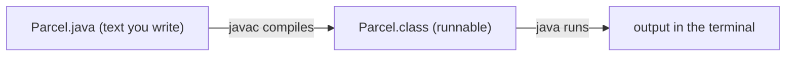
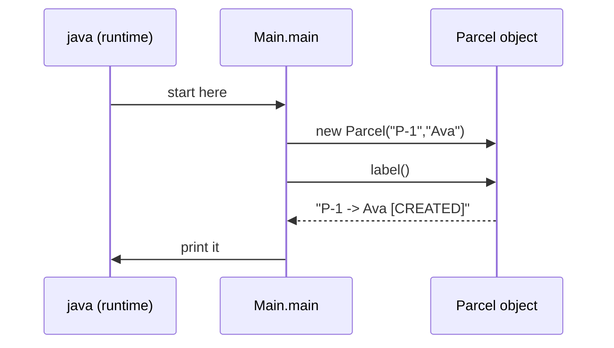

# Step 01: describe one parcel in Java

> In this step: write and run your very first Java program, from zero. By the end you will understand what a class, an object, a field, a method, and a constructor are, and you'll have code that prints a parcel. ~60–90 minutes.

## The problem right now

ParcelPilot doesn't exist yet. Before any web server or database, we need the smallest possible thing: a way to represent **one parcel** in code and show it on screen. If you've never programmed, this step teaches the absolute basics using our parcel as the example.

> **Never written any code before?** Start with the companion [Java syntax basics](java-syntax-basics.md) first. It covers the raw building blocks (variables, types, `if`/`else`, loops, printing, and how to compile and run) with tiny runnable examples (including your first "Hello"). For a thorough tour of every type (primitives vs objects, ranges, casting, `String`, the money/overflow traps), see [Java data types in detail](data-types.md). And [general coding concepts](../../references/coding-concepts.md) teaches habits like **early return** and guard clauses. Come back here once those feel familiar, and this step will make much more sense.

## First, what even is a Java program?

A program is a set of instructions a computer runs. In Java:

1. You write instructions in a text file ending in `.java`.
2. You **compile** it: the `javac` tool translates your text into a format the computer can run (`.class` files). This also catches typos and mistakes.
3. You **run** it with the `java` tool, which starts executing at a special method called `main`.



That's the whole loop: **write → compile → run → read output**. You'll repeat it constantly.

> Want to know *why* it's two steps and what the "JVM" is? Read the short companion: [How Java works (the flow)](how-java-works.md). It explains JDK vs JRE, bytecode, and "write once, run anywhere", and it's why Java + Docker fit so well later.

## Key words (read these slowly)

| Word | Beginner meaning | Everyday analogy |
|---|---|---|
| **Class** | A blueprint that describes what a kind of thing *is* and *can do*. | A cookie cutter |
| **Object / instance** | One actual thing built from a class. | One cookie |
| **Field / attribute** | A piece of data an object stores. | Info written on a label |
| **Method** | An action an object can do. | A verb / a button |
| **Constructor** | Special setup code that runs when you create an object. | Filling out a form when you receive a package |
| **Type** | The kind of a value: `String` (text), `int` (whole number), `boolean` (true/false). | "words" vs "numbers" |
| **`main`** | The one method Java runs first when the program starts. | The front door |
| **`new`** | The keyword that creates a new object from a class. | Stamping out a cookie |
| **`this`** | Inside a class, "this specific object". | "my own" label |
| **`private`** | Hides a field so only its own class can change it directly. | A locked drawer |
| **`return`** | Hands a value back out of a method. | The answer you give |

## What is a class, really? (and why we need one)

Imagine tracking parcels using loose variables:

```java
String parcel1Id = "P-1";
String parcel1Recipient = "Ava";
String parcel1Status = "CREATED";

String parcel2Id = "P-2";
String parcel2Recipient = "Ben";
String parcel2Status = "CREATED";
```

This gets messy fast: the three pieces of a parcel aren't grouped, and nothing stops you from mixing them up. A **class** solves this by bundling the related data (and later, behavior) under one name:

```java
public class Parcel {
    String id;
    String recipient;
    String status;
}
```

Now "a parcel" is a real concept in your code. `Parcel` is the **blueprint**. Each real parcel you make from it is an **object**.

### Why classes matter (what they bring us)

- **Grouping**: an id, recipient, and status travel together as one `Parcel`.
- **Reuse**: define it once, create thousands of parcels.
- **Safety**: later we add rules so a parcel can't enter an impossible state.
- **Behavior next to data**: a `label()` method lives right where the data is.

## What is an object? (using the class)

You create an object with `new`:

```java
Parcel p = new Parcel();   // p is one object built from the Parcel blueprint
```

`p` now refers to one parcel in memory. You can make as many as you want, each independent.

## Fields, constructor, and methods: piece by piece

A class is built from three kinds of members. You will use these three in *every* Java class you ever write, so let's go slowly and really understand each one, not just *what* to type, but *why* it's shaped that way.

### Fields (the data each object remembers)

Fields are variables that live **inside** an object. Every object you create gets its **own** copy of the fields, so parcel `P-1` and parcel `P-2` remember different ids at the same time.

```java
private String id;
private String recipient;
private String status;
```

- `private` means "only code inside `Parcel` may touch this directly". Nothing outside can secretly set `status` to nonsense. (Think: a locked drawer. In step 02 this is called **encapsulation**.)
- `String` is the **type**: this field holds text.
- `id` is the **name** you'll use to refer to the value.

> Why private and not public? If any code anywhere could write `parcel.status = "banana"`, you could never trust a parcel's data. Keeping fields private means the class stays in charge of its own rules. This is the single most important habit in object-oriented code.

### Constructor (how an object is *born*)

A **constructor** is a special block that runs **once**, at the exact moment you write `new Parcel(...)`. Its job is to make sure a brand-new object starts life **complete and valid**, never half-filled.

```java
public Parcel(String id, String recipient) {
    this.id = id;                 // store the given id in THIS object
    this.recipient = recipient;   // store the given recipient
    this.status = "CREATED";      // every new parcel starts as CREATED
}
```

Read the shape carefully, because a constructor looks *almost* like a method but has two tell-tale differences:

- **Its name is exactly the class name** (`Parcel`). That's how Java knows "this is the setup code for a `Parcel`".
- **It has no return type**, not even `void`. A method like `label()` says `String` before its name, but a constructor says nothing. If you accidentally write `void Parcel(...)`, Java treats it as an ordinary method, *not* a constructor, and your `new Parcel(...)` won't use it. This is a very common beginner trap.

**Why do we even need a constructor?** Without one, you'd have to create a blank parcel and then set each field afterward, and nothing would stop you from forgetting one, leaving the object half-built:

```java
Parcel p = new Parcel();   // blank: id=null, recipient=null  ← dangerous
// ...now you must remember to fill in every field, somewhere, somehow
```

A constructor makes the essentials **required**: once the constructor above exists, you literally cannot type `new Parcel()` with no arguments. Java forces the caller to pass an id and a recipient, so you can't create a parcel that's missing its id. (This pairs perfectly with `private` fields: outsiders can't set them directly *and* can't skip them at creation.)

**What actually happens when you write `new Parcel("P-1", "Ava")`:**

1. Java sets aside a fresh chunk of memory for one new `Parcel` object (all fields start empty/`null`).
2. Java runs the **constructor body**, copying `"P-1"` into that object's `id` field and `"Ava"` into its `recipient` field, and setting `status` to `"CREATED"`.
3. Java hands you back a **reference** to that finished object, which you store in a variable (`Parcel p = ...`).

> **The "free" constructor:** if you write *no* constructor at all, Java secretly gives you an empty one (`Parcel() {}`) so `new Parcel()` still works. The moment you write your **own** constructor, that free one disappears, which is exactly what we want, because a parcel with no id is meaningless.

### `this`: the word that means "this exact object"

This is the part beginners find most mysterious, so here is the whole idea in one sentence: **the same class code runs for every object, so inside the code `this` is how an object points at *itself*.**

Look again at the constructor line:

```java
this.id = id;
```

There are **two different things both called `id`** in scope here:

- `id` (on the right) is the **parameter**: the value the caller passed in, e.g. `"P-1"`.
- `this.id` (on the left) is the **field**: the slot inside *this* object where we want to store it.

They share a name, so plain `id` refers to the **closest** one, the parameter. This is called **shadowing** (the parameter temporarily "hides" the field). Writing `this.id` says explicitly: "the `id` **field** belonging to this object". So `this.id = id;` reads as *"put the passed-in value into my own id field."*

**What happens if you forget `this`?** Watch this bug:

```java
public Parcel(String id, String recipient) {
    id = id;   // ← BUG: assigns the parameter to itself. The field stays null!
}
```

`id = id;` just copies the parameter onto itself and never touches the field, so `this.id` stays `null` forever. The compiler won't stop you, so the program simply misbehaves. Writing `this.id = id;` is what makes it correct.

> **Everyday analogy:** imagine a room full of workers, each filling out *their own* timesheet from the same printed instructions. The instructions say "write the hours in **your** box". The word "your" is `this`: it means "the specific worker running these instructions right now", not the worker next to you.

You'll also see `this` used to call one of the object's own methods (e.g. `this.label()`), though inside the class you can usually drop it and just write `label()`.

### Methods (what an object can *do*)

A **method** is a named action an object can perform. Let's dissect the signature of `label()` word by word, because every method you meet later (`markDelivered()`, `getOne()`, ...) has this same shape:

```java
public String label() {
    return id + " -> " + recipient + " [" + status + "]";
}
```

| Part | In the example | What it means |
|---|---|---|
| **Access modifier** | `public` | Who may call this method. `public` = anyone, `private` = only this class. |
| **Return type** | `String` | The *kind* of value the method hands back. Use `void` if it returns nothing. |
| **Name** | `label` | What you call to run it. Methods are usually verbs. |
| **Parameters** | `()` | Inputs the method needs, inside the parentheses. Empty here, since `label` needs nothing extra. |
| **Body** | `{ ... }` | The instructions that run when the method is called. |

- **`return`** hands a value back to whoever called the method, and immediately ends the method. Because `label()` promises a `String`, its body must `return` a `String`.
- **Parameters vs arguments:** a *parameter* is the placeholder in the definition (like `String id` in the constructor). An *argument* is the actual value you pass when calling (`"P-1"`). Same idea, two words developers use precisely.
- **Calling a method** means "ask an object to run one of its actions": `parcel.label()` reads as *"parcel, build and give me your label."* The `.` means "reach into this object".

> **"Method" vs "function":** in Java, code that belongs to a class is called a **method** (there are no free-floating functions like in some other languages). If someone says "function", they usually mean the same thing.

## Build it in ParcelPilot (do this exactly)

You'll create two files in a new folder `applications/parcelpilot`.

### 1. Create the folder

In your terminal:

```bash
mkdir -p applications/parcelpilot
cd applications/parcelpilot
```

### 2. Create `Parcel.java`

Put this exact content in a file named `Parcel.java`:

```java
public class Parcel {
    private String id;
    private String recipient;
    private String status;

    public Parcel(String id, String recipient) {
        this.id = id;
        this.recipient = recipient;
        this.status = "CREATED";
    }

    public String label() {
        return id + " -> " + recipient + " [" + status + "]";
    }
}
```

### 3. Create `Main.java`

`main` is where the program starts. Here we create one parcel and print its label. `System.out.println(...)` prints a line to the terminal:

```java
public class Main {
    public static void main(String[] args) {
        Parcel parcel = new Parcel("P-1", "Ava");
        System.out.println(parcel.label());
    }
}
```

### What each part of `main` means

- `public`: other code (here, Java itself) is allowed to call it.
- `static`: it belongs to the class, so Java can run it without creating an object first.
- `void`: it returns nothing.
- `String[] args`: any words typed after the program name (ignore for now).



## Test it

From inside `applications/parcelpilot`:

```bash
javac Main.java Parcel.java
java Main
```

Expected output:

```text
P-1 -> Ava [CREATED]
```

If `javac` prints an error, read the file name and line number it gives, fix that line, and try again. Common beginner mistakes: a missing semicolon `;`, a mismatched `{ }`, or a typo in a name (Java is case-sensitive: `Parcel` ≠ `parcel`).

## Acceptance criteria

- [ ] The folder `applications/parcelpilot` contains `Parcel.java` and `Main.java`.
- [ ] `javac Main.java Parcel.java` compiles with **no** errors.
- [ ] `java Main` prints a line showing the id, recipient, and `CREATED` status.
- [ ] In your own words you can point at: the **class**, an **object**, a **field**, the **constructor**, and a **method**.
- [ ] You can explain why grouping data into a `Parcel` class beats separate loose variables.
- [ ] You can explain (from [How Java works](how-java-works.md)) why there are two steps: `javac` compiles to bytecode, `java` runs it on the JVM.

## Say it like a developer

Learning the vocabulary is half of learning to code: it's how you read docs, ask for help, and understand teammates. Practice saying these out loud until they feel natural:

- "`Parcel` is a **class**, and each parcel I make with `new` is an **object** (also called an **instance**)."
- "The parcel's `id` and `recipient` are **fields**: the data each object stores."
- "The **constructor** runs when I call `new`, and it makes sure every parcel starts with a valid id and recipient."
- "Inside the constructor, **`this.id`** is the field and **`id`** is the parameter, so `this.id = id` copies the passed-in value into the object."
- "`label()` is a **method** that **returns** a `String`."
- "I **call** the method by writing `parcel.label()`."

If you can narrate your own code with these words, you understand it.

## Quiz: check yourself

Answer each one out loud (or in your `NOTES.md`) in a full sentence **before** opening the toggle. If an answer surprises you, re-read the matching section above.

1. What is the difference between a **class** and an **object**?

<details><summary>Show answer</summary>

A class is the **blueprint** (`Parcel`, which describes what every parcel is and can do). An object is **one real thing** built from that blueprint with `new` (e.g. the specific parcel `P-1`). One class, many objects.

</details>

2. Why do we make fields `private`?

<details><summary>Show answer</summary>

So nothing outside the class can change them directly and put the object into an invalid state. The class stays in charge of its own data and rules (encapsulation).

</details>

3. In `this.id = id;`, what is `this.id` and what is `id`?

<details><summary>Show answer</summary>

`this.id` is the **field** belonging to this specific object. `id` (on the right) is the **parameter**: the value passed into the constructor. The line copies the parameter into the field. Without `this`, plain `id` would refer to the parameter only (shadowing), and the field would never get set.

</details>

4. How can you tell a constructor apart from a normal method?

<details><summary>Show answer</summary>

A constructor has the **exact same name as the class** and has **no return type** (not even `void`). A method has its own name and always declares a return type (or `void`).

</details>

5. In `public String label()`, what does `String` mean, and what would `void` mean instead?

<details><summary>Show answer</summary>

`String` is the **return type**: the method hands back a piece of text. `void` would mean the method returns **nothing**: it just does something and ends.

</details>

6. What does `new Parcel("P-1", "Ava")` actually do, step by step?

<details><summary>Show answer</summary>

Java (1) reserves memory for a new `Parcel`, (2) runs the constructor body, storing `"P-1"` in `id`, `"Ava"` in `recipient`, and `"CREATED"` in `status`, then (3) hands back a reference to the finished object, which you store in a variable.

</details>

## Reflect (don't fix yet)

Try `new Parcel("", "")` in `main` and run again. The program happily prints ` -> [CREATED]`, a parcel with **no id and no recipient**. That's an **invalid state**. Notice it. Step 02 adds rules to make such parcels impossible and gives the parcel real behavior.

## Next

[Step 02](../02-oop-and-composition/README.md): make parcels change state safely (CREATED → PICKED_UP → DELIVERED) and meet your first design patterns.

> **Curious how the project grows from here?** Right now everything is one or two loose files, and that's exactly right for this stage. [Code organization: from one file to a layered app](../../references/code-organization.md) shows the whole journey (one file → packages/imports → controllers/services → separate services) and *when* each stage is worth it. You don't need it yet. It's a map for the road ahead.
