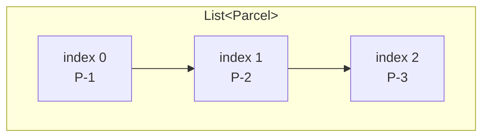
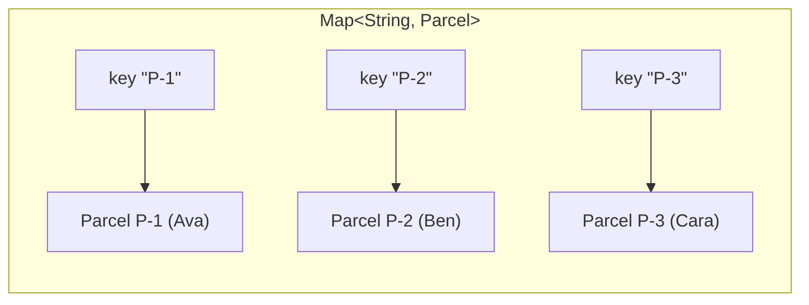
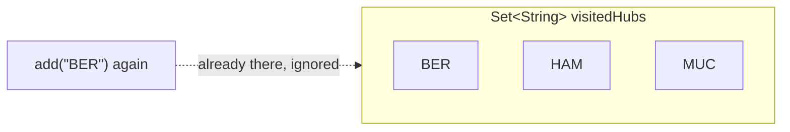

# Collections basics: List, Map, Set

> The three containers you'll use in every later step, explained from zero. Read after [Java syntax basics](java-syntax-basics.md) (which gave `List` a two-line cameo). ~40 minutes.

## The problem

One variable holds one value. But ParcelPilot needs *many* parcels, needs to *find* a parcel by its id fast, and needs to remember which hubs a parcel already visited *without duplicates*. Making a numbered variable for each (`parcel1`, `parcel2`, …) collapses immediately — you saw that pain in [Step 01](README.md).

## The solution

Java's **collections**: objects whose whole job is to hold other objects. Three cover almost everything:

| You need… | Use | ParcelPilot example |
|---|---|---|
| Things **in order**, duplicates allowed | `List` | parcels in the order they were created |
| **Look up** a value by a key | `Map` | parcel id → the `Parcel` object |
| A set of **unique** things, no duplicates | `Set` | hubs a parcel has visited |

## Key words

| Word | Beginner meaning |
|---|---|
| **Collection** | An object that holds other objects (a container). |
| **Element** | One item inside a collection. |
| **Index** | An element's position in a `List`, counted **from 0**. |
| **Key / value** | In a `Map`, the label you look up by (key) and what you get back (value). |
| **Duplicate** | The same value appearing twice. Lists allow it, sets refuse it. |
| **Generics** | The `<...>` part that says what type a collection holds, e.g. `List<Parcel>`. |
| **Interface vs implementation** | The *what* (`List`) vs the *how* (`ArrayList`). |

## List: an ordered sequence (duplicates allowed)

A `List` keeps elements **in the order you added them** and lets you grab any of them by position (index). The everyday implementation is `ArrayList`.



```java
import java.util.ArrayList;
import java.util.List;

List<Parcel> parcels = new ArrayList<>();
parcels.add(new Parcel("P-1", "Ava"));       // goes to index 0
parcels.add(new Parcel("P-2", "Ben"));       // index 1
parcels.add(new Parcel("P-3", "Cara"));      // index 2

System.out.println(parcels.size());          // 3
System.out.println(parcels.get(0).id());     // P-1  (first element: index 0!)
parcels.remove(1);                           // removes P-2; P-3 shifts to index 1
System.out.println(parcels.contains(null));  // false
```

Indexes start at **0**, not 1 — `get(0)` is the first element, and `get(size())` crashes with `IndexOutOfBoundsException`.

## Map: look things up by key

A `Map` stores **key → value pairs**. Give it a key, get the value back — instantly, no matter how many entries it holds. The everyday implementation is `HashMap`. In ParcelPilot this becomes the natural "storage" shape: *by parcel id, find the parcel*.



```java
import java.util.HashMap;
import java.util.Map;

Map<String, Parcel> byId = new HashMap<>();
byId.put("P-1", new Parcel("P-1", "Ava"));
byId.put("P-2", new Parcel("P-2", "Ben"));

Parcel found = byId.get("P-1");     // the Parcel object, instantly
Parcel missing = byId.get("P-9");   // null — no such key! (handle this)
System.out.println(byId.containsKey("P-2"));  // true
byId.put("P-1", new Parcel("P-1", "Ava M.")); // same key -> REPLACES the value
System.out.println(byId.size());    // 2 (not 3)
```

Two behaviors to burn in: `get` on an absent key returns **`null`** (a classic `NullPointerException` source), and `put` with an existing key **replaces** the old value — each key exists once.

## Set: unique members, no duplicates

A `Set` holds each value **at most once**. Adding a duplicate is silently ignored. The everyday implementation is `HashSet`. Perfect for "has this parcel already visited hub X?":



```java
import java.util.HashSet;
import java.util.Set;

Set<String> visitedHubs = new HashSet<>();
visitedHubs.add("BER");
visitedHubs.add("HAM");
boolean added = visitedHubs.add("BER");   // false — already present, set unchanged

System.out.println(visitedHubs.size());          // 2
System.out.println(visitedHubs.contains("HAM")); // true — the set's superpower, and it's fast
```

Note what a `HashSet` does **not** promise: any particular order. Print it and the hubs may come out in any arrangement.

## Which one do I use? (decision table)

| Question | List | Map | Set |
|---|---|---|---|
| Does insertion **order** matter? | ✅ kept | ❌ (HashMap: no order) | ❌ (HashSet: no order) |
| Are **duplicates** allowed? | ✅ yes | keys: no, values: yes | ❌ no |
| Access by **position** (`get(0)`)? | ✅ | ❌ | ❌ |
| **Look up by key/id** fast? | ❌ must search through | ✅ that's the point | — |
| "Is X in here?" fast? | slow for big lists | ✅ by key | ✅ |

Rules of thumb: reaching for "a bunch of things"? Start with `List`. Constantly *finding by id*? `Map`. Only care about *membership/uniqueness*? `Set`.

## Interface vs implementation: why `List<Parcel> list = new ArrayList<>()`

Look at the left and right sides of that declaration:

- `List` (left) is an **interface**: the contract — *what* a list can do (`add`, `get`, `size`…).
- `ArrayList` (right) is an **implementation**: one concrete *how* (backed by a resizable array).

Declaring the variable as the interface means the rest of your code depends only on the contract. If you later swap in a different implementation (a `LinkedList`, or an unmodifiable list from `List.of(...)`), nothing else changes. Same for `Map`/`HashMap` and `Set`/`HashSet`.

This "program to an interface" habit is a big idea with its own page: [Interfaces and abstractions](../02-oop-and-composition/interfaces-and-abstractions.md) in step 02.

## Iterating: the for-each loop

The standard way to visit every element:

```java
for (Parcel p : parcels) {                    // "for each Parcel p in parcels"
    System.out.println(p.label());
}

for (Map.Entry<String, Parcel> entry : byId.entrySet()) {
    System.out.println(entry.getKey() + " -> " + entry.getValue().label());
}

for (String hub : visitedHubs) {
    System.out.println("visited " + hub);
}
```

## Generics in one paragraph

The `<...>` after a collection type answers "**a list of what?**". `List<Parcel>` holds only parcels: the compiler rejects `parcels.add("hello")`, and `get(0)` gives you back a `Parcel` without any casting. The `<>` on the right (`new ArrayList<>()`) is the **diamond operator** — Java infers the type from the left side, so you don't repeat it. The full story (including the `List`-that-holds-anything problem generics solved) is in the [generics section of data types](data-types.md#generics-in-one-page).

## Common mistakes

**1. Removing while iterating → `ConcurrentModificationException`.** You cannot change a collection while for-eaching over it:

```java
for (Parcel p : parcels) {
    if (p.status() == Status.DELIVERED) {
        parcels.remove(p);   // 💥 ConcurrentModificationException
    }
}

// Fix: let the collection do it
parcels.removeIf(p -> p.status() == Status.DELIVERED);   // ✅
```

**2. Comparing elements with `==`.** Collections of objects hold *references*. `list.contains(...)` and `map.get(...)` use `.equals()` — but your own comparisons must too:

```java
if (parcels.get(0).id() == "P-1")        // ❌ may be false even when the text matches
if (parcels.get(0).id().equals("P-1"))   // ✅ compares the characters
```

(Why: see [primitive vs reference types](data-types.md).)

**3. Expecting a `HashMap`/`HashSet` to keep order.** They arrange entries for fast lookup, not for you to read in sequence. If it *looks* ordered in a small test, that's luck, not a promise. Need lookup *and* insertion order? That's `LinkedHashMap` — but at this stage, if order matters, you probably wanted a `List`.

**4. Forgetting that `map.get(missingKey)` returns `null`.** Check `containsKey`, use `getOrDefault(key, fallback)`, or handle `null` — otherwise the crash happens one line *later*, where you use the result.

## Pros and cons of the three implementations

| Implementation | Pros | Cons |
|---|---|---|
| `ArrayList` | Keeps order, fast to loop and `get(i)`, duplicates fine | Finding by value means scanning; removing from the middle shifts elements |
| `HashMap` | Near-instant lookup by key, natural "storage" shape | No order; `get` returns `null` for missing keys; keys must implement `equals`/`hashCode` correctly |
| `HashSet` | Near-instant `contains`, enforces uniqueness for free | No order; no "get by position" at all |

## Say it like a developer

- "I keep the parcels in a `List<Parcel>` because **order matters** and I loop over them."
- "Lookup by id is a `Map<String, Parcel>` — `get` is **near-instant** instead of scanning a list."
- "Visited hubs are a `Set`, so **duplicates are impossible** by construction."
- "I declare it as `List`, the **interface**, and instantiate an `ArrayList`, the **implementation**."
- "`removeIf` avoids the **ConcurrentModificationException** you get when removing inside a for-each."

## Quiz: check yourself

1. You need to store parcels and frequently fetch one by its id. `List` or `Map`, and why?

<details><summary>Show answer</summary>

`Map<String, Parcel>`. A map looks up by key near-instantly, while a list would have to be scanned element by element for every fetch.

</details>

2. What happens when you `add` a value to a `HashSet` that's already in it?

<details><summary>Show answer</summary>

Nothing changes — the set stays as it was, and `add` returns `false`. Sets hold each value at most once.

</details>

3. Why write `List<Parcel> parcels = new ArrayList<>()` instead of `ArrayList<Parcel> parcels = new ArrayList<>()`?

<details><summary>Show answer</summary>

Declaring the interface (`List`) means the surrounding code depends only on the contract, so you can swap the implementation later without touching anything else. This is "programming to an interface".

</details>

4. What does `byId.get("P-9")` return if the map has no key `"P-9"`, and why is that dangerous?

<details><summary>Show answer</summary>

`null`. Dangerous because the crash (`NullPointerException`) happens later, wherever the `null` gets used — not at the `get` itself.

</details>

5. Why does removing an element inside a for-each loop throw `ConcurrentModificationException`, and what's the fix?

<details><summary>Show answer</summary>

The loop is walking the collection's internal structure; changing that structure mid-walk would corrupt the iteration, so Java stops you. Use `removeIf(...)` (or an explicit iterator) instead.

</details>

## Next

Back to [Step 01](README.md), or onward: in [Step 02](../02-oop-and-composition/README.md) a `List<TrackingEvent>` records a parcel's history, and [interfaces and abstractions](../02-oop-and-composition/interfaces-and-abstractions.md) turns today's `List` vs `ArrayList` observation into a design principle.
