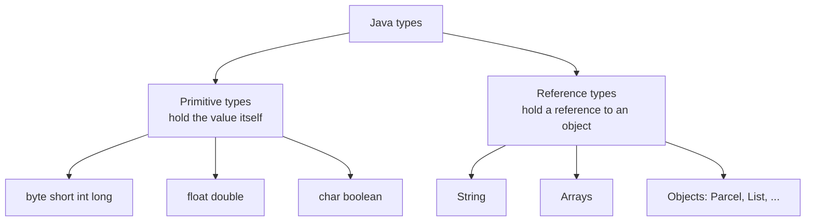
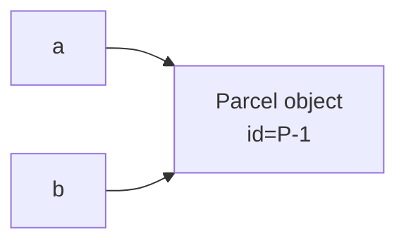

# Java data types in detail

> A deep-but-friendly tour of Java's types. Read after [Java syntax basics](java-syntax-basics.md) and before/alongside the [Step 01 README](README.md). You don't need to memorize every number, but knowing *why* the types differ removes a lot of future confusion (especially the `int` overflow and `double` money traps). ~40 minutes.

## What is a "type", and why does Java insist on them?

A **type** is the *kind* of value a variable holds, and it decides:

1. **what values are allowed** (an `int` can't hold `"Ava"`),
2. **how much memory** the value takes, and
3. **what operations** make sense (you can `+` two numbers, `<` two numbers, and `.length()` a `String`).

Java is **statically typed**: every variable's type is fixed and checked *at compile time*. That's why `javac` catches `int x = "hi";` before the program ever runs. The upside is fewer surprises at runtime. The cost is you must say what you mean.

Java has exactly **two families** of types:



## Primitive types (the 8 built-ins)

Primitives are the simplest values. The variable holds the actual value directly (not a reference). There are exactly **eight**.

### Whole numbers

| Type | Size | Range (approx.) | Use it for |
|---|---|---|---|
| `byte` | 8-bit | −128 … 127 | raw bytes, tight memory, rare in app code |
| `short` | 16-bit | −32,768 … 32,767 | rarely used |
| `int` | 32-bit | −2.1 billion … 2.1 billion | **the default whole number** |
| `long` | 64-bit | −9.2 quintillion … 9.2 quintillion | counts/ids that exceed 2 billion, timestamps in ms |

```java
int parcels = 42;
long epochMillis = 1_752_000_000_000L;   // note the L suffix (it's a long)
```

**The overflow trap:** an `int` silently *wraps around* past its max instead of erroring:

```java
int max = 2_147_483_647;   // Integer.MAX_VALUE
System.out.println(max + 1);   // -2147483648  (wraps to the minimum!)
```

That's why counts that can get huge (money in cents, view counts, DB ids) often use `long`. In ParcelPilot the JPA `@Version` field is a `long`.

### Decimal numbers

| Type | Size | Precision | Use it for |
|---|---|---|---|
| `float` | 32-bit | ~7 significant digits | rarely, only when memory is tight |
| `double` | 64-bit | ~15–16 significant digits | **the default decimal** |

```java
double weightKg = 2.5;
float ratio = 0.5f;   // note the f suffix (it's a float)
```

**The money trap: do NOT use `double`/`float` for currency.** They are *binary* approximations and can't represent some decimals exactly:

```java
System.out.println(0.1 + 0.2);   // 0.30000000000000004  😱
```

For money, use `BigDecimal` (a reference type) with `String` inputs, or store integer **cents** as a `long`:

```java
import java.math.BigDecimal;
BigDecimal price = new BigDecimal("19.99");   // exact
```

### Text (single character) and truth values

| Type | Size | Holds | Example |
|---|---|---|---|
| `char` | 16-bit | one Unicode character | `'A'`, `'7'`, `'€'` |
| `boolean` | (JVM-defined) | `true` or `false` only | `true` |

```java
char grade = 'A';        // single quotes = one char
boolean isPriority = true;
```

> `char` uses **single** quotes (`'A'`), and `String` uses **double** quotes (`"A"`). They are different types.

## Literals: how you write values

A **literal** is a fixed value typed directly in code. The way you write it tells Java its type.

```java
int decimal   = 100;
int hex       = 0xFF;          // 255, hexadecimal
int binary    = 0b1010;        // 10, binary
int readable  = 1_000_000;     // underscores are ignored, aid reading
long big      = 9_000_000_000L;// L -> long (needed above ~2.1 billion)
double d      = 3.14;          // decimals default to double
float f       = 3.14f;         // f -> float
boolean b     = true;
char c        = 'Z';
String s      = "Ava";         // String literal (double quotes)
```

Watch the suffixes: without `L`, `9_000_000_000` is too big for `int` and won't compile. Without `f`, `3.14` is a `double` and won't fit in a `float` without a cast.

## Type conversion and casting

**Widening (automatic):** moving to a bigger type is safe, so Java does it for you.

```java
int i = 5;
long l = i;        // int -> long   ✅ automatic
double d = i;      // int -> double ✅ automatic  (d == 5.0)
```

**Narrowing (explicit cast required):** moving to a smaller type can lose data, so you must ask for it with `(type)`:

```java
double price = 19.99;
int rounded = (int) price;   // 19  (decimals are TRUNCATED, not rounded!)

long big = 5_000_000_000L;
int overflowed = (int) big;  // garbage, doesn't fit in an int
```

Casting a `double` to `int` **truncates** toward zero (drops the fraction). To round properly use `Math.round(...)`.

**Numbers and text don't auto-convert:**

```java
int n = 5;
String text = n + "";              // "5"  (concatenation trick)
String text2 = String.valueOf(n);  // "5"  (clearer)
int back = Integer.parseInt("5");  // 5    (String -> int)
```

## Reference types (objects)

Everything that isn't one of the 8 primitives is a **reference type**: `String`, arrays, `List`, `Parcel`, `Instant`, etc. A reference variable doesn't hold the object itself: it holds a **reference** (think: an address/handle) that points to the object living on the heap.

```java
Parcel a = new Parcel("P-1", "Ava");
Parcel b = a;         // b points to the SAME object as a (not a copy)
```



This "same object, two names" behavior is why comparing references needs care (next section), and it's the reason a variable can be `null`, a reference pointing at **nothing**:

```java
Parcel none = null;      // points to no object
none.label();            // 💥 NullPointerException
```

### Primitive vs reference: the key differences

| | Primitive (`int`) | Reference (`String`, `Parcel`) |
|---|---|---|
| Holds | the value itself | a reference to an object |
| Can be `null`? | no | yes |
| Compare with | `==` (compares values) | `.equals()` (compares contents) |
| Default value (as a field) | `0` / `false` / `'\u0000'` | `null` |
| Lives on | the stack (mostly) | the heap |

## `String` deserves its own section

`String` is a reference type you'll use constantly, with two must-know facts.

**1. Strings are immutable.** Once created, a `String`'s contents never change. "Modifying" one actually creates a new object:

```java
String name = "ava";
name.toUpperCase();          // returns "AVA" but does NOT change name
System.out.println(name);    // still "ava"
name = name.toUpperCase();   // reassign to keep the result -> "AVA"
```

**2. Compare strings with `.equals()`, not `==`.** `==` asks "the same object?", and `.equals()` asks "the same characters?".

```java
String a = "Ava";
String b = new String("Ava");
System.out.println(a == b);        // false (different objects)
System.out.println(a.equals(b));   // true  (same characters) ✅
```

Handy `String` methods:

```java
"  Ava  ".trim()          // "Ava"
"Ava".isBlank()           // false   (true for "" or only spaces)
"Ava".length()            // 3
"Ava".toLowerCase()       // "ava"
"P-1,P-2".split(",")      // ["P-1", "P-2"]
"parcel %s".formatted("P-1")   // "parcel P-1"
```

Multi-line **text blocks** use triple quotes:

```java
String json = """
    { "id": "P-1", "recipient": "Ava" }
    """;
```

## Wrapper types & autoboxing (`int` vs `Integer`)

Every primitive has an **object wrapper**: `int`→`Integer`, `long`→`Long`, `boolean`→`Boolean`, `double`→`Double`, `char`→`Character`, etc.

You need the wrapper when something requires an *object*, most importantly in **generics/collections**: you can't write `List<int>`, you write `List<Integer>`:

```java
List<Integer> counts = new ArrayList<>();
counts.add(5);          // autoboxing: int 5 -> Integer automatically
int first = counts.get(0);   // auto-unboxing: Integer -> int
```

**Autoboxing** is Java converting between primitive and wrapper for you. Two cautions:

- Unboxing a `null` wrapper crashes: `Integer x = null; int y = x;` → `NullPointerException`.
- Compare wrapper values with `.equals()` or by unboxing, not `==` (identity can surprise you). Prefer primitives unless you specifically need an object or `null`.

## Generics in one page

You just saw `List<Integer>`. That `<...>` is **generics**, and it exists to solve a real problem. Before generics, a list held *anything*, and mistakes only exploded at runtime:

```java
List parcels = new ArrayList();        // a list of... whatever (old style)
parcels.add(new Parcel("P-1", "Ava"));
parcels.add("hello");                  // oops, a String snuck in — compiles fine!

Parcel p = (Parcel) parcels.get(1);    // 💥 ClassCastException at RUNTIME
```

The `<Type>` fills in the blank "a list **of what?**", and moves that explosion to **compile time**, where `javac` catches it before the program ever runs:

```java
List<Parcel> parcels = new ArrayList<>();
parcels.add(new Parcel("P-1", "Ava"));
parcels.add("hello");                  // ❌ compile error: String is not a Parcel

Parcel p = parcels.get(0);             // no cast needed — it can only be a Parcel
```

Two more things and you know enough generics for the whole course:

- **The diamond operator `<>`**: on the right-hand side you can leave the type out (`new ArrayList<>()`) and Java infers it from the left. Write the type once, not twice.
- **`<T>` in your own class**: the same trick is available to you. A class can leave a type as a placeholder, and the user of the class fills it in:

```java
public class Box<T> {                   // T = "some type, decided later"
    private T content;
    public void put(T item) { this.content = item; }
    public T take() { return content; }
}

Box<Parcel> box = new Box<>();          // now T means Parcel, everywhere in this box
```

You'll mostly *use* generic types (`List<Parcel>`, `Map<String, Parcel>`, later `Optional<Parcel>` and `ResponseEntity<Parcel>`) rather than write your own — recognizing "the `<>` says *of what type*" is the skill. Collections put generics to work on every line: see [collections basics](collections-basics.md).

## Optional: a pointer

`Optional<T>` is a small standard class that represents "**a box that may or may not contain a value**". It's an alternative to returning `null` from a lookup: a method that returns `Optional<Parcel>` *says in its type* "I might find nothing", and the caller can't forget to deal with that case — unlike a `null`, which crashes later, somewhere else, as a `NullPointerException`.

```java
Optional<Parcel> maybe = findParcel("P-9");   // maybe empty, maybe holding a parcel
String label = maybe
        .map(Parcel::label)                    // runs only if a parcel is inside
        .orElse("no such parcel");             // fallback if the box is empty
```

You don't need to practice it yet — it returns for real in step 10, where database repositories return `Optional<Parcel>` from `findById` precisely because "no row with that id" is a normal, expected outcome. For the wider strategy of keeping `null` out of your code, see [best practices #7: tame `null`](../../references/java-best-practices.md#7-tame-null-avoid-nullpointerexception).

## `var`: let Java infer the type

Since Java 10, `var` infers a local variable's type from the right-hand side. The variable is still strongly typed, so you just don't repeat the type name.

```java
var recipient = "Ava";              // inferred String
var counts = new ArrayList<Integer>(); // inferred ArrayList<Integer>
var parcel = new Parcel("P-1","Ava");  // inferred Parcel
```

Use `var` when the type is obvious from the right side (keeps code clean). Avoid it when it hurts readability (`var x = service.get();`, get *what*?). `var` is local-variables only, not fields, parameters, or return types.

## `final` and constants

`final` means "assign once, never reassign":

```java
final int MAX_RETRIES = 5;
MAX_RETRIES = 6;   // ❌ compile error

final Parcel p = new Parcel("P-1", "Ava");
// p = new Parcel(...);   ❌ can't repoint p
// p.markPickedUp();      ✅ but the object it points to can still change state
```

A class-level constant is usually `static final` in `UPPER_SNAKE_CASE`:

```java
public static final int MAX_PARCELS_PER_PAGE = 50;
```

Prefer `final` for fields and locals you don't intend to change: it documents intent and prevents accidental reassignment. (See [best practices #2](../../references/java-best-practices.md#2-prefer-immutability-final-records).)

## Default values (a subtle but common bug source)

- **Fields** get a default automatically: numbers `0`, `boolean` `false`, `char` `'\u0000'`, references `null`.
- **Local variables get NO default**: you must assign before use, or the compiler errors:

```java
void demo() {
    int x;
    System.out.println(x);   // ❌ "variable x might not have been initialized"
}
```

## Quick decision guide

- Whole number? → `int`, or `long` if it can exceed ~2 billion.
- Decimal that isn't money? → `double`.
- **Money?** → `BigDecimal` (or integer cents as `long`). Never `double`.
- True/false? → `boolean`.
- Text? → `String`.
- A fixed set of options (statuses, roles)? → an **`enum`** (see [Step 02](../02-oop-and-composition/README.md)).
- A value that might be absent from a lookup? → `Optional<T>` instead of `null` (see [best practices #7](../../references/java-best-practices.md#7-tame-null-avoid-nullpointerexception)).

## Say it like a developer

- "`id` is an `int` **primitive**, and `recipient` is a `String` **reference type**."
- "I used `long` for the version because an `int` could **overflow**."
- "Never use `double` for money: it's a binary approximation, so use `BigDecimal`."
- "Comparing strings with `==` is a bug, so use `.equals()`."
- "That crashed on **auto-unboxing** a `null` `Integer`."
- "I marked the field `final` because it's set once in the constructor."

## Quiz: check yourself

1. What's the difference between a **primitive** and a **reference** type?

<details><summary>Show answer</summary>

A primitive (like `int`) holds the actual value and can't be `null`. A reference type (like `String` or `Parcel`) holds a reference to an object on the heap, can be `null`, and is compared with `.equals()` rather than `==`.

</details>

2. Why shouldn't you use `double` for a price?

<details><summary>Show answer</summary>

`double`/`float` are binary approximations, so decimals like `0.1 + 0.2` aren't exact. For money use `BigDecimal` (or integer cents as a `long`).

</details>

3. What does `(int) 19.99` produce, and why?

<details><summary>Show answer</summary>

`19`. Casting a `double` to `int` **truncates** (drops the fraction toward zero), and it does not round. Use `Math.round(...)` to round.

</details>

4. Why is `a == b` sometimes `false` for two strings with the same text, and what should you use?

<details><summary>Show answer</summary>

`==` compares whether they're the *same object* in memory, which can be false even when the characters match. Use `a.equals(b)` to compare the contents.

</details>

5. When do you need `Integer` instead of `int`?

<details><summary>Show answer</summary>

When you need an object, most commonly in collections/generics (`List<Integer>`, not `List<int>`), or when the value can legitimately be `null`. Otherwise prefer the primitive `int`.

</details>

6. Why does `int x;` then `System.out.println(x);` fail to compile inside a method?

<details><summary>Show answer</summary>

Local variables have **no default value** and must be assigned before use. (Fields, by contrast, default to `0`/`false`/`null`.)

</details>

## Next

Back to the [Step 01 README](README.md) to put these types to work inside a `Parcel` class, then read [general coding concepts](../../references/coding-concepts.md) (early return, guard clauses, DRY) to write them cleanly.
