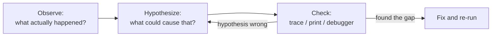

# Debugging your first program

> Your code will not work on the first try — nobody's does. This page teaches the three techniques for finding out *why*, for someone who has never debugged anything. ~45 minutes. Deeper toolbox (and later, Spring-specific debugging) lives in the [debugging and troubleshooting reference](../../references/debugging-and-troubleshooting.md).

## The problem

You run your program. It crashes, or worse, prints the wrong thing without crashing. Your instinct says "the computer is broken" or "Java is weird". Neither is true, and staring at the code re-reading it top to bottom rarely finds the problem.

## The solution: the debugging mindset

One sentence to internalize: **the computer did exactly what the code says — not what you *meant*.**

That's genuinely good news. It means there is no mystery: somewhere, what the code *says* differs from what you *believe* it says. Debugging is the process of finding that gap, and it's done with evidence, not staring:



## Key words

| Word | Beginner meaning |
|---|---|
| **Bug** | A gap between what the code does and what you intended. |
| **Debugging** | Systematically locating that gap using evidence. |
| **Stack trace** | The crash report: exception type, message, and the chain of calls (see [exceptions intro](exceptions-intro.md)). |
| **Print debugging** | Adding temporary `System.out.println` lines to see values and reached lines. |
| **Debugger** | An IDE tool that pauses your program on a line so you can inspect everything. |
| **Breakpoint** | The marker that tells the debugger where to pause. |
| **Step over** | In the debugger: run the current line, pause on the next. |

## Technique 1: read the error message (really read it)

Beginners see red text and look away. Don't — the message usually *names the problem*. Take this crash:

```text
Exception in thread "main" java.lang.NullPointerException:
    Cannot invoke "String.length()" because "recipient" is null
        at Parcel.labelWidth(Parcel.java:21)
        at Main.main(Main.java:6)
```

Read it slowly and it answers three questions:

- **What?** A `NullPointerException` — something was `null` when a method was called on it. Modern Java even says *which* thing: the variable `recipient`.
- **Where?** `Parcel.java` line 21, called from `Main.java` line 6.
- **So what's the hypothesis?** `recipient` was never given a value on the path that reached line 21. Now go look at how the `Parcel` in `Main.java:6` was created.

That's the whole technique: exception type + message + first `at` line in *your* code → jump there → ask "how could this value be what the message says it is?" The full walkthrough of trace anatomy is in [exceptions intro](exceptions-intro.md).

## Technique 2: print statements (see inside the running program)

When there's no crash — just wrong output — you need to see what the values *actually are* mid-run. The simplest tool: temporary `System.out.println` lines.

Two habits make print debugging effective instead of chaotic:

1. **Label every print.** Ten bare numbers in the terminal tell you nothing; `count after loop = 3` tells you everything.
2. **Print before *and* after the suspicious line**, so you can see exactly where the value goes wrong.

```java
System.out.println("DEBUG parcels.size() before delivery loop = " + parcels.size());
deliverAll(parcels);
System.out.println("DEBUG parcels.size() after delivery loop  = " + parcels.size());
```

A `DEBUG` prefix makes the lines easy to spot — and easy to find and delete when you're done (they're temporary scaffolding, not part of the program).

## Technique 3: the IDE debugger (pause the world)

Both IntelliJ and VS Code (with the Java extension pack) have a **debugger**: instead of guessing which values to print, you pause the program and look at *all* of them.

The core loop is the same in either editor:

1. **Set a breakpoint**: click in the margin (the "gutter") next to a suspicious line — a red dot appears.
2. **Run in debug mode**: the bug/insect icon instead of plain run (IntelliJ: right-click the file → *Debug*; VS Code: *Run and Debug* panel).
3. The program runs normally until it reaches your line, then **freezes there**.
4. **Inspect variables**: a panel shows every variable in scope and its current value — this is the debugger's superpower.
5. **Step over** (F8 in IntelliJ, F10 in VS Code): execute the current line, pause on the next. Watch the variables change line by line until one changes into something you didn't expect. That line is your gap.
6. **Resume** to run on to the next breakpoint, or stop.

No screenshots needed — the icons and shortcut names above are enough to find your way; both IDEs make this hard to miss once you click the gutter.

## A worked bug hunt (find it three ways)

Here's a small program with a planted bug. It should print the labels of **all** parcels:

```java
import java.util.List;

public class Main {
    public static void main(String[] args) {
        List<Parcel> parcels = List.of(
                new Parcel("P-1", "Ava"),
                new Parcel("P-2", "Ben"),
                new Parcel("P-3", "Cara"));

        printAllLabels(parcels);
    }

    static void printAllLabels(List<Parcel> parcels) {
        for (int i = 0; i < parcels.size() - 1; i++) {   // the bug is here
            System.out.println(parcels.get(i).label());
        }
    }
}
```

Actual output — no crash, just quietly wrong:

```text
P-1 -> Ava [CREATED]
P-2 -> Ben [CREATED]
```

Three parcels in, two printed. `P-3` is missing. Hunt it three ways:

**Way 1 — reason from the evidence.** No error message this time, so the "message" is the output itself: *exactly the last item* is missing. What controls how many times the loop runs? The condition `i < parcels.size() - 1`. Size is 3, so `i` runs 0, 1 — never 2. That `- 1` is a classic **off-by-one**: someone conflated "last index is size − 1" (true) with "loop while `i < size - 1`" (wrong — `i < size` already stops at the last index).

**Way 2 — print statements.** Make the invisible visible:

```java
static void printAllLabels(List<Parcel> parcels) {
    System.out.println("DEBUG size = " + parcels.size());
    for (int i = 0; i < parcels.size() - 1; i++) {
        System.out.println("DEBUG i = " + i);
        System.out.println(parcels.get(i).label());
    }
}
```

Output shows `size = 3` but `i = 0`, `i = 1` — and no `i = 2`. The loop condition is now the only suspect.

**Way 3 — the debugger.** Breakpoint on the `for` line, debug, and *step over* repeatedly. You watch `i` become `0`, then `1`, and then the loop exits while the variables panel plainly shows `parcels.size()` is `3`. Same conclusion, zero code changes.

The fix, whichever road you took:

```java
for (int i = 0; i < parcels.size(); i++) {   // ✅ visits 0, 1, 2
```

(Or sidestep index arithmetic entirely with a for-each — see [collections basics](collections-basics.md).)

## Print debugging vs the debugger

| | Print statements | IDE debugger |
|---|---|---|
| Setup | none — works anywhere, even inside Docker/CI logs | IDE run config; trickier for code running elsewhere |
| Best for | quick checks, "did this line even run?", async/timing issues | rich state: many variables, nested objects, "step until it goes wrong" |
| Cost | you must guess what to print, edit, re-run each time | learning curve; pausing changes timing (rarely matters here) |
| Cleanup | must remember to delete the lines | nothing to clean up |

Honest guidance: professionals use **both**. Print debugging never stops being useful (in later steps, its grown-up form is *logging*, step 07). The debugger wins when you don't yet know what to print, or when inspecting a complex object beats printing it field by field.

## Say it like a developer

- "The message says `recipient` was **null** at `Parcel.java:21` — let me check the call site in the trace."
- "I added a **labeled print** before and after the loop to see where the count changes."
- "Set a **breakpoint** on the loop and **step over** — watch `i` in the variables panel."
- "Classic **off-by-one**: the condition stopped one element early."
- "The computer did exactly what the code says — my *belief* about that line was wrong."

## Quiz: check yourself

1. Your program crashes. What are the first two things you read, before touching any code?

<details><summary>Show answer</summary>

The exception type + message (what went wrong), then the first `at` line that points into your own code (where). Only then jump to that file and line.

</details>

2. Why label print statements instead of printing bare values?

<details><summary>Show answer</summary>

Ten unlabeled values in the terminal can't be matched to the code that printed them. A label like `size after filter = 2` says what was measured and where, so the output reads as evidence.

</details>

3. What does a breakpoint do, and what does "step over" do?

<details><summary>Show answer</summary>

A breakpoint pauses the program when execution reaches that line, with all variables inspectable. "Step over" executes the current line and pauses on the next one, letting you watch state change line by line.

</details>

4. The output is wrong but there's no crash. What's your first move?

<details><summary>Show answer</summary>

Treat the wrong output itself as the evidence: what exactly differs from the expectation (missing last item? off by one? wrong value?), form a hypothesis about what code controls that, and verify with prints or the debugger.

</details>

## Next

Back to [Step 01](README.md) — and from now on, when something breaks, hunt it instead of re-reading. More tools and recipes accumulate in the [debugging and troubleshooting reference](../../references/debugging-and-troubleshooting.md) as the course grows.
