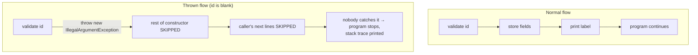

# Exceptions: first contact

> What it means when your program "crashes", how to *cause* that on purpose, and how to read the message it leaves behind. Genuinely introductory — the full treatment (checked vs unchecked, custom exceptions, catching well) comes in [step 06](../06-error-handling/exceptions-in-java.md). ~30 minutes.

## The problem

Your code will hit situations it cannot sensibly continue from: someone tries to create a parcel with no id, a lookup returns nothing, a number is divided by zero. If the program just carried on with garbage data, you'd get *wrong answers silently* — the worst kind of bug. Java needs a way to say **"stop — this is not okay"**, loudly.

## The solution

An **exception**: an object Java creates when something goes wrong, which immediately **interrupts the normal flow** of the program. Unless some code explicitly deals with it, the program stops and prints a report (the **stack trace**) telling you exactly what went wrong and where.

## Key words

| Word | Beginner meaning |
|---|---|
| **Exception** | An object representing "something went wrong", which interrupts normal execution. |
| **Throw** | To raise an exception: `throw new IllegalArgumentException("...")` says "stop, this is invalid". |
| **Catch** | To intercept a thrown exception and decide what to do instead of crashing. |
| **Stack trace** | The report a crash prints: what went wrong, and the chain of method calls that led there. |
| **Crash** | Informal for: an exception reached the top with nobody catching it, so the program ended. |
| **`IllegalArgumentException`** | The standard exception for "you called me with a bad value". |

## Normal flow vs thrown flow (one picture)

Normally, statements run top to bottom. The moment an exception is thrown, everything after it in that path is **skipped** — control jumps out of the method, out of its caller, and so on, until something catches it or the program ends.



## Throwing: how code says "no"

You've already seen this shape in [Step 02](../02-oop-and-composition/README.md)'s `Parcel` — it's how the constructor refuses nonsense:

```java
public Parcel(String id, String recipient) {
    if (id == null || id.isBlank()) {
        throw new IllegalArgumentException("id is required");
    }
    this.id = id;
    this.recipient = recipient;
}
```

Read `throw new IllegalArgumentException("id is required")` as three parts:

- `new IllegalArgumentException("...")` — create an exception object carrying a **message** (write messages a tired future-you will thank you for).
- `throw` — hurl it. The constructor stops **right here**; `this.id = id` never runs, and no half-valid `Parcel` ever exists.
- The caller's world now has a problem to deal with — or a crash to read.

## Reading a stack trace (the skill that pays forever)

Here is a tiny ParcelPilot-flavored program with a planted bug:

```java
public class Main {
    public static void main(String[] args) {
        Parcel parcel = createFromInput("", "Ava");   // oops: blank id
        System.out.println(parcel.label());
    }

    static Parcel createFromInput(String id, String recipient) {
        return new Parcel(id, recipient);
    }
}
```

Run it and you get:

```text
Exception in thread "main" java.lang.IllegalArgumentException: id is required
        at Parcel.<init>(Parcel.java:8)
        at Main.createFromInput(Main.java:9)
        at Main.main(Main.java:3)
```

**How to read it — first line first, then bottom-up:**

1. **Line 1: what went wrong.** The exception type (`IllegalArgumentException`) and the message (`id is required`). Always read this first; often it's the whole answer.
2. **The `at ...` lines: the chain of calls, innermost first.** The *top* `at` line is where the exception was thrown (`Parcel.java` line 8 — the `throw` inside the constructor; `<init>` means "constructor"). Reading **downward** walks you *out* toward `main`: the constructor was called by `createFromInput` (`Main.java:9`), which was called by `main` (`Main.java:3`).
3. **Find the deepest line that's in *your* code.** Here all three are yours. In Spring apps later, traces are long and mostly framework lines — scan from the bottom of the trace upward (or top-down for the first file *you* wrote) and jump to that file and line number.

So the diagnosis reads like a sentence: *"`main` line 3 called `createFromInput` line 9, which built a `Parcel`, whose constructor at line 8 rejected the id because it was blank."* The bug is at the call site: `main` passed `""`.

## Catching: try/catch (know it exists, use it sparingly)

Sometimes you want to intercept an exception instead of crashing:

```java
try {
    Parcel parcel = new Parcel(inputId, inputRecipient);
    System.out.println("created " + parcel.id());
} catch (IllegalArgumentException e) {
    System.out.println("invalid input: " + e.getMessage());
}
```

The `try` block runs normally; if a line inside throws an `IllegalArgumentException`, execution jumps to the `catch` block with the exception in `e`, and the program continues afterward.

## When to catch vs when to let it crash

At this stage of the course: **usually let it crash, and read the trace.**

- A crash with a good message is *information*. Catching too early hides it — the classic beginner sin is a `catch` that prints something vague (or nothing) and carries on, turning a loud, findable bug into a silent, wandering one.
- Only catch when you can genuinely **do something useful** at that spot: retry, substitute a default, or report the problem properly to a user.
- "Report properly to a user" is exactly what a web API needs — turning `IllegalStateException` into an HTTP `409 Conflict` instead of a crash. That's [step 06](../06-error-handling/README.md), where exceptions get their full treatment (checked vs unchecked, custom exception types, and where the catch *should* live) in [exceptions in Java](../06-error-handling/exceptions-in-java.md).

## Pros and cons of exceptions

| Pros | Cons |
|---|---|
| Impossible to ignore accidentally — bad states stop the program instead of corrupting it | A crash is jarring until you learn to read traces calmly |
| The message + trace point to the exact file and line | Caught-and-swallowed exceptions hide bugs worse than crashes do |
| Validation code stays near the data it protects | Overusing exceptions for normal control flow makes code confusing |

## Say it like a developer

- "The constructor **throws** an `IllegalArgumentException` when the id is blank."
- "It crashed — let me **read the stack trace**: the type, the message, then the first `at` line in our code."
- "The exception was thrown in `Parcel`, but the **bug is at the call site** that passed the blank id."
- "Don't **swallow** the exception — either handle it usefully or let it propagate."

## Quiz: check yourself

1. What happens to the rest of a method's code after a `throw` statement runs?

<details><summary>Show answer</summary>

It's skipped. The method stops immediately and control jumps out toward the caller (and further out) until something catches the exception or the program ends.

</details>

2. In a stack trace, what do the first line and the first `at` line tell you?

<details><summary>Show answer</summary>

The first line gives the exception type and message (what went wrong). The first `at` line is the exact file and line where the exception was thrown. The lines below it walk outward through the callers that led there.

</details>

3. The exception was thrown inside `Parcel`'s constructor. Does that mean the constructor has the bug?

<details><summary>Show answer</summary>

Not necessarily — the constructor is doing its job (rejecting bad input). The bug is usually at the *call site* further down the trace, where the bad value came from.

</details>

4. Why is `catch (Exception e) { }` (empty catch block) worse than letting the program crash?

<details><summary>Show answer</summary>

It swallows the evidence. The program continues in a broken state with no message and no trace, so the bug surfaces later, somewhere unrelated, and is much harder to find. A crash at least tells you exactly what and where.

</details>

## Next

Practice reading traces on purpose in [debugging your first program](debugging-your-first-program.md), then back to [Step 01](README.md). Exceptions return in full in [step 06: error handling](../06-error-handling/README.md).
