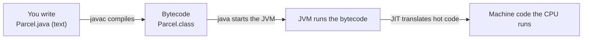
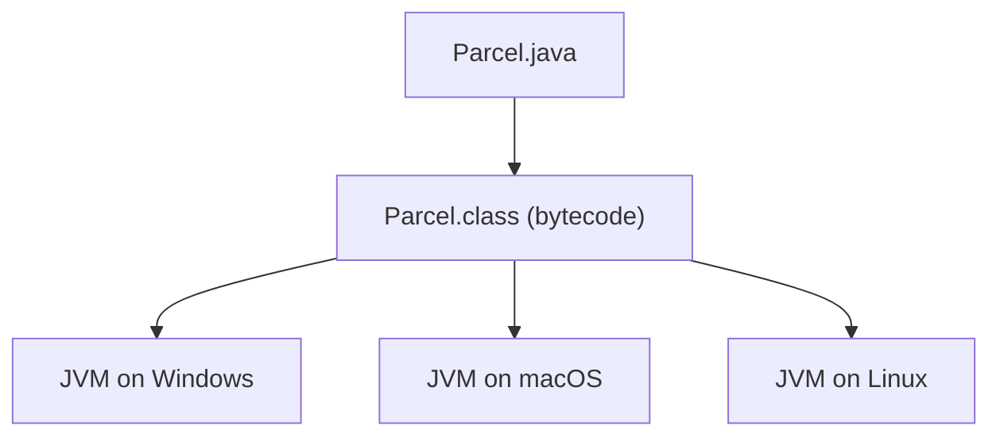
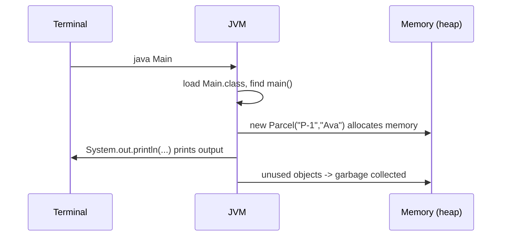

# How Java works (the flow)

Read this once. You do not need to memorize it — but knowing the flow removes a lot of "why do I run two commands?" confusion.

## The problem it explains

You wrote `Parcel.java` (plain text). But a computer's processor does not understand Java text — it understands its own machine instructions. Something must translate between them. Java's answer is a two-step flow with a helper program called the **JVM**.

## The big picture



1. **You write** `.java` source — human-readable text.
2. **`javac` compiles** it into **bytecode** (`.class` files). Bytecode is a compact instruction set that is *not* tied to any specific computer.
3. **`java` starts the JVM** (Java Virtual Machine), which reads the bytecode and executes it.
4. The JVM's **JIT** (Just-In-Time compiler) notices code that runs often ("hot") and translates it into fast machine code while the program runs.

## Key words

| Word | Beginner meaning |
|---|---|
| **JDK** | Java Development Kit: everything to **build** Java (includes `javac`, the JVM, libraries). |
| **JRE** | Java Runtime Environment: just enough to **run** Java (the JVM + libraries), no compiler. |
| **JVM** | Java Virtual Machine: the program that runs your bytecode. |
| **Bytecode** | The compiled `.class` instructions the JVM understands. |
| **JIT** | Just-In-Time compiler inside the JVM that speeds up frequently-run code. |
| **Garbage collector (GC)** | The JVM part that automatically frees memory you no longer use. |
| **Classpath** | The list of places the JVM looks to find your classes and libraries. |
| **Platform independence** | "Write once, run anywhere" — the same bytecode runs on any machine that has a JVM. |

## Why two steps (compile, then run)?

Because of **platform independence**. The compiler turns your code into bytecode *once*. That same bytecode then runs on Windows, macOS, or Linux, as long as each has a JVM. Contrast with languages that compile straight to one machine's instructions — those must be recompiled per platform.



This is also why **Docker + Java** fit so well later: we ship the bytecode (a JAR) with a JVM inside an image, and it runs identically anywhere.

## What happens when you run `java Main`

1. The JVM starts up.
2. It **loads** the `Main` class (finds `Main.class` on the classpath).
3. It finds the special `public static void main(String[] args)` method.
4. It starts executing your instructions there.
5. When you write `new Parcel(...)`, the JVM allocates memory for that object on the **heap**.
6. When nothing uses an object anymore, the **garbage collector** reclaims that memory automatically — you never free memory by hand in Java.



## Memory in one paragraph (enough for now)

Java keeps small, short-lived data (like a method's local variables) on the **stack**, and objects created with `new` on the **heap**. You don't manage this manually; the GC cleans up the heap. You'll meet these words again — for now, just know: `new` puts an object on the heap, and Java frees it for you.

## Pros and cons of this design

**Pros:** run anywhere; automatic memory management (fewer crashes/leaks); mature, fast JIT; huge library ecosystem.
**Cons:** startup is slower than pre-compiled native programs; the JVM uses extra memory; you need a JVM present to run anything (which Docker makes easy).

## Real-world analogy

Bytecode is like sheet music: written once in a standard notation. Any musician (JVM) on any instrument (OS) can play it. The composer (you) doesn't rewrite the song for each musician.

## Back to the step

Now the two commands make sense:

```bash
javac Main.java Parcel.java   # compile: .java -> .class bytecode
java Main                     # run: JVM executes the bytecode, starting at main()
```

Return to [Step 01](README.md) and finish the build if you haven't.
