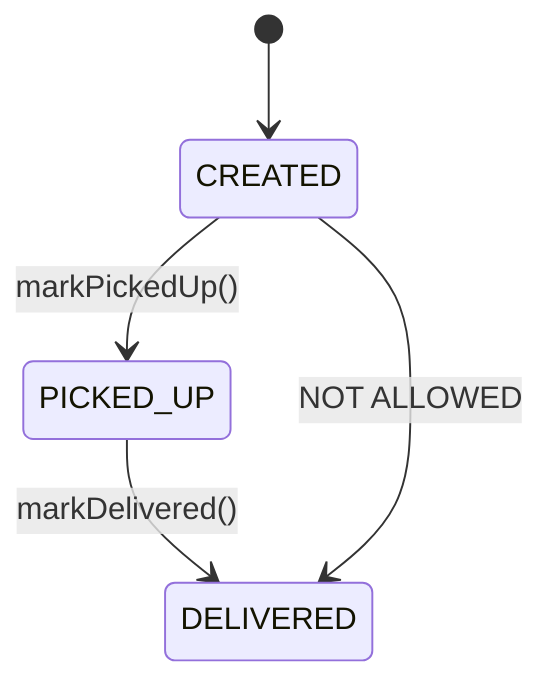
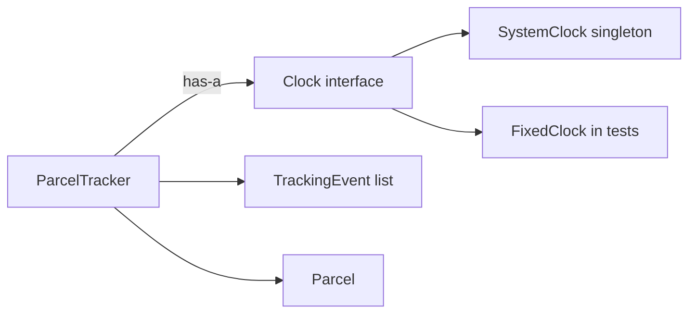

# Step 02: OOP rules, composition, and first patterns

> In this step: stop parcels from entering impossible states, record when things happen, and meet four ideas by name: encapsulation, composition, singleton, builder, and factory. ~90 minutes.

## The problem right now

From step 01, a `Parcel` is just three text fields. Two things are wrong:

1. You can create a nonsense parcel (`new Parcel("", "")`).
2. There are no **rules**: nothing stops a parcel being "delivered" before it was ever "picked up", and nothing records *when* each change happened.

A real parcel moves through a lifecycle, and the code must **forbid impossible moves**.



## Key words

| Word | Beginner meaning |
|---|---|
| **OOP** | Object-Oriented Programming: organizing code as objects that hold data + behavior. |
| **Encapsulation** | Keep data private, and only change it through methods that enforce rules. |
| **State** | The current situation of an object (e.g. status = `PICKED_UP`). |
| **Enum** | A fixed, named set of allowed values (e.g. the three statuses). |
| **Exception** | Java's way of signaling "this is not allowed" and stopping the bad action. |
| **Interface** | A contract: a list of methods without the how (e.g. `Clock`). |
| **Composition** | An object *has* the helpers it needs, given from outside ("has-a"). |
| **Inheritance** | An object *is a* special kind of another ("is-a"), powerful but easy to misuse. |
| **Dependency** | Something an object needs to do its job (e.g. a tracker needs a clock). |
| **Design pattern** | A named, reusable solution to a common problem. |
| **Singleton** | Pattern: exactly one shared instance exists. |
| **Builder** | Pattern: construct an object step-by-step, readably. |
| **Factory** | Pattern: a method decides which object to create for you. |

## Idea 1: Encapsulation (rules that protect the data)

Right now anyone could set `status` to anything. Encapsulation means the data is `private` and can only change through methods that **check the rules first**.

First, replace the loose `String status` with an **enum**, a fixed set of valid values, so a typo like `"DELIVRED"` becomes impossible:

```java
public enum Status {
    CREATED, PICKED_UP, DELIVERED
}
```

Then the parcel guards its own transitions. If a move is illegal, we throw an **exception** (stop with an error) instead of allowing bad data:

```java
public class Parcel {
    private final String id;
    private final String recipient;
    private Status status = Status.CREATED;

    public Parcel(String id, String recipient) {
        if (id == null || id.isBlank()) {
            throw new IllegalArgumentException("id is required");
        }
        if (recipient == null || recipient.isBlank()) {
            throw new IllegalArgumentException("recipient is required");
        }
        this.id = id;
        this.recipient = recipient;
    }

    public void markPickedUp() {
        if (status != Status.CREATED) {
            throw new IllegalStateException("can only pick up a CREATED parcel");
        }
        status = Status.PICKED_UP;
    }

    public void markDelivered() {
        if (status != Status.PICKED_UP) {
            throw new IllegalStateException("can only deliver a PICKED_UP parcel");
        }
        status = Status.DELIVERED;
    }

    public String id() { return id; }
    public Status status() { return status; }
}
```

Notice `final` on `id` and `recipient`: once set, they can't change. An id shouldn't move to a different parcel. This is encapsulation: **the rule lives next to the data it protects.**

## Idea 2: Composition (give an object what it needs)

We want to record *when* each change happens. The parcel needs the current time, but reading the real clock directly makes testing hard (time always moves). Instead we define a small **interface** and *give* it to a tracker. This is **composition** ("has-a").

```java
import java.time.Instant;

public interface Clock {
    Instant now();
}
```

A record for what happened (a `record` is a short way to make a small data-holding class):

```java
import java.time.Instant;

public record TrackingEvent(String parcelId, Status newStatus, Instant when) {}
```

The tracker is *composed of* a clock and a list of events. The clock is passed **in** through the constructor:

```java
import java.util.ArrayList;
import java.util.List;

public class ParcelTracker {
    private final Clock clock;                          // a dependency, given from outside
    private final List<TrackingEvent> events = new ArrayList<>();

    public ParcelTracker(Clock clock) {                 // composition happens here
        this.clock = clock;
    }

    public void pickUp(Parcel parcel) {
        parcel.markPickedUp();
        events.add(new TrackingEvent(parcel.id(), parcel.status(), clock.now()));
    }

    public void deliver(Parcel parcel) {
        parcel.markDelivered();
        events.add(new TrackingEvent(parcel.id(), parcel.status(), clock.now()));
    }

    public List<TrackingEvent> events() { return List.copyOf(events); }
}
```

### Why composition beats inheritance here

A `ParcelTracker` is **not** "a kind of clock", so it shouldn't inherit from one. It **has** a clock. Because the clock is passed in, a test can pass a fake clock and get predictable timestamps. Loosely-connected parts are easier to change and test.

> This "has-a vs is-a" choice is so important that it has its own companion page: [Composition vs inheritance](composition-vs-inheritance.md), with the wrong-way example, the right-way fix, a comparison table, and when inheritance *is* appropriate. Read it before the lab.



## Idea 3: Singleton (exactly one real clock)

The real clock is stateless (it just reads the system time), so one shared instance is enough. That's the **singleton** pattern: a `private` constructor (nobody else can build one) plus one shared instance handed out by `instance()`:

```java
import java.time.Instant;

public final class SystemClock implements Clock {
    private static final SystemClock INSTANCE = new SystemClock();
    private SystemClock() {}                       // nobody outside can call new
    public static SystemClock instance() { return INSTANCE; }
    @Override public Instant now() { return Instant.now(); }
}
```

**Rule:** use singletons only for small, stateless helpers. Never use one to hide global changing data. That makes bugs and tests painful.

## Ideas 4 & 5: Builder and Factory (in the lab)

- **Builder**, for readable creation with optional fields: `Parcel.builder().id("P-1").recipient("Ava").priority(true).build()` instead of a long confusing constructor.
- **Factory**, a method that picks the right object: `NotificationSenderFactory.forChannel(SMS)` returns an SMS sender without callers knowing the concrete class.

Do the [builder and factory lab](patterns-lab.md) to add these.

### Pros and cons of the patterns

| Pattern | Pros | Avoid when |
|---|---|---|
| Singleton | one shared instance, no repeated setup | it would hold changing data, or overuse hurts tests |
| Builder | readable, validates at `build()` | the object has only 2 simple fields |
| Factory | hides which implementation is chosen | there is only ever one implementation |

**Real-world examples:** a logger is often a singleton, a pizza/order object uses a builder (many optional parts), and a payment library uses a factory to pick "Visa" vs "PayPal" handlers.

## Build it in ParcelPilot (do this exactly)

Work in `applications/parcelpilot`.

1. Add `Status.java` (the enum above).
2. Rewrite `Parcel.java` with the guarded transitions and validating constructor.
3. Add `Clock.java`, `SystemClock.java`, `TrackingEvent.java`, and `ParcelTracker.java`.
4. Update `Main.java` to run a full lifecycle and print the events.
5. Do the [builder and factory lab](patterns-lab.md).

Example `Main.java`:

```java
public class Main {
    public static void main(String[] args) {
        ParcelTracker tracker = new ParcelTracker(SystemClock.instance());
        Parcel parcel = new Parcel("P-1", "Ava");

        tracker.pickUp(parcel);
        tracker.deliver(parcel);

        System.out.println("final status: " + parcel.status());
        tracker.events().forEach(System.out::println);
    }
}
```

## Test it

```bash
cd applications/parcelpilot
javac *.java
java Main
```

Expected: final status `DELIVERED` and two `TrackingEvent` lines. Then, to see a rule work, temporarily add `new Parcel("P-2","Ben").markDelivered();` in `main` and confirm it **throws** `IllegalStateException` (delivering before pickup).

## Acceptance criteria

- [ ] `new Parcel("", "")` throws an error instead of creating a broken parcel.
- [ ] Delivering a parcel that was never picked up throws `IllegalStateException`.
- [ ] Each successful change records a `TrackingEvent` with a timestamp from the injected `Clock`.
- [ ] `ParcelTracker` receives its `Clock` via the constructor (it does not call `SystemClock.instance()` deep inside `Parcel`).
- [ ] You created a parcel with the **builder** (from the lab).
- [ ] You can explain in one sentence each: encapsulation, composition, singleton, builder, factory.

## Say it like a developer

- "The `Parcel` **encapsulates** its status. You can only change it through `markPickedUp()` and `markDelivered()`, which **enforce the rules**."
- "`Status` is an **enum**, so an invalid value like `DELIVRED` can't even compile."
- "Trying an illegal move **throws** an `IllegalStateException`."
- "`ParcelTracker` **has-a** `Clock`, which is **composition**, not inheritance."
- "I **inject** the clock through the constructor, so a test can pass a fake one, which is **dependency injection**."
- "`SystemClock` is a **singleton**: there's exactly one shared instance."
- "I built the parcel with a **builder** and picked a sender with a **factory**."

## Quiz: check yourself

Answer out loud before opening each toggle.

1. What does **encapsulation** mean, and how does `Parcel` use it?

<details><summary>Show answer</summary>

Encapsulation means keeping data `private` and only allowing changes through methods that enforce rules. `Parcel` keeps `status` private and only changes it via `markPickedUp()`/`markDelivered()`, which reject illegal transitions.

</details>

2. Why use an **enum** for `Status` instead of a `String`?

<details><summary>Show answer</summary>

An enum is a fixed set of allowed values, so typos like `"DELIVRED"` are impossible: the code won't compile. A `String` could hold any nonsense value.

</details>

3. What is the difference between **composition** ("has-a") and **inheritance** ("is-a")? Which does `ParcelTracker` use for its clock?

<details><summary>Show answer</summary>

Composition means an object *has* a helper given from outside. Inheritance means an object *is a* special kind of another. `ParcelTracker` **has-a** `Clock` (composition), so it is not a kind of clock.

</details>

4. Why is passing the `Clock` into the constructor (instead of calling `SystemClock.instance()` inside) so useful?

<details><summary>Show answer</summary>

Because a test can pass a `FixedClock` that returns a known time, making timestamps predictable. Injected dependencies make code easier to test and change.

</details>

5. What makes `SystemClock` a **singleton**, and when should you avoid singletons?

<details><summary>Show answer</summary>

A private constructor (nobody else can `new` it) plus one shared instance handed out by `instance()`. Avoid singletons for anything holding changing data. That creates hidden global state that breaks tests.

</details>

6. When is a **builder** worth it, and when is it overkill?

<details><summary>Show answer</summary>

Worth it when an object has many fields (especially optional ones), so creation stays readable and validation happens at `build()`. Overkill for an object with just two simple required fields.

</details>

## Reflect (stretch)

Because the clock is injected, a `FixedClock` in a test could return a known instant and you could assert exact timestamps, but you're still checking results by eye in `main`. Running checks by hand doesn't scale. The next step gives you **automated tests**.

## Next

[Step 03](../03-maven/README.md): use Maven so one command compiles and tests everything.
