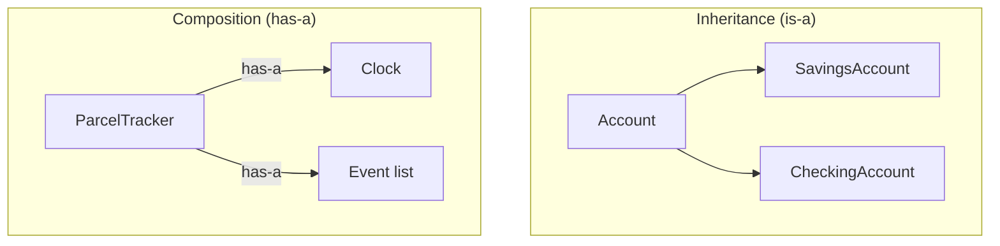

# Composition vs inheritance

This is one of the most important beginner decisions in OOP. Both let you reuse code, but they connect objects very differently.

## The two relationships

- **Inheritance = "is-a".** A `SavingsAccount` **is a** kind of `Account`. The child gets the parent's fields and methods automatically.
- **Composition = "has-a".** A `ParcelTracker` **has a** `Clock`. It holds a reference to another object and uses it.



## The problem inheritance can cause

Inheritance tightly binds child to parent. Change the parent and every child is affected — sometimes in surprising ways. The classic trap: you inherit to reuse a method, but you also inherit things that don't make sense for the child.

```java
// Tempting but wrong: a tracker is NOT a kind of clock
class ParcelTracker extends SystemClock {   // BAD
    // now a tracker accidentally "is a" clock and exposes now(), etc.
}
```

A `ParcelTracker` is not a specialized clock. Saying so leaks clock methods onto the tracker and locks you into `SystemClock` forever.

## The composition solution

Give the tracker a clock instead of making it one:

```java
class ParcelTracker {
    private final Clock clock;               // has-a
    ParcelTracker(Clock clock) {             // receive it from outside
        this.clock = clock;
    }
    void pickUp(Parcel p) {
        p.markPickedUp();
        // uses the clock's behavior, without BEING a clock
        var event = new TrackingEvent(p.id(), p.status(), clock.now());
    }
}
```

Now you can pass a real `SystemClock` in production and a `FixedClock` in tests. The tracker only depends on the small `Clock` **interface**, not a concrete class.

## Why "prefer composition over inheritance"

| | Inheritance (is-a) | Composition (has-a) |
|---|---|---|
| Coupling | tight: child locked to parent | loose: depends on a small interface |
| Testing | hard to swap parent behavior | easy: pass a fake collaborator |
| Flexibility | one fixed parent | swap implementations freely |
| Risk | parent changes break children | changes stay local |

The rule of thumb: **reach for composition first.** Use inheritance only when the child truly *is* a substitutable kind of the parent (and even then, prefer inheriting from an interface).

## When inheritance IS appropriate

- Modeling a genuine "is-a" that is always substitutable (e.g. `SmsSender` and `EmailSender` both **are** a `NotificationSender`). Here we inherit from an **interface**, which is the safest form.
- Frameworks sometimes ask you to extend a base class — that's fine when the framework designed it that way.

## Real-world analogy

A car **has an** engine (composition) — you can swap a petrol engine for an electric one. A sports car **is a** car (inheritance) — a fixed, permanent relationship. You'd never say a car **is an** engine.

## Back to the step

In [Step 02](README.md) you inject a `Clock` into `ParcelTracker`. That injection *is* composition, and it's why the step's test can use a `FixedClock`.
