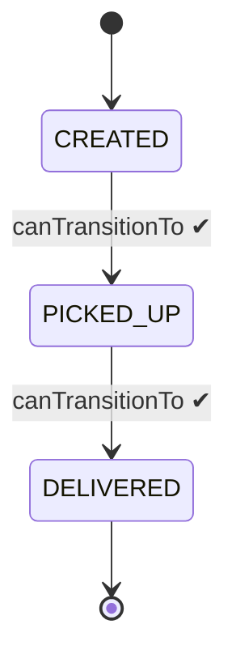

# Enums explained

> In [Step 02](README.md) you replaced `String status` with an enum in three lines. This page shows what an enum actually is, why the alternatives invite bugs, and the enum features you'll lean on for the rest of the course. ~40 minutes.

## The problem

A parcel's status is one of exactly three values: `CREATED`, `PICKED_UP`, `DELIVERED`. How do you represent "one value out of a fixed set" in code? The obvious candidates — strings and int constants — both *work*, and both quietly invite bugs the compiler can't catch.

## The solution

An **enum**: a type whose complete list of possible values is written down once, checked by the compiler everywhere.

## Key words

| Word | Beginner meaning |
|---|---|
| **Enum** | A type with a fixed, named set of instances (`enum Status { CREATED, ... }`). |
| **Enum constant** | One of those named instances, e.g. `Status.CREATED`. |
| **Ordinal** | A constant's position in the declaration (0, 1, 2, …) — fragile, avoid storing it. |
| **`values()`** | Built-in method returning all constants in declaration order. |
| **`valueOf(String)`** | Built-in method turning text into a constant — throws if the text matches nothing. |
| **Exhaustive switch** | A `switch` covering every constant, so the compiler flags forgotten cases. |

## What an enum really is: a class with a fixed guest list

`enum` looks like new syntax, but underneath it's a **class** — one whose instances are created by Java, all at once, and *nobody else may ever create another*:

```java
public enum ParcelStatus {
    CREATED, PICKED_UP, DELIVERED
}
```

is conceptually:

```java
public final class ParcelStatus {
    public static final ParcelStatus CREATED   = new ParcelStatus();
    public static final ParcelStatus PICKED_UP = new ParcelStatus();
    public static final ParcelStatus DELIVERED = new ParcelStatus();

    private ParcelStatus() {}   // private constructor: the list above is ALL there is
}
```

Three pre-built objects, a private constructor, done. (Recognize the shape? It's the [singleton](README.md) idea — an enum is a set of singletons.) Two consequences fall out of "it's a class":

1. Each constant **is an object**, so enums can have fields and methods (below).
2. Each constant exists **exactly once**, so `==` comparison is safe (also below).

## Why not Strings or int constants? (the bugs each allows)

**Strings.** Any text is a "valid" status as far as the compiler cares:

```java
String status = "CREATED";
status = "DELIVRED";                       // typo: compiles, runs, corrupts data
status = "delivered";                      // case mismatch: is this the same status?
if (status == "CREATED") { ... }           // == on strings: sometimes false anyway
```

Every one of those bugs surfaces at *runtime*, in production, as weird behavior — not at compile time as a red squiggle.

**Int constants** (the pre-enum idiom you'll still meet in old code):

```java
public static final int CREATED = 0;
public static final int PICKED_UP = 1;
public static final int DELIVERED = 2;

int status = PICKED_UP;
status = 7;                                // no such status — compiles fine
status = status + 1;                       // "incrementing a status"?? compiles fine
int x = CREATED * DELIVERED;               // meaningless math — compiles fine
```

An `int` doesn't know it's supposed to be a status. The enum closes every hole at once:

```java
ParcelStatus status = ParcelStatus.CREATED;
status = ParcelStatus.DELIVRED;   // ❌ compile error: no such constant
status = 7;                       // ❌ compile error: int is not a ParcelStatus
```

**The whole universe of invalid values is unrepresentable.** This is the "make invalid states impossible" habit from [best practices #3](../../references/java-best-practices.md#3-make-invalid-states-impossible).

## Enums with fields and methods (the underused superpower)

Because constants are objects, they can carry data and behavior. Watch `ParcelStatus` absorb the transition rules that [Step 02](README.md) wrote as `if`-checks inside `Parcel`:

```java
public enum ParcelStatus {
    CREATED("waiting for pickup"),
    PICKED_UP("on the way"),
    DELIVERED("done");

    private final String description;          // each constant carries its own

    ParcelStatus(String description) {         // runs once per constant, at class load
        this.description = description;
    }

    public String description() { return description; }

    public boolean canTransitionTo(ParcelStatus next) {
        return switch (this) {
            case CREATED   -> next == PICKED_UP;
            case PICKED_UP -> next == DELIVERED;
            case DELIVERED -> false;            // terminal state
        };
    }
}
```

Now the state machine's rules live *inside the type that is the state*, and `Parcel` shrinks to:

```java
public void transitionTo(ParcelStatus next) {
    if (!status.canTransitionTo(next)) {
        throw new IllegalStateException("cannot go from " + status + " to " + next);
    }
    status = next;
}
```



## `values()` and `valueOf()`: the free built-ins

Every enum gets these without you writing anything:

```java
for (ParcelStatus s : ParcelStatus.values()) {         // all constants, in order
    System.out.println(s + ": " + s.description());
}

ParcelStatus s = ParcelStatus.valueOf("PICKED_UP");    // text -> constant
ParcelStatus bad = ParcelStatus.valueOf("SHIPPED");    // 💥 IllegalArgumentException
```

That exception on `valueOf` is a feature with a future: the moment ParcelPilot becomes a web API, clients will send statuses **as text** in JSON, and *"is this text one of our real statuses?"* becomes a validation question at the system's boundary. `valueOf` (and friendlier wrappers around it) is exactly how [step 05: validation and inputs](../05-validation-and-inputs/README.md) answers it — invalid text gets rejected at the door instead of wandering into the domain.

## Switch over enums: the compiler counts your cases

A modern `switch` expression over an enum must be **exhaustive** — cover every constant or don't compile:

```java
String emoji = switch (status) {
    case CREATED   -> "📦";
    case PICKED_UP -> "🚚";
    case DELIVERED -> "✅";
};   // no default needed: all three covered
```

Here's the payoff: add a fourth status (`RETURNED`) next month, and **every such switch turns into a compile error** until you handle the new case. The compiler hands you a to-do list of every spot that needs thought. A `default ->` branch would silence that help — so with enums, prefer listing all cases and *omitting* `default` when you can.

## EnumSet and EnumMap (one paragraph)

When you need a *collection* of enum values, `EnumSet` and `EnumMap` are drop-in, enum-specialized versions of `Set` and `Map` ([collections basics](../01-java-basics/collections-basics.md)): `EnumSet.of(CREATED, PICKED_UP)` for "the non-terminal statuses", `new EnumMap<ParcelStatus, Long>(ParcelStatus.class)` for per-status counters. Because the full set of keys is known at compile time they're faster and smaller than their hash-based cousins — and they even iterate in declaration order. Nothing to memorize: just know they exist so you reach for them when the key is an enum.

## Pros and cons

| Pros | Cons |
|---|---|
| Invalid values can't compile — typo-proof by construction | The set of values is fixed at compile time (users can't add one at runtime — usually a feature!) |
| Carries fields and methods: rules live inside the type | Slightly more ceremony than a bare `String` |
| Exhaustive `switch`: the compiler finds every forgotten case | `valueOf` throws on unknown text — you must handle boundaries deliberately (step 05) |
| Safe `==` comparison, free `values()`/`valueOf()` | Persisting them has a trap (ordinal — see below) |

## Common mistakes

**Persisting by ordinal.** Each constant has a position number: `CREATED.ordinal()` is `0`. It's tempting (some tools even default to it) to store that number in a database. Don't: reorder the declaration or insert a constant, and **every stored number silently means a different status**. `PICKED_UP` becomes someone's `DELIVERED` — data corruption with no error anywhere. Store the **name** instead (`name()` / store-as-string). This trap gets a proper treatment when parcels hit a real database in [step 10: persistence](../10-persistence/README.md).

**Fearing `==` and using `equals` (or vice versa) without knowing why.** For enums specifically, `==` is *correct and preferred*: each constant exists exactly once, so identity and equality coincide. `==` is also null-safe (`status == ParcelStatus.CREATED` is simply `false` when `status` is null, while `status.equals(...)` throws `NullPointerException`) and typo-proof (comparing an enum to the wrong *type* won't compile). This is the one famous exception to the "compare objects with `.equals()`" rule from [data types](../01-java-basics/data-types.md) — strings still need `.equals()`.

**Validating with `valueOf` and letting the raw exception escape.** At a boundary, catch it (or check against `values()`) and turn it into a *helpful* message: "unknown status 'SHIPPED', expected one of CREATED, PICKED_UP, DELIVERED". Step 05 makes this concrete.

## Say it like a developer

- "`ParcelStatus` is an **enum**, so an invalid status is a **compile error**, not a runtime surprise."
- "The transition rules live **on the enum** in `canTransitionTo`, next to the states they govern."
- "The **switch is exhaustive** — add a constant and the compiler points at every place that must handle it."
- "Never persist the **ordinal**; store the **name**."
- "Enums are the one place where **`==` beats `equals`**: single instances, null-safe, type-checked."

## Quiz: check yourself

1. What is an enum underneath the syntax?

<details><summary>Show answer</summary>

A class whose instances are a fixed, pre-built set of named constants, with a private constructor so no further instances can ever be created — essentially a family of singletons.

</details>

2. Name two bugs a `String` status allows that `ParcelStatus` makes impossible.

<details><summary>Show answer</summary>

Typos (`"DELIVRED"`) and case mismatches (`"delivered"`) compile fine as strings but are compile errors as enum constants. (Also: strings compare wrongly with `==`, and any arbitrary text can be assigned.)

</details>

3. Why is storing `status.ordinal()` in a database dangerous?

<details><summary>Show answer</summary>

The ordinal is just the declaration position. Reordering or inserting a constant shifts the numbers, so existing stored values silently point at different statuses. Store the name instead.

</details>

4. What does `ParcelStatus.valueOf("SHIPPED")` do, and where does that matter in ParcelPilot's future?

<details><summary>Show answer</summary>

It throws `IllegalArgumentException` because no constant has that name. It matters at the API boundary (step 05), where client-sent text must be validated and rejected with a helpful message before it reaches the domain.

</details>

5. Why is `==` the right comparison for enums when it's wrong for strings?

<details><summary>Show answer</summary>

Each enum constant exists exactly once, so "same object" and "same value" are the same question. Strings with equal text can be different objects, so they need `.equals()`. Enum `==` is also null-safe and type-checked.

</details>

6. What advantage does an exhaustive `switch` over an enum give you when the enum grows?

<details><summary>Show answer</summary>

Adding a constant turns every non-exhaustive switch into a compile error, so the compiler lists every place in the codebase that must handle the new case — no forgotten branch ships.

</details>

## Next

Back to [Step 02](README.md). Related: [interfaces and abstractions](interfaces-and-abstractions.md) (the other kind of type this step introduces), enum validation at the boundary in [step 05](../05-validation-and-inputs/README.md), and the ordinal trap resurfaces in [step 10: persistence](../10-persistence/README.md).
