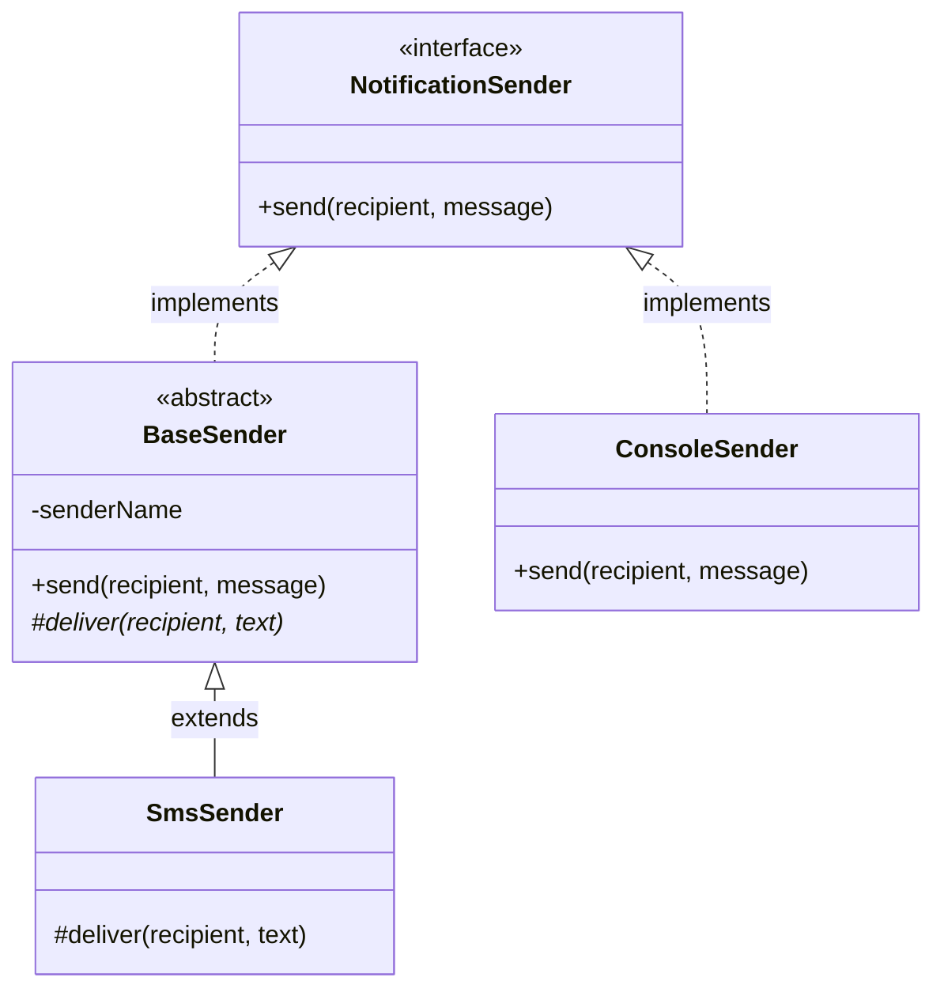
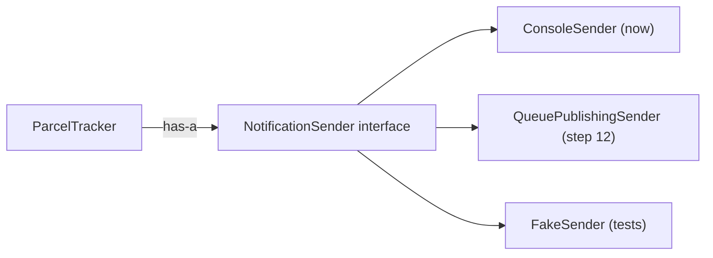

# Interfaces and abstractions

> In [Step 02](README.md) you met `Clock`, an interface, without much ceremony. This page explains what an interface really is, how it differs from an abstract class, and why "program to an interface" is one of the most-repeated sentences in software. ~40 minutes.

## The problem

`ParcelTracker` needs the current time. If it depends directly on the concrete `SystemClock`, it is welded to it: no fake clock in tests, no different clock ever, without editing the tracker itself. More generally: **code that depends on a concrete class can only ever work with exactly that class.** We want to depend on *what we need done*, not on *who does it*.

## The solution

An **abstraction**: a type that describes capability without implementation. Java gives you two tools for this — the **interface** (a pure contract) and the **abstract class** (a contract *plus* shared code). Depending on the abstraction leaves the concrete choice open.

## Key words

| Word | Beginner meaning |
|---|---|
| **Abstraction** | Describing *what* something does while hiding *how*. |
| **Interface** | A pure contract: method signatures with no state, implemented with `implements`. |
| **Abstract class** | A half-finished class: some methods implemented, some left for children, extended with `extends`. |
| **Contract** | The promise: "anything of this type can do these things". |
| **Implementation** | A concrete class that fulfills the contract. |
| **`@Override`** | Annotation marking "this method fulfills a promise from the interface/parent" — the compiler checks you got the signature right. |
| **Default method** | An interface method *with* a body, used by implementations that don't override it. |
| **Seam** | A place where you can swap one implementation for another without touching surrounding code. |

## Interface vs abstract class (plain definitions)

**An interface is a list of promises.** No fields holding state, just "whoever implements me can do these things":

```java
public interface NotificationSender {
    void send(String recipient, String message);
}
```

**An abstract class is a half-finished class.** It can have fields, constructors, and fully implemented methods, but leaves some methods `abstract` (bodyless) for children to fill in:

```java
public abstract class BaseSender {
    private final String senderName;              // shared state

    protected BaseSender(String senderName) { this.senderName = senderName; }

    public void send(String recipient, String message) {
        deliver(recipient, "[" + senderName + "] " + message);   // shared logic...
    }

    protected abstract void deliver(String recipient, String text);  // ...child fills this in
}
```



## When to use which (decision table)

| Question | Interface | Abstract class |
|---|---|---|
| Do implementations share **state or code**? | no — pure contract | yes — that's its reason to exist |
| Can a class take on **several** of them? | ✅ `implements A, B` | ❌ only one `extends` |
| Coupling between contract and implementations | loose | tighter (children inherit fields and behavior) |
| Typical use | boundaries and swap points (`Clock`, `NotificationSender`, `List`) | a family of variants sharing a code skeleton |
| Default choice? | **start here** | only when duplication across implementations actually hurts |

Rule of thumb: **need only a contract? Interface. Need a contract *plus* shared code? Abstract class** — and even then, ask whether composition (a shared helper object) would do the same with less coupling ([composition vs inheritance](composition-vs-inheritance.md)).

## Two Java specifics worth knowing

**Default methods.** Since Java 8, an interface *may* carry method bodies, marked `default`. Implementations get them for free and can override them. This exists mainly so interfaces can evolve (adding a method to an interface would otherwise break every implementer), and it blurs the interface/abstract-class line a little — but an interface still can't hold instance state, so the decision table above stands.

**Multiple interfaces vs single superclass.** A Java class can extend only **one** class, but implement **many** interfaces. `class SmsSender extends BaseSender implements NotificationSender, AutoCloseable` is legal. That's a strong practical reason to express capabilities as interfaces: they compose, superclasses don't.

## A ParcelPilot example: the seam you'll thank yourself for

When a parcel is delivered, someone should be told. Today, "told" means a line in the terminal. Define the *capability* as an interface and the terminal version as one implementation:

```java
public interface NotificationSender {
    void send(String recipient, String message);
}

public class ConsoleSender implements NotificationSender {
    @Override
    public void send(String recipient, String message) {
        System.out.println("NOTIFY " + recipient + ": " + message);
    }
}
```

The tracker asks for the *interface* — composition, exactly like the `Clock` in [Step 02](README.md):

```java
public class ParcelTracker {
    private final Clock clock;
    private final NotificationSender sender;     // depends on the contract only

    public ParcelTracker(Clock clock, NotificationSender sender) {
        this.clock = clock;
        this.sender = sender;
    }

    public void deliver(Parcel parcel) {
        parcel.markDelivered();
        sender.send(parcel.recipient(), "Your parcel " + parcel.id() + " was delivered");
    }
}
```

Here's the payoff, and it's not hypothetical in this course: in **step 12**, notifications stop being a console line and become messages published to a **queue**, handled by a worker. Because `ParcelTracker` depends on `NotificationSender` and not on `ConsoleSender`, that change is *one new implementing class* passed into the constructor — the tracker doesn't change by a single character. The interface is a **seam**: a prepared cut-line where the future can be swapped in. (Preview: [step 12: queues](../12-queues/README.md).)



## "Program to an interface" — what the phrase actually means

You've been doing it since [collections basics](../01-java-basics/collections-basics.md):

```java
List<Parcel> parcels = new ArrayList<>();   // variable type: the contract
```

The variable's type is `List` (what it can do), and only the `new` names `ArrayList` (how it does it). Everything downstream — parameters, return types, fields — speaks `List`, so swapping the implementation touches exactly one line. The phrase means: **let your declarations name the contract; confine the concrete class to the one place that constructs it.** `Clock`/`SystemClock` and `NotificationSender`/`ConsoleSender` are the same move.

## Pros and cons

| Pros | Cons |
|---|---|
| Swap implementations without touching callers (tests, step 12) | One more type to read for each seam |
| A class can implement many interfaces (capabilities compose) | Indirection can obscure "what actually runs here?" |
| Tests pass fakes instead of real clocks/senders/queues | Speculative interfaces add noise (see below) |
| Contracts document intent (`Clock` says exactly what's needed) | Abstract classes couple children to parent changes |

## Common mistakes

**The "just in case" interface.** The classic over-correction: every class gets a matching interface (`ParcelService` + `ParcelServiceImpl`) with exactly one implementation, forever, "in case we need another". Honest take: an interface with one implementation and *no test fake, no plausible second implementation, no module boundary* is pure ceremony — it doubles the files and helps nobody. Our `Clock` and `NotificationSender` earn their existence concretely: `Clock` gets a `FixedClock` in tests *today*, and `NotificationSender` has a named successor arriving in step 12. Extract an interface **when the second implementation (or the test fake) is real**, not when it's imaginable. Pulling an interface out of a concrete class later is a small, safe refactor — you lose almost nothing by waiting.

**Abstract class as a code dumping ground.** A `BaseService` that accumulates helpers for unrelated children creates the tight coupling that [composition vs inheritance](composition-vs-inheritance.md) warns about. Shared *code* usually wants to be a small injected helper, not a parent.

**Forgetting `@Override`.** Without it, a typo in the method name silently creates a *new* method instead of implementing the contract — and the compiler can't warn you. Always annotate.

## Say it like a developer

- "`NotificationSender` is the **interface**; `ConsoleSender` is one **implementation** of it."
- "The tracker **programs to the interface**, so step 12 swaps in a queue-based sender without touching it."
- "I declared it as `List`, not `ArrayList` — **name the contract, confine the concrete class**."
- "Don't extract an interface **just in case** — extract it when the second implementation or the test fake is real."
- "A class can **implement many interfaces** but **extend only one class**."

## Quiz: check yourself

1. What's the core difference between an interface and an abstract class?

<details><summary>Show answer</summary>

An interface is a pure contract: method signatures, no instance state. An abstract class is a partial implementation: it can hold fields and shared method bodies, leaving some methods abstract for children. Interface = *what*; abstract class = *what plus some shared how*.

</details>

2. Why does `ParcelTracker` depend on `NotificationSender` instead of `ConsoleSender` directly?

<details><summary>Show answer</summary>

So the implementation can be swapped without editing the tracker: a fake sender in tests today, a queue-publishing sender in step 12. The interface is a seam.

</details>

3. What does "program to an interface" mean in `List<Parcel> parcels = new ArrayList<>()`?

<details><summary>Show answer</summary>

The declaration names the contract (`List`), and the concrete class (`ArrayList`) appears only at construction. All surrounding code depends on `List`, so changing the implementation is a one-line change.

</details>

4. When is creating an interface a mistake?

<details><summary>Show answer</summary>

When it has one implementation and no realistic second one, no test fake, and no boundary to protect — it's ceremony that doubles files without adding flexibility. Extract the interface when the need is real; it's a cheap refactor to do later.

</details>

5. How many classes can a Java class extend, and how many interfaces can it implement?

<details><summary>Show answer</summary>

Extend exactly one class, implement any number of interfaces. That's why capabilities are usually modeled as interfaces: they compose.

</details>

## Next

Back to [Step 02](README.md). Related: [composition vs inheritance](composition-vs-inheritance.md) (why we inject these interfaces), [enums explained](enums-explained.md) (the other kind of type you meet in this step), and the seam pays off in [step 12: queues](../12-queues/README.md).
