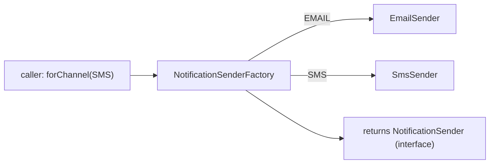

# Pattern lab: Builder and Factory

Two patterns you'll actually use in ParcelPilot, each explained the same way: **problem → solution → high-level → code → pros/cons → when to use**.

---

# Pattern 1: Builder

## The problem (real world)

Imagine ordering a coffee by shouting all options in a fixed order: `new Coffee("large", true, false, 2, null, true)`. Nobody can read that. Which `true` is "extra shot"? What's the `null`? Now do the same for a `Parcel` that grows optional fields (priority, insurance, notes, weight):

```java
// what do these values even mean?
Parcel p = new Parcel("P-1", "Ava", true, false, null, 2.5);
```

This is called the **telescoping constructor problem**: as options grow, constructors multiply and become unreadable and error-prone (easy to swap two arguments of the same type).

## The solution

A **Builder** collects fields one at a time by name, applies defaults for what you skip, validates once, and creates the object in `build()`.

## High-level

```mermaid
flowchart LR
  B["Parcel.builder()"] --> S1[".id(\"P-1\")"]
  S1 --> S2[".recipient(\"Ava\")"]
  S2 --> S3[".priority(true)"]
  S3 --> V["build(): validate + create"]
  V --> P["a valid Parcel"]
```

## Code example

```java
public class Parcel {
    private final String id;
    private final String recipient;
    private final boolean priority;

    private Parcel(Builder b) {           // only the builder may construct
        this.id = b.id;
        this.recipient = b.recipient;
        this.priority = b.priority;
    }

    public static Builder builder() { return new Builder(); }

    public static class Builder {
        private String id;
        private String recipient;
        private boolean priority = false;  // optional -> sensible default

        public Builder id(String id) { this.id = id; return this; }          // return this = chainable
        public Builder recipient(String r) { this.recipient = r; return this; }
        public Builder priority(boolean p) { this.priority = p; return this; }

        public Parcel build() {
            if (id == null || id.isBlank()) throw new IllegalArgumentException("id required");
            if (recipient == null || recipient.isBlank()) throw new IllegalArgumentException("recipient required");
            return new Parcel(this);
        }
    }
}
```

Reads like a sentence, and order doesn't matter:

```java
Parcel parcel = Parcel.builder()
        .id("P-1")
        .recipient("Ava")
        .priority(true)
        .build();
```

The trick is each setter returns `this` (the builder itself), so calls **chain**. `build()` is the single place that validates, so a half-built parcel can never escape.

## Pros and cons

| Pros | Cons |
|---|---|
| Readable: every value is labeled | More code than a plain constructor |
| Order-independent, optional fields with defaults | Overkill for objects with 1–2 required fields |
| One validation point (`build()`) | Slightly more to learn at first |
| Hard to mix up same-typed arguments | n/a |

## When to use / when not

- **Use it** when an object has several fields, especially **optional** ones, or several same-typed fields that are easy to swap.
- **Don't use it** for a tiny value like `new Point(x, y)`. A constructor is clearer.

**Real-world examples:** `StringBuilder`, HTTP client request builders, and test-data builders. Java's own `HttpRequest.newBuilder().uri(...).GET().build()` is exactly this pattern.

---

# Pattern 2: Factory (factory method)

## The problem (real world)

A parcel can be delivered by different notification channels: email or SMS. If every place that sends a notification writes `if (channel == EMAIL) ... else if (channel == SMS) ...`, that decision is **copy-pasted everywhere**. Add a third channel later and you must hunt down every `if`.

```java
// scattered decision, repeated in many places:
if (channel == EMAIL) sender = new EmailSender();
else if (channel == SMS) sender = new SmsSender();
```

## The solution

A **Factory** centralizes the "which one do I create?" decision behind a single method that returns a shared **interface**. Callers ask for behavior, not a specific class.

## High-level



## Code example

```java
public interface NotificationSender {
    void send(String message);
}

public class NotificationSenderFactory {
    public static NotificationSender forChannel(Channel channel) {
        return switch (channel) {
            case EMAIL -> new EmailSender();
            case SMS   -> new SmsSender();
        };
    }
}
```

```java
// caller depends only on the interface + the factory
NotificationSender sender = NotificationSenderFactory.forChannel(Channel.SMS);
sender.send("Your parcel was delivered");
```

Adding a "push notification" channel later means editing **one** place (the factory), not every caller.

## Pros and cons

| Pros | Cons |
|---|---|
| One place decides which implementation to build | Another layer of indirection |
| Callers depend on an interface, not concrete classes | Pointless if there's only ever one implementation |
| Easy to add new types later | Can hide a simple `new` behind ceremony if misused |

## When to use / when not

- **Use it** when the concrete class to create depends on input/config, or when you want callers decoupled from concrete classes.
- **Don't use it** when there is exactly one implementation and no foreseeable second. Just call `new`.

**Real-world examples:** `DriverManager.getConnection(url)` returns the right database driver. Logging frameworks return the configured logger implementation.

---

## Proof (do this)

1. Create a parcel with the **builder** and write a test asserting `build()` throws when `recipient` is blank.
2. Implement the sender **factory** and write a test asserting `forChannel(SMS)` returns an `SmsSender`.

## Where the other patterns live

Adapter, decorator, facade, proxy, composite, observer, strategy, command, and iterator each appear in the step where they solve a real ParcelPilot problem. The full catalog with examples is in [Design patterns](../../references/design-patterns.md).
