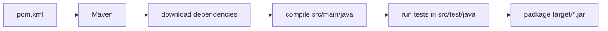

# Step 03 — Maven: a repeatable, tested build

> In this step: turn your loose `.java` files into a real project that builds and tests with **one command**, and write your first automated tests. ~60–90 minutes.

## The problem right now

You compile with `javac *.java` and check results by reading the printout. That does not scale:

- adding an external library means downloading JAR files by hand;
- checking behavior by eye misses mistakes;
- there's no single, standard way for another machine (or a teammate) to build your project.

You need **one command** that compiles, runs tests, and packages the app — the same way everywhere.

## Key words

| Word | Beginner meaning |
|---|---|
| **Build tool** | A program that automates compiling, testing, and packaging. |
| **Maven** | The build tool this course uses for Java. |
| **`pom.xml`** | Maven's project file: Java version, libraries, build settings. |
| **Dependency** | An external library your project uses; Maven downloads it automatically. |
| **Artifact** | The thing your build produces (here, a JAR). |
| **JAR** | One packaged file containing your compiled program, runnable with `java -jar`. |
| **Convention** | A standard folder layout Maven expects, so you write almost no config. |
| **Unit test** | Small automated code that checks one behavior and passes/fails on its own. |
| **JUnit** | The most common Java testing library. |
| **Assertion** | A check inside a test, e.g. "the status must equal DELIVERED". |
| **CI** | Continuous Integration: a server that runs your build + tests automatically. |

> Maven isn't the only build tool. For a short comparison of Maven vs Gradle vs Ant vs plain `javac` — and exactly why this course starts with Maven — read [Build tools compared](build-tools-compared.md).

## What Maven does (and why it feels magical at first)

You declare *what* you need in `pom.xml`; Maven works out *how*: download libraries, compile, test, package.



Maven only works smoothly if you follow its **conventions** (standard folders). Put code where it expects and everything "just works":

```text
applications/parcelpilot/
├── pom.xml
└── src/
    ├── main/java/            # your program
    │   └── com/parcelpilot/
    │       ├── Parcel.java
    │       ├── Status.java
    │       ├── Clock.java
    │       ├── SystemClock.java
    │       ├── TrackingEvent.java
    │       └── ParcelTracker.java
    └── test/java/            # your tests (mirror the same packages)
        └── com/parcelpilot/
            └── ParcelTrackerTest.java
```

> **Package note:** the `com/parcelpilot/` folders match a line `package com.parcelpilot;` you add at the top of each `.java` file. A **package** is just a namespace/folder that groups related classes. New to packages and imports? Read [Packages, imports, and project structure](packages-imports-structure.md) — it explains the `package` line, when you need `import`, and why folders must match.

## Why do it? Pros and cons

**What it brings us:** repeatable builds, automatic tests, easy library management, and a project any Java developer or CI server understands instantly.

**Pros:** one command (`mvn test`) does everything; dependencies are declared, not hand-downloaded; tests catch regressions automatically.
**Cons:** `pom.xml` XML looks verbose; the first build downloads a lot; new vocabulary. All worth it.

**Real-world example:** essentially every Java team uses Maven or Gradle. Nobody ships production Java by running `javac` by hand.

## Build it in ParcelPilot (do this exactly)

### 1. Create `pom.xml`

In `applications/parcelpilot`, create `pom.xml` with this content. Comments explain each part:

```xml
<?xml version="1.0" encoding="UTF-8"?>
<project xmlns="http://maven.apache.org/POM/4.0.0"
         xmlns:xsi="http://www.w3.org/2001/XMLSchema-instance"
         xsi:schemaLocation="http://maven.apache.org/POM/4.0.0
                             http://maven.apache.org/xsd/maven-4.0.0.xsd">
    <modelVersion>4.0.0</modelVersion>

    <!-- Who/what this project is (its coordinates) -->
    <groupId>com.parcelpilot</groupId>
    <artifactId>parcelpilot</artifactId>
    <version>0.1.0</version>
    <packaging>jar</packaging>

    <!-- Use Java 21 to compile and run -->
    <properties>
        <maven.compiler.release>21</maven.compiler.release>
        <project.build.sourceEncoding>UTF-8</project.build.sourceEncoding>
    </properties>

    <!-- Libraries we need. JUnit is only needed for tests. -->
    <dependencies>
        <dependency>
            <groupId>org.junit.jupiter</groupId>
            <artifactId>junit-jupiter</artifactId>
            <version>5.10.2</version>
            <scope>test</scope>
        </dependency>
    </dependencies>
</project>
```

### 2. Move your classes

Move the classes from step 02 into `src/main/java/com/parcelpilot/` and add `package com.parcelpilot;` as the first line of each file.

### 3. Write your first test

Create `src/test/java/com/parcelpilot/ParcelTrackerTest.java`. A **test** creates objects, performs actions, and **asserts** expected results. A test method annotated with `@Test` is run automatically by Maven:

```java
package com.parcelpilot;

import org.junit.jupiter.api.Test;
import java.time.Instant;
import static org.junit.jupiter.api.Assertions.*;

class ParcelTrackerTest {

    // A fake clock so timestamps are predictable in tests (composition pays off!)
    static class FixedClock implements Clock {
        public Instant now() { return Instant.parse("2026-01-01T00:00:00Z"); }
    }

    @Test
    void full_lifecycle_records_two_events() {
        ParcelTracker tracker = new ParcelTracker(new FixedClock());
        Parcel parcel = new Parcel("P-1", "Ava");

        tracker.pickUp(parcel);
        tracker.deliver(parcel);

        assertEquals(Status.DELIVERED, parcel.status());
        assertEquals(2, tracker.events().size());
    }

    @Test
    void cannot_deliver_before_pickup() {
        ParcelTracker tracker = new ParcelTracker(new FixedClock());
        Parcel parcel = new Parcel("P-2", "Ben");

        // This action MUST throw. The test passes only if it does.
        assertThrows(IllegalStateException.class, () -> tracker.deliver(parcel));
    }
}
```

## Test it

```bash
cd applications/parcelpilot
mvn test        # compiles everything + runs the tests
mvn package     # builds target/parcelpilot-0.1.0.jar
```

`mvn test` should end with **BUILD SUCCESS** and `Tests run: 2, Failures: 0`. Try breaking a rule on purpose (e.g. allow delivering from CREATED) and watch a test go red — that red is the safety net working.

> Do **not** add Spring Boot yet. Maven is worth it for plain Java too.

## Acceptance criteria

- [ ] Project follows Maven's layout (`src/main/java`, `src/test/java`) with a `package` line in each file.
- [ ] `mvn test` reports **BUILD SUCCESS** with all tests green.
- [ ] There's at least one test for the legal lifecycle and one for an illegal transition (using `assertThrows`).
- [ ] A test uses a fixed/fake clock to make timestamps predictable.
- [ ] `mvn package` produces a JAR.
- [ ] You can explain what `pom.xml`, a dependency, an assertion, and a JAR are.
- [ ] You can explain what a `package` line does and when you need an `import` (see [packages guide](packages-imports-structure.md)).
- [ ] You can name one alternative build tool and why we chose Maven (see [build tools compared](build-tools-compared.md)).

## Say it like a developer

- "I declared the JUnit **dependency** in `pom.xml`, and Maven **downloaded** it for me."
- "`mvn test` **compiles** the code and **runs the tests**; `mvn package` builds the **JAR** (the **artifact**)."
- "Each `.java` file starts with a **package** line that matches its folder."
- "The test **asserts** that the status equals `DELIVERED`."
- "I follow Maven's **conventions** — code in `src/main/java`, tests in `src/test/java` — so it just works."

## Quiz — check yourself

Answer out loud before opening each toggle.

1. What is a `pom.xml` and what do you put in it?

<details><summary>Show answer</summary>

Maven's project file. It declares the Java version, the project's coordinates (groupId/artifactId/version), and the dependencies (libraries) your project needs, plus build settings.

</details>

2. What is a **dependency**, and how does it get onto your machine?

<details><summary>Show answer</summary>

A dependency is an external library your project uses (e.g. JUnit). You declare it in `pom.xml` and Maven downloads it automatically — you never hand-download JAR files.

</details>

3. What is the difference between `mvn test` and `mvn package`?

<details><summary>Show answer</summary>

`mvn test` compiles the code and runs the tests. `mvn package` does that *and* bundles the result into a runnable JAR (the artifact) in `target/`.

</details>

4. Why must your `.java` files live in `src/main/java` and tests in `src/test/java`?

<details><summary>Show answer</summary>

Those are Maven's **conventions**. Following the expected folder layout means Maven finds and builds everything with almost no configuration.

</details>

5. What is an **assertion** in a test, and what happens if it's false?

<details><summary>Show answer</summary>

An assertion is a check inside a test, e.g. `assertEquals(DELIVERED, parcel.status())`. If it's false, the test **fails** (turns red), telling you the code no longer behaves as expected.

</details>

6. Name one alternative to Maven and one reason this course chose Maven.

<details><summary>Show answer</summary>

Alternatives include Gradle, Ant, and Bazel. This course chose Maven because its XML config is explicit and beginner-friendly, it's the most widely documented, and its conventions mean very little setup. (See [Build tools compared](build-tools-compared.md).)

</details>

## Reflect (stretch)

You now change code, run `mvn test`, and instantly know if you broke something. That safety net is what makes every later step (Spring, database, queues) survivable. See the [Maven reference](../../references/maven.md) for the Maven Wrapper (`./mvnw`) and dependency tips.

## Next

[Step 04](../04-first-spring-api/README.md): let the outside world talk to ParcelPilot over HTTP.
