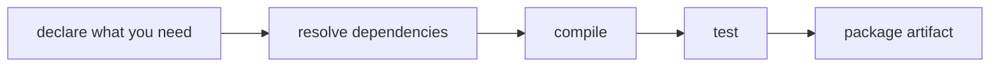

# Build tools compared: why Maven (for now)

You could compile ParcelPilot in several ways. Here's the landscape and why this course starts with Maven.

## The problem a build tool solves

As a project grows you need to: download libraries, compile in the right order, run tests, and package a runnable artifact — **repeatably**, on any machine. Doing this by hand does not scale.

## The options

| Tool | What it is | Pros | Cons | Good when |
|---|---|---|---|---|
| **Plain `javac`** | Compile files yourself | zero setup; fine to learn the basics | no dependency management, no test runner, manual and fragile | one throwaway file (step 01 only) |
| **Maven** | Declarative, XML-based build tool | huge ecosystem; standard layout; predictable; every Java dev knows it; great docs | verbose XML; less flexible for exotic builds | learning, most business apps, Spring Boot |
| **Gradle** | Programmable build tool (Groovy/Kotlin DSL) | fast (incremental builds, caching); very flexible; concise | more concepts; build scripts can get complex; more "magic" | large/complex builds, Android, performance-sensitive CI |
| **Ant (+Ivy)** | Older, task-based XML tool | total control | very verbose; you script everything; largely legacy | maintaining old projects |
| **Bazel** | Google's large-scale build system | reproducible; scales to huge monorepos | steep learning curve; overkill for small apps | very large multi-language codebases |

## Why we choose Maven here

1. **Beginner-friendly and predictable.** "Convention over configuration" means the standard folder layout just works — you write very little config.
2. **Ubiquitous with Spring Boot.** Spring's docs, starters, and examples are Maven-first (Gradle is supported too). Fewer surprises while learning.
3. **Readable dependencies.** A dependency is a clear XML block; it's obvious what the project pulls in.
4. **Transferable.** Almost every Java job uses Maven or Gradle; the concepts (dependencies, phases, artifacts) carry straight over.

Gradle is an excellent choice in real projects — especially where build speed matters. We pick Maven purely to reduce the number of new things you learn at once. Once you understand Maven's model (declare needs → resolve → compile → test → package), switching to Gradle later is easy.

## The mental model is the same everywhere

Whatever tool you use later, this pipeline is what it automates.

## Back to the step

Return to [Step 03](README.md) and create the `pom.xml`.
