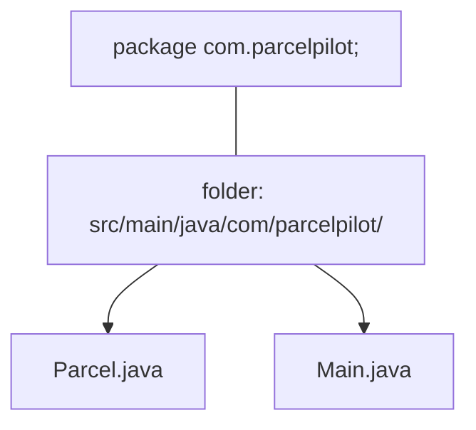

# Packages, imports, and project structure

New in this step: your files move into folders and gain a `package` line. Here's what that means and why.

## The problem

In step 01 you had `Parcel.java` and `Main.java` loose in one folder. In a real app you'll have dozens of classes, and some names repeat (there might be many `Status` classes across libraries). You need a way to **group** classes and avoid name clashes.

## What is a package?

A **package** is a namespace, a labeled group of related classes. It matches a folder path. If a class starts with:

```java
package com.parcelpilot;
```

then its file must live in a folder path ending `.../com/parcelpilot/`. The full ("fully-qualified") name of the class becomes `com.parcelpilot.Parcel`.



### Naming convention

Packages use lowercase, reverse-domain style: `com.company.project`. This makes them globally unique (nobody else owns `com.parcelpilot`). It's a convention, not a rule the compiler enforces.

## What is an import?

Classes in the **same** package see each other automatically. To use a class from a **different** package, you `import` it (or write its full name every time).

```java
package com.parcelpilot;

import java.time.Instant;          // bring in Instant from the java.time package
import java.util.List;             // and List from java.util

public record TrackingEvent(String parcelId, Status newStatus, Instant when) {}
```

Without the import you'd have to write `java.time.Instant` everywhere. `Status` needs no import here because it's in the same `com.parcelpilot` package.

### When do you NOT need an import?

- Classes in the **same package**.
- Classes in `java.lang` (like `String`, `Integer`, `System`), which are always available automatically.

## Why this structure matters

- **No name clashes:** your `Status` (`com.parcelpilot.Status`) can't be confused with some library's `Status`.
- **Organization:** later you'll group by feature: `com.parcelpilot.parcel`, `com.parcelpilot.notification` (that's step 07).
- **Tooling:** Maven relies on the standard layout to know what's app code vs test code.

## The standard Maven layout (recap)

```text
applications/parcelpilot/
├── pom.xml
└── src/
    ├── main/
    │   ├── java/com/parcelpilot/       # your classes (package com.parcelpilot;)
    │   └── resources/                  # config files (later: application.properties)
    └── test/
        └── java/com/parcelpilot/       # tests mirror the same packages
```

Rule of thumb: **the folders under `java/` must match the `package` line exactly.** If they don't, compilation fails with a "package does not match" style error.

## A note on annotations (preview)

You'll soon see lines like `@Test` (step 03) and `@RestController` (step 04) sitting above classes/methods. Those are **annotations**: labels that give the compiler or a framework extra instructions. They're explained in depth in [step 04's annotations guide](../04-first-spring-api/annotations-imports.md). For now: `@Test` tells JUnit "run this method as a test".

## Back to the step

Return to [Step 03](README.md), add `package com.parcelpilot;` to each file, and place files under the matching folders.
