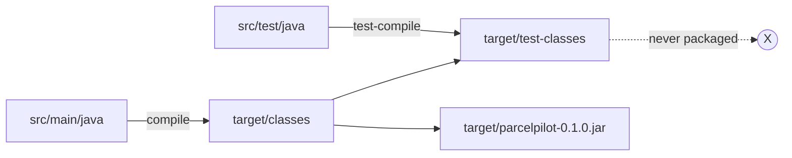
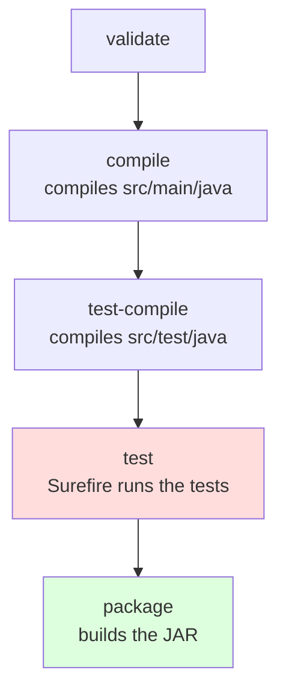

# Testing with Maven: what really happens when you type `mvn test`

In [Step 03](README.md) you ran `mvn test` and saw `Tests run: 2, Failures: 0`. This page opens the hood: where test code lives and why, which build phases run, the plugin that actually executes your tests, and the flags you'll reach for daily.

## The problem

`mvn test` "just works", which is great until it doesn't. When a test fails on a colleague's machine but not yours, when you need to re-run only one test out of two hundred, or when you wonder why JUnit isn't inside your JAR, you need to know *how* Maven runs tests, not just *that* it does.

## Key words

| Word | Beginner meaning |
|---|---|
| **Lifecycle** | Maven's fixed sequence of build steps (validate → compile → test → package → …). |
| **Phase** | One step in the lifecycle, e.g. `test-compile` or `test`. |
| **Plugin** | A piece of Maven that does the actual work of a phase. |
| **Surefire** | The Maven plugin that runs your unit tests during the `test` phase. |
| **Test scope** | A dependency marked `<scope>test</scope>`: available to test code only, never packaged. |
| **Test report** | Files Surefire writes to `target/surefire-reports/` describing what passed and failed. |

## `src/main/java` vs `src/test/java`: the split that keeps tests out of production

Maven insists on two separate source folders, and the reason is not tidiness:

- **`src/main/java`** is what ships. It's compiled into `target/classes/` and packaged into the JAR.
- **`src/test/java`** is your safety net. It's compiled into `target/test-classes/` and **never** enters the JAR.

Because the folders are separate, main code physically *cannot* call test code (it isn't on main's classpath), while test code *can* call main code. Your customers run the JAR; your tests, fake clocks, and JUnit itself stay home. Mix the two into one folder and you'd ship test helpers, test data, and the whole JUnit library to production.



(The arrow from `target/classes` to `target/test-classes` means: test code can see main code, not the other way around.)

## The default lifecycle: which phases run when

Maven's **default lifecycle** is a fixed ordered list of phases. When you ask for a phase, Maven runs **every phase before it too**, in order. That's why `mvn package` also compiles and tests: `package` sits after `test` in the list.



| You type | Phases that run | You get |
|---|---|---|
| `mvn compile` | validate → compile | compiled main classes, no tests touched |
| `mvn test` | validate → compile → test-compile → **test** | tests executed, no JAR |
| `mvn package` | validate → compile → test-compile → test → **package** | tests executed **and** a JAR in `target/` |

The important consequence: **you cannot package a JAR while a test is failing** (unless you explicitly skip tests, see below). Maven refuses, and that refusal is the safety net.

## Surefire: the plugin that actually runs your tests

Maven itself doesn't know how to run JUnit. Each phase is carried out by a **plugin**, and the `test` phase belongs to the **Maven Surefire Plugin**. You never declared it in `pom.xml` because it's bound to the `test` phase by default in every Maven project.

### How Surefire finds your tests

Surefire scans `target/test-classes` for classes whose **names** match its conventions:

- `*Test` (e.g. `ParcelTrackerTest`) — the common one
- `Test*`, `*Tests`, `*TestCase` also match

Name your class `ParcelTrackerCheck` and Surefire silently skips it: `Tests run: 0` with BUILD SUCCESS. That's a classic trap — a green build that ran nothing. Stick to the `SomethingTest` convention.

### Where reports land, and how to read a failure

Every run writes reports to `target/surefire-reports/`: one `.txt` and one `.xml` per test class (the XML is what CI servers parse). When a test fails, the terminal already shows the essentials, and the `.txt` file has the same, plus timing:

```text
[ERROR] Tests run: 2, Failures: 1, Errors: 0, Skipped: 0
[ERROR] ParcelTrackerTest.full_lifecycle_records_two_events:24
        expected: <DELIVERED> but was: <PICKED_UP>
```

Read it like this: **which test** (`full_lifecycle_records_two_events`), **which line** (`:24`), **which assertion** (expected `DELIVERED`, got `PICKED_UP`). That's usually enough to jump straight to the bug. For other build errors (compile failures, dependency problems), see [Common build failures](common-build-failures.md).

## Skipping tests: two flags, one smell

Two flags exist and they are **not** the same:

| Flag | What it does |
|---|---|
| `mvn package -DskipTests` | Compiles the tests but doesn't run them. |
| `mvn package -Dmaven.test.skip=true` | Doesn't even **compile** the tests. |

`-DskipTests` is the milder one: at least broken test *code* still fails the build. `-Dmaven.test.skip=true` hides even that.

**Why skipping is a smell:** the entire point of step 03 is that `mvn package` proves your code works before producing an artifact. A JAR built with tests skipped is a package with the safety seal removed. Legitimate uses exist (rebuilding quickly while you iterate on something unrelated, CI stages that ran tests separately), but if you skip because tests are red, you've only relocated the problem to production.

## Running a single test

With one test class this doesn't matter. With two hundred, re-running everything to check one fix is slow. Surefire accepts a filter:

```bash
mvn test -Dtest=ParcelTrackerTest                                  # one class
mvn test -Dtest=ParcelTrackerTest#cannot_deliver_before_pickup    # one method
```

The `#` separates class from method. Patterns work too (`-Dtest='Parcel*'`).

## `<scope>test</scope>`: why JUnit never leaks into your JAR

Look at the JUnit dependency in your `pom.xml`:

```xml
<dependency>
    <groupId>org.junit.jupiter</groupId>
    <artifactId>junit-jupiter</artifactId>
    <version>5.10.2</version>
    <scope>test</scope>
</dependency>
```

`<scope>test</scope>` tells Maven: this library is only on the classpath when compiling and running **test** code. Main code can't import it (try `import org.junit.jupiter.api.Test;` in `Parcel.java` — compile error), and it is never packaged into the artifact. Your JAR stays small and ships zero testing machinery. If you omit the scope, JUnit becomes a normal dependency and travels everywhere your app goes — harmless-ish for JUnit, a real problem for heavier test tools.

## Proof commands

Run these in `applications/parcelpilot` and check what you see:

```bash
mvn test                                   # ends with: Tests run: 2, Failures: 0
ls target/surefire-reports/                # the .txt and .xml reports exist

mvn package -DskipTests                    # JAR builds, "Tests are skipped." in the log
mvn test -Dtest=ParcelTrackerTest#cannot_deliver_before_pickup
                                           # Tests run: 1 (only that method)

# prove test scope: JUnit is NOT inside the JAR
jar tf target/parcelpilot-0.1.0.jar | grep -i junit   # prints nothing
```

Then break something on purpose (make `deliver` legal from `CREATED`), run `mvn test`, and read the failure in the terminal *and* in `target/surefire-reports/com.parcelpilot.ParcelTrackerTest.txt`. Undo the break afterwards.

## Build-tool tests vs IDE-run tests: pros and cons

Your IDE (IntelliJ, VS Code) can run the same tests with a green ▶ button. Both are useful; they answer different questions.

| | Maven-run (`mvn test`) | IDE-run (▶ button) |
|---|---|---|
| **Pros** | Same result on every machine and in CI; the *official* verdict; runs everything, no test forgotten | Instant feedback, one click; jump-to-failure in the editor; built-in debugger |
| **Cons** | Slower (full compile + scan); output in a terminal, not clickable | Depends on IDE config, which can drift from `pom.xml`; "works in my IDE" proves nothing for CI |

Rule of thumb: **iterate with the IDE, verify with Maven.** If the IDE says green but `mvn test` says red, Maven is right — it's what CI (and step 03's acceptance criteria) run.

## Next

- Something red or broken? [Common build failures](common-build-failures.md) decodes the error messages.
- Maven Wrapper and dependency tips: [Maven reference](../../references/maven.md).
- Your test suite grows beyond unit tests — HTTP-level and database-level testing — in [Step 08](../08-testing/README.md).
- Back to [Step 03](README.md).
