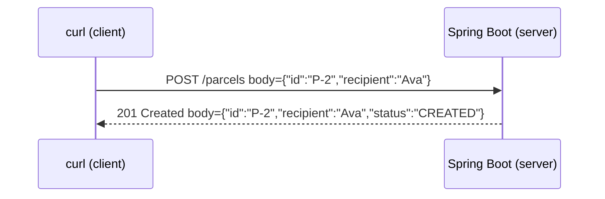

# Step 04: Spring Boot, the first web API

> In this step: put ParcelPilot on the web so anyone can create and read parcels with `curl`. You'll learn what HTTP, REST, and JSON are, and write a real Spring Boot controller line by line. ~90–120 minutes.

## The problem right now

Your program only talks to its own terminal via `main`. To be useful, other people and programs (a phone app, a website, `curl`) must create and read parcels **over the network**, without your Java source. The standard way to do that is an HTTP **API**.

## What is HTTP? (the foundation)

HTTP is the request/response language of the web. A **client** sends a **request** (a method + a path + optional body), and a **server** sends back a **response** (a status code + optional body).



A request has four things that matter to us:

- **Method (verb):** what you want to do. `GET` (read), `POST` (create), `PUT`/`PATCH` (change), `DELETE` (remove), and the newer `QUERY` (complex safe reads).
- **Path:** which resource, e.g. `/parcels/P-1`.
- **Query parameters:** filters after `?`, e.g. `/parcels?status=CREATED`.
- **Body:** data you send, usually **JSON**.

> Every method (including the emerging **`QUERY`** method and the "safe"/"idempotent" properties that decide which to use) is explained with examples in [HTTP methods explained](http-methods.md). Read it after this section.

## Key words

| Word | Beginner meaning |
|---|---|
| **API** | A defined way for programs to talk to each other. |
| **REST** | A popular API style: name data as resources (nouns) + use HTTP methods as verbs. |
| **Resource** | A thing your API exposes, e.g. a parcel at `/parcels/P-1`. |
| **Endpoint** | One callable method+path, e.g. `GET /parcels/{id}`. |
| **JSON** | A text format for data: `{"id":"P-1","recipient":"Ava"}`. |
| **Status code** | A number describing the result: `200`, `201`, `404`, `409`. Tour them all in the [status codes lab](http-status-codes-lab.md). |
| **Header** | Extra info on a request/response, e.g. `Content-Type: application/json`. |
| **Spring Boot** | A framework that runs your Java as a web server with minimal setup. |
| **Controller** | A class whose methods handle incoming HTTP requests. |
| **Annotation** | A `@Something` label that tells Spring how to treat a class/method. |
| **DTO** | Data Transfer Object: a small class shaped for the API request/response. |
| **Dependency injection** | Spring creates your objects and hands them their dependencies (composition, automated). See the [DI walkthrough](dependency-injection-walkthrough.md). |

## What is REST (beginner version)?

**The problem REST solves:** without a shared convention, every API invents its own way to name things and trigger actions (`/getParcel`, `/parcelFetch`, `/doDeliver`...). Clients then have to learn each one. REST is a widely-agreed **style** that makes APIs predictable.

**How REST solves it:** name your data as **resources** (nouns, like `/parcels/P-1`) and use HTTP **methods** as the verbs on them. Anyone who knows HTTP can guess how to read, create, or change a parcel.

| You want to… | Request | Typical response |
|---|---|---|
| Create a parcel | `POST /parcels` | `201 Created` + the new parcel |
| Read one | `GET /parcels/P-1` | `200 OK`, or `404 Not Found` |
| Search / filter (simple) | `GET /parcels?status=CREATED` | `200 OK` + a list |
| Search (complex, emerging) | `QUERY /parcels` + JSON body | `200 OK` + a list |
| Change status | `PATCH /parcels/P-1/status` | `200 OK`, or `409 Conflict` |
| Replace a parcel | `PUT /parcels/P-1` | `200 OK` / `204` |
| Delete | `DELETE /parcels/P-1` | `204 No Content` |

Keep `GET` **safe**: reading must never change data.

### More examples (same resource, different verbs)

```bash
GET    /parcels                 # list all
GET    /parcels?status=CREATED  # list filtered
GET    /parcels/P-1             # one parcel
POST   /parcels                 # create
PATCH  /parcels/P-1/status      # advance status
DELETE /parcels/P-1             # remove
```

Notice the **path stays about the resource** (`/parcels`), and the **method changes the intent**. That consistency is the whole point of REST.

### Why and when to use REST, and its limits

**Why:** predictable, uses plain HTTP, cache-friendly for reads, and works with any client (browser, `curl`, mobile).

**When:** classic create/read/update/delete resources over HTTP, which is exactly ParcelPilot's needs, and most business backends.

| Pros | Cons / when something else fits better |
|---|---|
| Simple, universal, easy to test with `curl` | Over-fetching/under-fetching data (GraphQL can help) |
| Cache-friendly reads | Many round-trips for deeply linked data |
| Clear mapping of verbs to intent | Not ideal for real-time streams (use WebSockets/SSE) |
| Huge tooling support | Very high-throughput internal calls may prefer gRPC |

Don't add GraphQL, WebSockets, or gRPC in this beginner path. REST is the right first tool. Learn that the alternatives exist and when they'd win.

## Why Spring Boot? Pros and cons

**What it brings us:** an embedded web server, automatic JSON conversion, and dependency injection, so you focus on parcels, not plumbing.

**Pros:** fast to start, huge ecosystem, industry standard for Java.
**Cons:** annotations do hidden "magic", the app is larger, and there's a learning curve for what happens behind the scenes.

**Real-world example:** a delivery company's app calls `GET /parcels?status=CREATED` to list pickups and `PATCH /parcels/{id}/status` when a driver scans a package.

## Build it in ParcelPilot (do this exactly)

Still one project: `applications/parcelpilot`. We turn it into a Spring Boot app.

### 1. Make `pom.xml` a Spring Boot project

Add the Spring Boot parent and the web starter (keep your JUnit dependency). A **starter** is a bundle of related libraries:

```xml
<parent>
    <groupId>org.springframework.boot</groupId>
    <artifactId>spring-boot-starter-parent</artifactId>
    <version>3.3.2</version>
</parent>

<dependencies>
    <dependency>
        <groupId>org.springframework.boot</groupId>
        <artifactId>spring-boot-starter-web</artifactId>
    </dependency>
    <dependency>
        <groupId>org.springframework.boot</groupId>
        <artifactId>spring-boot-starter-test</artifactId>
        <scope>test</scope>
    </dependency>
</dependencies>

<build>
    <plugins>
        <plugin>
            <groupId>org.springframework.boot</groupId>
            <artifactId>spring-boot-maven-plugin</artifactId>
        </plugin>
    </plugins>
</build>
```

### 2. Add the application entry point

`@SpringBootApplication` marks the start of a Spring Boot app, and `SpringApplication.run(...)` boots the embedded web server:

```java
package com.parcelpilot;

import org.springframework.boot.SpringApplication;
import org.springframework.boot.autoconfigure.SpringBootApplication;

@SpringBootApplication
public class ParcelPilotApplication {
    public static void main(String[] args) {
        SpringApplication.run(ParcelPilotApplication.class, args);
    }
}
```

### 3. Add request/response DTOs

DTOs are small classes shaped for the API. `record` makes them one line. We keep them separate from the internal `Parcel` so the API shape and the domain can evolve independently (the full reasoning, plus how these records become JSON, is in [JSON and DTOs](json-and-dtos.md)):

```java
package com.parcelpilot;

public record CreateParcelRequest(String id, String recipient) {}
public record ParcelResponse(String id, String recipient, String status) {}
```

### 4. Write the controller (the heart of this step)

Every annotation is explained in comments below, and in depth in [Annotations and imports in Spring Boot](annotations-imports.md) (what `@RestController`, `@GetMapping`, `@RequestBody`, etc. mean, and why imports matter). It's fine for now that this one class holds the data and the endpoints. A real database arrives in step 10, and you'll split responsibilities into controller/service/repository **layers** in step 11. Want to see that layering shape (and why we don't do it yet)? See Stage 4 of [Code organization](../../references/code-organization.md).

```java
package com.parcelpilot;

import org.springframework.http.ResponseEntity;
import org.springframework.web.bind.annotation.*;

import java.util.ArrayList;
import java.util.List;
import java.util.Map;
import java.util.concurrent.ConcurrentHashMap;

@RestController                 // this class handles HTTP and returns JSON
@RequestMapping("/parcels")     // every path below starts with /parcels
public class ParcelController {

    // Temporary in-memory storage (a Map). Replaced by a database in step 10.
    private final Map<String, Parcel> store = new ConcurrentHashMap<>();

    // POST /parcels  -> create a parcel from the JSON body
    @PostMapping
    public ResponseEntity<ParcelResponse> create(@RequestBody CreateParcelRequest req) {
        Parcel parcel = new Parcel(req.id(), req.recipient()); // constructor validates input
        store.put(parcel.id(), parcel);
        return ResponseEntity
                .status(201)                                   // 201 Created
                .body(toResponse(parcel));
    }

    // GET /parcels/{id}  -> read one parcel, or 404 if missing
    @GetMapping("/{id}")
    public ResponseEntity<ParcelResponse> getOne(@PathVariable String id) {
        Parcel parcel = store.get(id);
        if (parcel == null) {
            return ResponseEntity.notFound().build();          // 404 Not Found
        }
        return ResponseEntity.ok(toResponse(parcel));          // 200 OK
    }

    // GET /parcels?status=CREATED  -> filtered list (query parameters)
    @GetMapping
    public List<ParcelResponse> list(@RequestParam(required = false) String status) {
        List<ParcelResponse> result = new ArrayList<>();
        for (Parcel p : store.values()) {
            if (status == null || p.status().name().equals(status)) {
                result.add(toResponse(p));
            }
        }
        return result;                                         // 200 OK + JSON array
    }

    private ParcelResponse toResponse(Parcel p) {
        return new ParcelResponse(p.id(), p.recipient(), p.status().name());
    }
}
```

**What the annotations mean:**

- `@RestController`: the class handles HTTP and its return values become the JSON response body.
- `@RequestMapping("/parcels")`: a shared path prefix for the whole class.
- `@PostMapping`, `@GetMapping`: map a method to `POST`/`GET`.
- `@RequestBody`: convert the incoming JSON into a Java object.
- `@PathVariable`: grab a value from the URL path (`{id}`).
- `@RequestParam`: grab a value from the query string (`?status=...`).
- `ResponseEntity`: lets you set the status code and body explicitly.

### 5. (Lab) Add status changes

Do the [REST API lab](rest-api.md) to add `PATCH /parcels/{id}/status`, returning `409 Conflict` on illegal transitions (reusing the rules from step 02).

## Test it

```bash
cd applications/parcelpilot
mvn spring-boot:run
```

In a second terminal (`-i` shows the status line and headers):

```bash
# create
curl -i -X POST http://localhost:8080/parcels \
  -H 'Content-Type: application/json' \
  -d '{"id":"P-2","recipient":"Ava"}'

# read it back
curl -i http://localhost:8080/parcels/P-2

# read a missing one -> 404
curl -i http://localhost:8080/parcels/does-not-exist

# filter
curl -i 'http://localhost:8080/parcels?status=CREATED'
```

## Acceptance criteria

- [ ] `mvn spring-boot:run` starts and the app listens on port 8080.
- [ ] `POST /parcels` returns `201` and the created parcel as JSON.
- [ ] `GET /parcels/{id}` returns `200`+JSON for an existing parcel and `404` for a missing one.
- [ ] `GET /parcels?status=CREATED` returns only matching parcels.
- [ ] (Lab) an illegal status change returns `409 Conflict`.
- [ ] You've predicted and verified the status codes in the [HTTP status codes lab](http-status-codes-lab.md).
- [ ] You can point at each annotation in your controller and say what it does (see [annotations guide](annotations-imports.md)).
- [ ] You can explain "safe" and "idempotent" and say which methods are which (see [HTTP methods](http-methods.md)).
- [ ] You can say what problem REST solves and name one situation where GraphQL/WebSockets/gRPC would fit better.

## Say it like a developer

- "I exposed a REST **endpoint**: `POST /parcels` creates a parcel."
- "`/parcels/P-1` is a **resource**, and the **method** (`GET`, `POST`, `PATCH`) is the verb on it."
- "The controller takes the request **body** as JSON and turns it into a `CreateParcelRequest` **DTO** via `@RequestBody`."
- "`@PathVariable` pulls `{id}` out of the URL, and `@RequestParam` pulls `?status=` out of the query string."
- "I return a `201 Created` **status code** on success and `404 Not Found` when the parcel doesn't exist."
- "`GET` is **safe**: reading never changes data."

## Quiz: check yourself

Answer out loud before opening each toggle.

1. In one sentence, what problem does **REST** solve?

<details><summary>Show answer</summary>

It gives APIs a shared, predictable convention: name data as **resources** (nouns like `/parcels/P-1`) and use HTTP **methods** as the verbs, so any client that knows HTTP can guess how to use the API.

</details>

2. What is the difference between a **resource** and an **endpoint**?

<details><summary>Show answer</summary>

A resource is the *thing* the API exposes (e.g. a parcel at `/parcels/P-1`). An endpoint is one callable method+path combination (e.g. `GET /parcels/{id}`).

</details>

3. What does "`GET` is **safe**" mean?

<details><summary>Show answer</summary>

A safe method only reads and never changes server data. Calling `GET` a hundred times must not create, modify, or delete anything.

</details>

4. What do `@RequestBody`, `@PathVariable`, and `@RequestParam` each grab?

<details><summary>Show answer</summary>

`@RequestBody` converts the incoming JSON body into a Java object. `@PathVariable` grabs a value from the URL path (`/parcels/{id}`). `@RequestParam` grabs a value from the query string (`?status=CREATED`).

</details>

5. Why keep separate `CreateParcelRequest`/`ParcelResponse` **DTOs** instead of exposing the internal `Parcel`?

<details><summary>Show answer</summary>

So the API's shape and the internal domain can evolve independently. You can change internal fields without breaking clients, and you don't accidentally expose internal details.

</details>

6. Which status code fits: creating a parcel succeeded / the parcel doesn't exist / an illegal status change?

<details><summary>Show answer</summary>

`201 Created` for a successful create, `404 Not Found` when the parcel doesn't exist, and `409 Conflict` for an illegal status change.

</details>

## Reflect (stretch)

Stop and restart the app, then `GET /parcels/P-2`. It's gone, because the `Map` lives in memory. That restart-data-loss still gets fixed later: **portability** in step 09 (Docker) and **durability** in step 10 (a database). But the NEXT problem is nearer: the API **trusts input blindly**. Try `POST /parcels` with an empty `"id"` or a blank `"recipient"` and watch either a confusing `500` or a broken parcel get happily stored. An API that accepts garbage is a bug factory.

## Next

[Step 05](../05-validation-and-inputs/README.md): reject bad input at the boundary with Bean Validation, and return helpful 400s.
