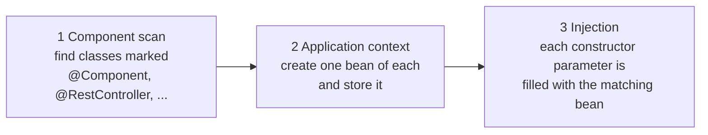

# Dependency injection walkthrough: who creates your objects?

Step 04's key-words table says dependency injection is "composition, automated". This page makes that concrete: the problem DI solves, what beans and the application context actually are, and a hands-on refactor of the step 04 controller that you can do right now.

## The problem: `new` everywhere

Imagine the step 04 controller creating its own storage:

```java
@RestController
@RequestMapping("/parcels")
public class ParcelController {

    private final ParcelStore store = new ParcelStore();   // I build my own dependency

    // ... endpoints using store ...
}
```

Looks harmless. Now scale the thought experiment:

- A future `ReportsController` also needs the store — so it calls `new ParcelStore()` too, and now there are **two stores** that don't see each other's parcels. Whoops.
- In step 10 the store becomes a database-backed one. You must now hunt down **every** `new ParcelStore()` in the codebase and change it.
- In step 08 you want a test to use a pre-filled fake store. You can't: the controller hard-wired the real one inside itself, and no test can reach in and swap it.

The root issue: **a class that constructs its own dependencies has glued itself to them.** The fix is old and simple — don't build your dependencies, *ask for them* — and it's exactly step 02's composition: `ParcelTracker` didn't create its own `Clock`, it received one through the constructor. See [Composition vs inheritance](../02-oop-and-composition/composition-vs-inheritance.md).

The only new question in a Spring app is: *if the controller doesn't call `new`, who does?*

## Key words

| Word | Beginner meaning |
|---|---|
| **Dependency** | An object your class needs to do its job (here: the store the controller needs). |
| **Dependency injection (DI)** | Someone else creates the dependency and hands it in, instead of your class calling `new`. |
| **Bean** | An object that Spring creates and manages for you. |
| **Application context** | Spring's container: the registry holding all beans, built at startup. |
| **Component scan** | Spring's startup search for classes marked `@Component` / `@Service` / `@RestController` etc. |
| **Constructor injection** | Receiving dependencies as constructor parameters — the recommended style. |
| **Field injection** | `@Autowired` directly on a field — works, but discouraged (see below). |

## What is a bean? What is the application context?

A **bean** is nothing exotic: a perfectly ordinary Java object, with one difference — *Spring* called `new` on it, not you, and Spring keeps hold of it. By default there is exactly **one** instance of each bean, shared by everyone who asks for it (which quietly fixes the "two stores" bug above).

The **application context** is the container where those beans live. When your app starts, Spring builds it in three moves:



1. **Component scan:** starting from the package of your `@SpringBootApplication` class (`com.parcelpilot`), Spring searches for annotated classes.
2. **Context:** it creates one instance of each and registers it.
3. **Injection:** wherever a bean's constructor declares a parameter, Spring looks in the context for a bean of that type and passes it in. It works out the right creation order by itself.

That's the whole trick. DI frameworks sound grand; the mechanism is "a map of objects, filled at startup, used to satisfy constructor parameters".

## The walkthrough: extract a `ParcelStore` and inject it

Right now the step 04 controller owns the map directly (`private final Map<String, Parcel> store = new ConcurrentHashMap<>();`). Let's give storage its own class and inject it — a small taste of the layering that arrives properly in [Step 11](../11-monolith/README.md), without committing to it yet.

**1. Extract the storage into a component:**

```java
package com.parcelpilot;

import org.springframework.stereotype.Component;

import java.util.Collection;
import java.util.Map;
import java.util.concurrent.ConcurrentHashMap;

@Component                              // "Spring, create and manage one of these"
public class ParcelStore {

    private final Map<String, Parcel> parcels = new ConcurrentHashMap<>();

    public void save(Parcel parcel) {
        parcels.put(parcel.id(), parcel);
    }

    public Parcel find(String id) {
        return parcels.get(id);
    }

    public Collection<Parcel> all() {
        return parcels.values();
    }
}
```

**2. Ask for it in the controller's constructor:**

```java
@RestController
@RequestMapping("/parcels")
public class ParcelController {

    private final ParcelStore store;

    public ParcelController(ParcelStore store) {   // Spring fills this parameter
        this.store = store;
    }

    @PostMapping
    public ResponseEntity<ParcelResponse> create(@RequestBody CreateParcelRequest req) {
        Parcel parcel = new Parcel(req.id(), req.recipient());
        store.save(parcel);
        return ResponseEntity.status(201).body(toResponse(parcel));
    }

    // getOne/list change the same way: store.find(id), store.all()
}
```

No `@Autowired` needed anywhere: when a class has a single constructor, Spring automatically uses it for injection. At startup, the scan finds `ParcelStore` and `ParcelController`, creates the store first, then creates the controller *passing the store in*. You wrote zero wiring code.

Notice what did **not** change: the endpoints, the JSON, the behavior. `mvn spring-boot:run` and the step 04 `curl` commands work exactly as before. DI is invisible to clients — it reorganizes who constructs what.

### Why constructor injection is THE way

- The field can be **`final`**: the dependency is set once and can never be half-missing.
- Dependencies are **visible in the signature**: anyone reading `ParcelController(ParcelStore store)` knows exactly what this class needs.
- The class works **without Spring**: a test can simply call `new ParcelController(new ParcelStore())` — or pass a fake.

### Why field injection is discouraged

You will meet this style in tutorials and older codebases:

```java
@RestController
public class ParcelController {
    @Autowired
    private ParcelStore store;    // works, but don't copy this
}
```

| | Constructor injection | Field injection (`@Autowired` on fields) |
|---|---|---|
| **Pros** | `final` fields; dependencies explicit; trivially testable with `new`; too many parameters *visibly* signals a class doing too much | Slightly fewer lines; no constructor to write |
| **Cons** | A few more lines of boilerplate | Field can't be `final`; dependencies hidden inside the class body; without Spring running, the field is silently `null` (hello `NullPointerException` in tests); easy to accumulate ten hidden dependencies without noticing |

Honest verdict: field injection's only advantage is saving keystrokes, and it pays for them with untestability and hidden coupling. Use constructor injection; treat `@Autowired` on a field as a code smell to refactor when you see it.

## This is step 02's composition, automated

Compare the two eras of ParcelPilot:

```java
// Step 02: manual composition — YOU are the wiring
ParcelTracker tracker = new ParcelTracker(new SystemClock());

// Step 04+: Spring composition — the CONTEXT is the wiring
public ParcelController(ParcelStore store) { this.store = store; }
```

Same principle — objects receive their parts instead of building them ([composition vs inheritance](../02-oop-and-composition/composition-vs-inheritance.md)) — different assembler. In step 02 *you* were the application context, calling `new` in the right order in `main`. Spring just automates that assembly for hundreds of classes.

## Why this pays off in step 08 (testing)

Because the controller *receives* its store, a test can hand it whatever it likes:

```java
// No web server, no Spring context — plain Java, thanks to constructor injection
ParcelStore store = new ParcelStore();
store.save(new Parcel("P-1", "Ava"));

ParcelController controller = new ParcelController(store);
// call controller methods and assert on the results
```

And when the store becomes a real database in step 10, tests can swap in an in-memory fake so they stay fast and independent. Swapping implementations without touching the class under test is *the* payoff of DI — [Step 08](../08-testing/README.md) leans on it heavily.

## Common mistakes

- **Two beans of the same type.** If two classes are both `@Component` and both implement the same type Spring must inject, startup fails with `required a single bean, but 2 were found`. Spring refuses to guess. (Fixes like `@Primary`/`@Qualifier` exist — for now, just know the error means "ambiguous wiring", and don't create duplicates.)
- **Forgetting `@Component`.** Constructor injection only works with beans. If `ParcelStore` lacks the annotation, startup fails with `Parameter 0 of constructor ... required a bean of type 'ParcelStore' that could not be found`. The fix is the annotation, not more `@Autowired`.
- **`new`-ing a bean manually.** Writing `new ParcelStore()` inside the controller *while* `ParcelStore` is also a `@Component` creates a private copy that Spring doesn't know about — injected elsewhere is the shared bean, yours is a lonely twin, and data "mysteriously disappears" between them. Rule: for beans, either Spring calls `new`, or you do. In app code, let Spring; in plain unit tests, do it yourself on purpose.

## Next

- The annotations used here in table form: [Annotations and imports](annotations-imports.md).
- The manual version of this idea: [Composition vs inheritance](../02-oop-and-composition/composition-vs-inheritance.md).
- Where injection makes tests easy: [Step 08](../08-testing/README.md).
- Where the extracted store grows into real layers: [Step 11](../11-monolith/README.md).
- Back to [Step 04](README.md).
