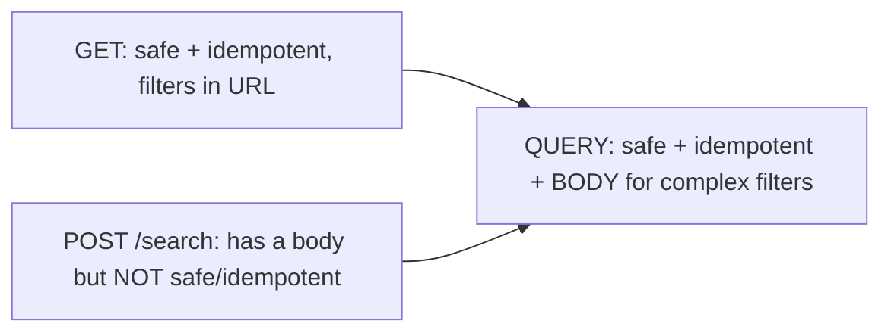

# HTTP methods explained (GET, POST, PUT, PATCH, DELETE, QUERY)

HTTP methods are the **verbs** of the web: they say *what you want to do* to a resource. This page explains each with a ParcelPilot example, plus two properties that decide which to use.

## Two properties you must know

- **Safe** = the request does not change data (read-only). `GET` is safe.
- **Idempotent** = doing it once or many times has the **same end result**. `PUT` and `DELETE` are idempotent; `POST` is not.

Why care? Networks retry. If a request might be sent twice, an idempotent method keeps data correct. A non-idempotent `POST` sent twice can create two parcels.

## The methods

### GET — read

Fetch a resource. Safe and idempotent. No body.

```bash
curl -i http://localhost:8080/parcels/P-1
```

**When:** reading one parcel or listing/filtering parcels. **Never** change data in a `GET`.

### POST — create / trigger

Create a new resource or start an action. **Not** safe, **not** idempotent.

```bash
curl -i -X POST http://localhost:8080/parcels \
  -H 'Content-Type: application/json' \
  -d '{"id":"P-2","recipient":"Ava"}'
```

**When:** creating a parcel, or a "do this" command. Sending it twice may create two things — that's why it's not idempotent.

### PUT — replace

Replace a resource entirely at a known URL. Idempotent (replacing with the same body twice = same result).

```bash
curl -i -X PUT http://localhost:8080/parcels/P-2 \
  -H 'Content-Type: application/json' \
  -d '{"id":"P-2","recipient":"Ava Newname","status":"CREATED"}'
```

**When:** you send the **full** new version of a resource.

### PATCH — partial change

Change part of a resource. Not guaranteed idempotent (depends on the change).

```bash
curl -i -X PATCH http://localhost:8080/parcels/P-2/status \
  -H 'Content-Type: application/json' \
  -d '{"status":"PICKED_UP"}'
```

**When:** updating one field/action (like advancing status) without resending everything. ParcelPilot uses this for status changes.

### DELETE — remove

Remove a resource. Idempotent (deleting an already-deleted thing still ends "not there").

```bash
curl -i -X DELETE http://localhost:8080/parcels/P-2
```

### QUERY — complex, safe reads (the newer method)

`QUERY` is a **newer HTTP method** (being standardized by the IETF) designed to fix a real gap: sometimes a read needs a **large or complex filter** that doesn't fit comfortably in a URL.

The gap it fills:

- `GET /parcels?status=CREATED` is perfect for simple filters, but URLs have length limits and can't cleanly express rich, nested search criteria.
- People often abuse `POST /parcels/search` for complex reads — but `POST` is not safe or idempotent, so caches and retries treat it as a change.

`QUERY` combines the best of both: it is **safe and idempotent like GET**, but it can carry a **request body like POST**, so complex search criteria go in the body.

```bash
# Conceptual example (support is still emerging in servers/clients)
curl -i -X QUERY http://localhost:8080/parcels \
  -H 'Content-Type: application/json' \
  -d '{"status":["CREATED","PICKED_UP"],"recipientContains":"Av","priorityOnly":true}'
```



**When to use QUERY:** rich search/reporting reads whose criteria are too big or structured for a query string, where you still want caching/retry safety.

**Caveats (important for a beginner):** `QUERY` is **new and not yet universally supported** by all frameworks, proxies, and clients. Today, the common and safe choice for most reads is still `GET` with query parameters, and complex search is often done with `POST` to a `/search` endpoint as a pragmatic fallback. Learn `QUERY` as the *correct future direction* for complex safe reads, and use `GET` in the ParcelPilot exercises.

## Quick reference

| Method | Purpose | Safe? | Idempotent? | Has body? |
|---|---|---|---|---|
| GET | read | yes | yes | no |
| POST | create / command | no | no | yes |
| PUT | replace | no | yes | yes |
| PATCH | partial change | no | not always | yes |
| DELETE | remove | no | yes | usually no |
| QUERY | complex safe read | yes | yes | yes |

## Back to the step

Return to [Step 04](README.md). ParcelPilot uses `GET`, `POST`, and `PATCH`; you now understand where `PUT`, `DELETE`, and the emerging `QUERY` fit too.
