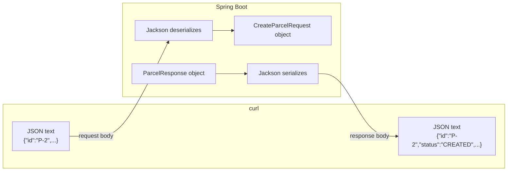

# JSON and DTOs: how objects become text (and back)

In step 04 you sent `{"id":"P-2","recipient":"Ava"}` with `curl` and a Java `CreateParcelRequest` object appeared in your controller — and you never wrote a single line of conversion code. This page explains that magic: what JSON is, who converts it (Jackson), how records map to it, what happens when the input is weird, and why the DTO records exist at all.

## The problem

HTTP carries **text**, but your program works with **Java objects**. A `Parcel` object lives in your JVM's memory; `curl`, a phone app, or a Python script can't receive a Java object. The two sides need a shared text format and something that converts between it and your objects — reliably, in both directions.

## Key words

| Word | Beginner meaning |
|---|---|
| **JSON** | JavaScript Object Notation: a text format for structured data that every language can read. |
| **Serialization** | Turning a Java object **into** JSON text (object → text). |
| **Deserialization** | Turning JSON text **into** a Java object (text → object). |
| **Jackson** | The Java library Spring Boot uses to do both, automatically. |
| **DTO** | Data Transfer Object: a small class whose only job is to define the API's request/response shape. |
| **Domain object** | Your internal class with rules and behavior (like `Parcel`). Not the same thing as a DTO. |

## What is JSON?

JSON has exactly six kinds of value: **strings**, **numbers**, **booleans** (`true`/`false`), **null**, **objects** (`{...}` with key–value pairs), and **arrays** (`[...]`). Objects and arrays can nest. That tiny vocabulary is why every language supports it.

An annotated ParcelPilot example (a shape you'll build toward in later steps — step 04's responses are flatter):

```json
{
  "id": "P-2",                          // string
  "recipient": "Ava",                   // string
  "status": "PICKED_UP",                // string (we send the enum's name)
  "weightKg": 1.5,                      // number (JSON doesn't distinguish int/double)
  "express": true,                      // boolean
  "deliveredAt": null,                  // null: known key, no value yet
  "events": [                           // array of nested objects
    { "newStatus": "PICKED_UP", "when": "2026-01-01T09:30:00Z" }
  ]
}
```

(Strictly, JSON allows no comments — they're here only to label the lines.)

Notice what JSON does **not** have: dates, enums, or any Java type. A `Status` enum travels as a string, an `Instant` travels as a string, and it's the converting library's job to map them.

## Serialization and deserialization

Plain definitions: **serialization** converts a live Java object into JSON text to send it out; **deserialization** parses incoming JSON text and builds a Java object from it. In your step 04 controller, both happen on every create:



## Jackson: the invisible worker

The library doing both directions is **Jackson**. You never added it to `pom.xml` — it came bundled inside `spring-boot-starter-web` — and you never called it. This is step 04's "magic", explained:

- When a request arrives at a parameter marked `@RequestBody`, Spring hands the body text to Jackson, which builds your object.
- When your controller method returns an object (or a `ResponseEntity` with a body), Spring hands it to Jackson, which writes JSON, and sets `Content-Type: application/json`.

So "Spring converts JSON automatically" really means: *Spring Boot auto-configured Jackson and wired it into the web layer for you*. Auto-configuration is the same mechanism that gave you an embedded web server without asking.

## How records map to JSON

For a record, the mapping rule is beautifully simple: **each component name becomes a JSON key**, and the value is serialized recursively.

```java
public record ParcelResponse(String id, String recipient, String status) {}
```

```json
{ "id": "P-2", "recipient": "Ava", "status": "CREATED" }
```

Deserialization runs the rule backwards: Jackson matches JSON keys to component names and calls the record's constructor. That's also why records make such good DTOs — no getters or setters to write, and the shape is visible in one line.

## When the input is weird

Clients send strange things. Know what happens in each case:

| Input problem | Example | What Jackson does |
|---|---|---|
| **Unknown field** | `{"id":"P-9","recipient":"Ava","color":"red"}` | Silently **ignores** `color` (Spring Boot's default). Your object is built normally. |
| **Missing field** | `{"id":"P-9"}` | Sets `recipient` to **`null`** — no error! Your code must cope, or reject it. |
| **Wrong type** | `{"id":"P-9","recipient":123}` for a nested object, or text where a number belongs | Deserialization **fails** → Spring answers **`400 Bad Request`** before your method runs. |
| **Broken JSON** | `{"id":"P-9"` (missing brace) | Same: parse fails → **`400 Bad Request`**. |

The "missing field → null" row is the dangerous one, and it points straight at step 05: **deserialization errors and validation errors are different failures**. Deserialization asks "*can I even build the object from this text?*" — if not, Jackson fails and you get an automatic 400. Validation asks "*is this successfully-built object acceptable?*" (is `recipient` non-blank? is `id` well-formed?) — Jackson can't answer that, because `{"id":"P-9"}` is perfectly valid JSON. Today ParcelPilot leans on the `Parcel` constructor to throw, which produces an ugly 500. [Step 05](../05-validation-and-inputs/README.md) fixes that boundary properly with Bean Validation.

## Customizing the mapping (just enough for now)

**Names:** sometimes the JSON key can't match the Java name — the client's contract says `recipient_name`, or the name clashes with a Java keyword. `@JsonProperty` on a record component renames the key: `public record CreateParcelRequest(String id, @JsonProperty("recipient_name") String recipient) {}` now reads and writes `recipient_name` while your Java code keeps saying `recipient()`. Use it when the wire format is fixed by someone else; don't rename things just because you can.

**Dates and times:** Jackson (as configured by Spring Boot) writes `Instant` and friends as **ISO-8601 strings** like `"2026-01-01T09:30:00Z"` — an unambiguous, sortable, timezone-explicit format every platform parses. Keep that default. If you ever need another format for a specific field, `@JsonFormat(pattern = "...")` exists, but a custom date format in an API is usually a future bug report.

## Why DTOs exist: the boundary argument

Step 04 could have skipped `CreateParcelRequest`/`ParcelResponse` and let Jackson serialize `Parcel` directly. It would work — and it's a trap. The DTO is a deliberate **boundary** between what clients see and what your code is.

**Before** (exposing the domain object directly):

```java
@GetMapping("/{id}")
public Parcel getOne(@PathVariable String id) {   // domain object goes straight out
    return store.get(id);
}
```

Now every field of `Parcel` is API contract. Rename `recipient` to `recipientName` during a refactor and every client breaks. Add an internal field (`warehouseShelf`, a cost estimate, later a database ID) and it leaks to the world whether you meant it or not.

**After** (what step 04 actually does):

```java
@GetMapping("/{id}")
public ParcelResponse getOne(@PathVariable String id) {
    Parcel p = store.get(id);
    return new ParcelResponse(p.id(), p.recipient(), p.status().name());
}
```

The `toResponse` mapping line is the boundary. It buys you three things:

- **Evolution:** internals can change freely; only the mapping function needs updating to keep the JSON identical.
- **Security:** nothing is exposed by accident — a field appears in the response only if you put it there.
- **Shape control:** the API can differ from the domain on purpose (the enum becomes a plain string here; later, a response can combine or omit fields).

## Pros and cons: separate DTOs vs exposing domain objects

| | Separate DTOs | Exposing domain objects |
|---|---|---|
| **Pros** | API contract is explicit and stable; refactor internals freely; no accidental data leaks; request and response shapes can differ | Less code; no mapping to maintain; fine for throwaway prototypes |
| **Cons** | A little duplication; mapping code to keep in sync | Every internal change is a breaking API change; easy to leak fields; domain gets bent to fit the API |

For anything that outlives a demo, DTOs win. The cost is one small mapping function; the price of skipping them arrives later, as a breaking change you didn't intend to ship.

## Common mistakes

**Empty JSON from a plain class (`{}`).** Records expose their components automatically, but if you write a **plain class** DTO with private fields and no getters, Jackson finds nothing to serialize and outputs `{}`. Jackson discovers values through public getters (or record components) — it doesn't read private fields by default. Fix: use a record, or add getters.

**Circular references (`StackOverflowError` or infinite JSON).** If a `Parcel` holds a list of `TrackingEvent`s and each event holds a reference back to its `Parcel`, serialization loops forever: parcel → events → parcel → events… Jackson crashes with a nesting-depth error. DTOs are the clean fix: a `ParcelResponse` simply doesn't contain back-references — you choose a tree shape for the wire even if the domain is a graph. (Jackson also has `@JsonIgnore` to cut a cycle, but shaping the DTO is the clearer tool.)

## Next

- Bad input deserves a helpful `400`, not a mysterious `500`: [Step 05](../05-validation-and-inputs/README.md).
- Which status code means what, hands-on: [HTTP status codes lab](http-status-codes-lab.md).
- The annotations that trigger all this (`@RequestBody` and friends): [Annotations and imports](annotations-imports.md).
- HTTP quick reference: [Spring and HTTP](../../references/spring-and-http.md).
- Back to [Step 04](README.md).
