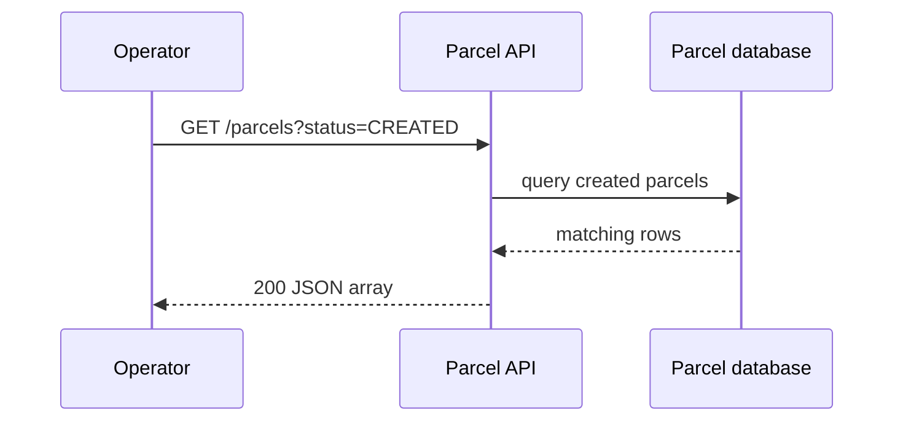

# REST API lab: resources, commands, and queries

## Problem

A client needs to create, find, update, and search parcels without knowing Java internals. HTTP gives a shared request/response language, and REST-style paths give it predictable resource names.

## Resource design

Use nouns in paths and HTTP methods for intent:

| Intent | Request | Expected response |
|---|---|---|
| Create | `POST /parcels` | `201 Created` and the new parcel |
| Read one | `GET /parcels/P-1` | `200 OK` or `404 Not Found` |
| List/query | `GET /parcels?status=DELIVERED&recipient=Ava` | `200 OK` and a list |
| Replace | `PUT /parcels/P-1` | `200 OK` or `204 No Content` |
| Change one field/action | `PATCH /parcels/P-1/status` | `200 OK` |
| Delete | `DELETE /parcels/P-1` | `204 No Content` |

Two different "query" ideas, don't mix them up: **query parameters** are the `?status=...` part of a `GET`, used for simple filters. The **`QUERY` method** is a separate, newer HTTP method for complex safe reads that carry criteria in a body (see [HTTP methods explained](http-methods.md)). For these exercises, use `GET` with query parameters. Keep `GET` safe: it must not change a parcel.

## Real-world example

An operator dashboard calls `GET /parcels?status=CREATED` to show work waiting for pickup. A delivery scanner calls `PATCH /parcels/P-1/status` with `{"status":"PICKED_UP"}`. The API returns `409 Conflict` if the current status makes that transition illegal.



## Example Spring shape

```java
@GetMapping("/parcels")
List<ParcelResponse> list(
    @RequestParam(required = false) String status,
    @RequestParam(required = false) String recipient) {
  return parcelApplication.find(status, recipient);
}
```

Validate input at the boundary, return response DTOs instead of persistence entities, and keep lifecycle rules in the domain/application code.

## Pros and limits

REST is simple, cache-friendly for reads, and works well with `curl`. It is not ideal for every interaction: a long-running operation may need `202 Accepted` plus status polling, and an event stream may be a better fit for real-time updates. Do not add GraphQL, WebSockets, or gRPC in this beginner path until a concrete need appears.

## Try it

```bash
curl -i 'http://localhost:8080/parcels?status=CREATED'
curl -i -X PATCH http://localhost:8080/parcels/P-1/status \
  -H 'Content-Type: application/json' \
  -d '{"status":"PICKED_UP"}'
```

## Idempotency and safety, applied to this lab

The definitions of "safe" and "idempotent" live in [HTTP methods explained](http-methods.md); here's what they mean for the two endpoints you just exercised.

**Why this PATCH is NOT idempotent.** Suppose parcel `P-1` is `CREATED` and a delivery scanner sends `PATCH /parcels/P-1/status` with `{"status":"PICKED_UP"}`. It succeeds (`200`). The scanner's network hiccups, it never sees the response, and it retries the *same* request. Second time around, `P-1` is already `PICKED_UP`, `PICKED_UP → PICKED_UP` is not a legal transition, and the API answers `409 Conflict`. Same request, different outcome — that's non-idempotence in the flesh. This isn't a bug to fix today; it's a property to *know about*, because networks retry whether you planned for it or not. (Real systems tame this with idempotency keys or by making the transition rule tolerate repeats — ideas that return with queues in [Step 12](../12-queues/README.md), where redelivery makes repeats routine.)

**Why GET must stay safe.** It's tempting to sneak a side effect into a read — say, `GET /parcels/P-1` also stamps a "last viewed" field or logs a tracking event into the parcel's history. Don't. The operator dashboard polls that endpoint every few seconds, browsers prefetch, proxies cache and revalidate — none of them believe a `GET` changes anything, because the HTTP contract says it doesn't. One "harmless" side effect and your parcel history fills with phantom events nobody caused. If viewing a parcel should be recorded, that's a change, so it gets its own `POST` (e.g. `POST /parcels/P-1/views`) — and the `GET` stays a pure read.

## REST vs RPC

There's an older, still-common alternative style worth recognizing: **RPC** (Remote Procedure Call), where the API exposes *actions* instead of *resources*. An RPC-flavored ParcelPilot would look like:

```bash
POST /advanceParcelStatus
Content-Type: application/json

{"parcelId": "P-1", "newStatus": "PICKED_UP"}
```

One method (`POST`), verb-shaped paths (`/advanceParcelStatus`, `/getParcel`, `/createParcel`), everything in the body. It works — plenty of production APIs look like this — but you lose what REST's uniformity buys.

| | REST (resources + methods) | RPC (named actions) |
|---|---|---|
| **Pros** | Uniform: knowing `/parcels` exists tells you how to read, create, and change one; safe `GET`s are cacheable; discoverable and guessable | Explicit action names; sometimes clearer for operations that aren't naturally create/read/update/delete (`/recalculateRoute`, `/mergeDuplicates`) |
| **Cons** | Some real actions fit awkwardly into resource grammar | Every endpoint is its own convention to learn; everything is `POST`, so caches and retries can't help; easy to grow a junk drawer of verbs |

(gRPC is a modern, high-performance RPC framework you'll hear about for internal service-to-service calls; one sentence is all it needs here.)

**The guidance: resources first.** Model your API as resources and reach for `GET`/`POST`/`PATCH`/`DELETE` — that covers nearly everything ParcelPilot will ever need. But when an operation truly isn't CRUD on any resource, a well-named action endpoint (`POST /parcels/P-1/recalculate-route`) is honest and fine. Purity contests over "is this RESTful enough" are less useful than an API that's consistent and predictable.

## Next

- Which status code to return when, hands-on: [HTTP status codes lab](http-status-codes-lab.md).
- Method-by-method reference: [HTTP methods explained](http-methods.md).
- Back to [Step 04](README.md).
