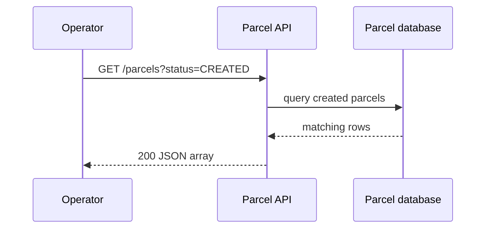

# REST API lab: resources, commands, and queries

## Problem

A client needs to create, find, update, and search parcels without knowing Java internals. HTTP gives a shared request/response language, and REST-style paths give it predictable resource names.

## Resource design

Use nouns in paths and HTTP methods for intent:

| Intent | Request | Expected response |
|---|---|---|
| Create | `POST /parcels` | `201 Created` and the new parcel |
| Read one | `GET /parcels/P-1` | `200 OK` or `404 Not Found` |
| List/query | `GET /parcels?status=DELIVERED&recipient=Ava` | `200 OK` and a list |
| Replace | `PUT /parcels/P-1` | `200 OK` or `204 No Content` |
| Change one field/action | `PATCH /parcels/P-1/status` | `200 OK` |
| Delete | `DELETE /parcels/P-1` | `204 No Content` |

Two different "query" ideas, don't mix them up: **query parameters** are the `?status=...` part of a `GET`, used for simple filters. The **`QUERY` method** is a separate, newer HTTP method for complex safe reads that carry criteria in a body (see [HTTP methods explained](http-methods.md)). For these exercises, use `GET` with query parameters. Keep `GET` safe: it must not change a parcel.

## Real-world example

An operator dashboard calls `GET /parcels?status=CREATED` to show work waiting for pickup. A delivery scanner calls `PATCH /parcels/P-1/status` with `{"status":"PICKED_UP"}`. The API returns `409 Conflict` if the current status makes that transition illegal.



## Example Spring shape

```java
@GetMapping("/parcels")
List<ParcelResponse> list(
    @RequestParam(required = false) String status,
    @RequestParam(required = false) String recipient) {
  return parcelApplication.find(status, recipient);
}
```

Validate input at the boundary, return response DTOs instead of persistence entities, and keep lifecycle rules in the domain/application code.

## Pros and limits

REST is simple, cache-friendly for reads, and works well with `curl`. It is not ideal for every interaction: a long-running operation may need `202 Accepted` plus status polling, and an event stream may be a better fit for real-time updates. Do not add GraphQL, WebSockets, or gRPC in this beginner path until a concrete need appears.

## Try it

```bash
curl -i 'http://localhost:8080/parcels?status=CREATED'
curl -i -X PATCH http://localhost:8080/parcels/P-1/status \
  -H 'Content-Type: application/json' \
  -d '{"status":"PICKED_UP"}'
```
