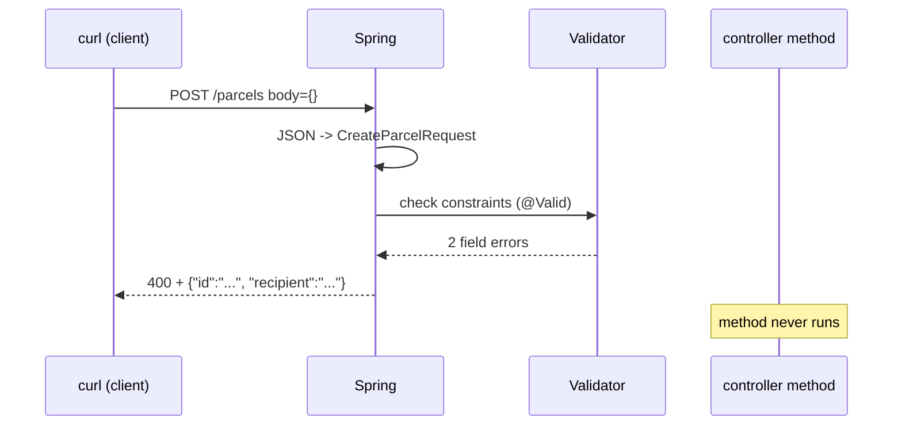

# Step 05: Validation and trustworthy inputs

> In this step: stop bad requests at the front door. You'll learn Bean Validation (`@NotBlank`, `@Size`, `@Pattern`, `@Valid`) and make ParcelPilot answer garbage input with a clear `400 Bad Request` instead of a broken parcel or a confusing `500`. ~60–90 minutes.

## The problem right now

Try this against your step 04 app:

```bash
curl -i -X POST http://localhost:8080/parcels \
  -H 'Content-Type: application/json' \
  -d '{}'
```

The JSON body is empty, so `req.id()` and `req.recipient()` are `null`. Two bad things can happen, depending on how strict your `Parcel` constructor from step 02 is:

- The constructor throws `IllegalArgumentException`, Spring has no idea what to do with it, and the client gets a **`500 Internal Server Error`** — a status that means "the server broke", when really the *client* sent nonsense.
- Or the check doesn't catch it (a recipient of `"   "` is not `null`…), and a **broken parcel gets stored**. It will haunt every list and lookup from now on.

Either way, the client gets **no useful message** telling them what was wrong with their request. This step adds a checkpoint at the HTTP boundary: bad input is rejected with `400 Bad Request` and a JSON body that names each bad field, before it ever reaches your domain code.

## Key words

| Word | Beginner meaning |
|---|---|
| **Validation** | Checking that input follows the rules before you act on it. |
| **Boundary** | The edge where outside data enters your app — here, the HTTP endpoints. |
| **Bean Validation** | The Java standard for declaring rules with annotations (`jakarta.validation`). |
| **Constraint** | One rule on one field, e.g. `@NotBlank` = "must not be null or only spaces". |
| **`@Valid`** | The trigger: tells Spring "check the constraints on this object before calling my method". |
| **`400 Bad Request`** | The status code for "your request was malformed — fix it and retry". |
| **Field error** | One validation failure tied to one field, with a message. |
| **API contract** | The agreed shape and rules of your API: what clients must send, what they get back. |

## What is Bean Validation?

Bean Validation is the standard Java way to say "this field must follow this rule" using annotations, instead of writing `if` statements by hand. You put constraints like `@NotBlank` directly on the DTO fields, put `@Valid` on the `@RequestBody` parameter, and Spring runs the checks **after** turning JSON into your record but **before** your controller method runs. If any rule fails, your method is never called — Spring throws an exception carrying the list of field errors, and you turn that into a `400` response.



Here is the whole idea in one ParcelPilot-sized example — rules on the record, trigger on the parameter:

```java
public record CreateParcelRequest(
    @NotBlank String id,
    @NotBlank String recipient
) {}
```

```java
@PostMapping
public ResponseEntity<ParcelResponse> create(@Valid @RequestBody CreateParcelRequest req) {
    // only reached when every constraint passed
}
```

How the validator works under the hood, and the full tour of constraints, is in [Bean Validation explained](bean-validation-explained.md).

### Two layers of checks — boundary and domain

You now have rules in two places, and that is correct. They have **different jobs**:

- **Boundary validation** (this step) checks the *shape of the request*: fields present, not blank, right format. It protects clients from themselves and gives them a helpful `400`.
- **Domain rules** (your `Parcel` constructor and status transitions from step 02) protect the *business truth*: a `Parcel` object must never exist in an invalid state, no matter who constructs it — a controller, a test, or (later) a message consumer.

Keep both. The boundary answers "is this request well-formed?"; the domain answers "is this operation ever allowed?". Deleting the constructor checks because "the DTO validates now" reopens the hole for every non-HTTP caller.

One forward-looking rule: validate **DTOs**, never persistence entities. In step 10 you'll add JPA entities for the database — resist the urge to hang HTTP validation on them. Entities model storage; DTOs model the API contract. The full philosophy is in [Validation and API contracts](../../references/validation-and-api-contracts.md).

## Why do it? Pros and cons

| Pros | Cons |
|---|---|
| **Fail fast**: bad requests die at the door, before touching your domain or store | Some rules now exist twice (DTO + domain constructor) — a duplication risk to manage |
| **Clear client errors**: `400` + field-by-field messages instead of a mystery `500` | Messages must stay consistent across endpoints, or clients get confused |
| **Less garbage stored**: no blank-recipient parcels polluting every future query | Declarative annotations can't express every rule (cross-field or stateful checks still need code) |
| Rules are declared next to the data, readable at a glance | One more dependency and one more concept to learn |

## When to use it (and when not)

**Use it** on every endpoint that accepts data from a client you don't control — which for a public-facing API means all of them. `POST` and `PATCH` bodies are the classic spots.

**Don't over-invest** in internal service-to-service calls where the sender is another service you own that *already validated* at the original boundary. Re-checking every field on every internal hop adds noise for little safety. The principle: **validate at the edges, trust inside** — but the edge itself is non-negotiable. (When ParcelPilot splits into services in step 13, this distinction becomes real.)

## Real-world example

A library catalog API accepts `POST /books` with an ISBN and a title. Without boundary validation, a scanner glitch that submits `{"isbn":"", "title":"???"}` creates a ghost book that no one can ever find or check out — and the librarian only discovers it months later during inventory. With `@NotBlank` on the title and `@Pattern` on the ISBN, the scanner gets an immediate `400` with `"isbn": "must match 978-XXXXXXXXXX"`, the bug is caught the same day, and the catalog stays clean.

## Common mistakes

- **Forgetting `@Valid`.** The constraints on the record are just decoration until something triggers them. No `@Valid` on the parameter = no validation, silently.
- **Forgetting the dependency.** Without `spring-boot-starter-validation` on the classpath, the annotations compile fine and do nothing. If your bad request sails through, check the `pom.xml` first.
- **Using `@NotNull` when you mean `@NotBlank`.** `@NotNull` happily accepts `""` and `"   "`. For required text, `@NotBlank` is almost always what you want (the full distinction table is in [Bean Validation explained](bean-validation-explained.md)).
- **Validating the entity instead of the DTO.** HTTP rules belong on the request DTO. Persistence classes (step 10) have their own concerns.
- **Deleting domain checks because the DTO validates.** The constructor guards *every* caller; the DTO only guards HTTP.

## Build it in ParcelPilot

Still one project: `applications/parcelpilot`. Three small changes and one handler. Follow the [validation lab](validation-lab.md) if you want to *break the app first* and watch each change take effect — recommended.

### 1. Add the validation starter to `pom.xml`

Next to your existing `spring-boot-starter-web` dependency:

```xml
<dependency>
    <groupId>org.springframework.boot</groupId>
    <artifactId>spring-boot-starter-validation</artifactId>
</dependency>
```

This pulls in the `jakarta.validation` API and Hibernate Validator (the engine that actually runs the checks).

### 2. Put constraints on `CreateParcelRequest`

Records take constraints directly on their components:

```java
package com.parcelpilot;

import jakarta.validation.constraints.NotBlank;
import jakarta.validation.constraints.Pattern;
import jakarta.validation.constraints.Size;

public record CreateParcelRequest(
        @NotBlank(message = "id must not be blank")
        @Pattern(regexp = "P-\\d+", message = "id must look like P-1, P-42, ...")
        String id,

        @NotBlank(message = "recipient must not be blank")
        @Size(max = 100, message = "recipient must be at most 100 characters")
        String recipient
) {}
```

Every `message` here is part of your API contract — clients will read these words. Keep them short, concrete, and about the *field*, not your internals.

### 3. Trigger validation with `@Valid`

One word in the controller:

```java
import jakarta.validation.Valid;

@PostMapping
public ResponseEntity<ParcelResponse> create(@Valid @RequestBody CreateParcelRequest req) {
    Parcel parcel = new Parcel(req.id(), req.recipient());
    store.put(parcel.id(), parcel);
    return ResponseEntity.status(201).body(toResponse(parcel));
}
```

### 4. Turn the failure into a friendly 400

When validation fails, Spring throws `MethodArgumentNotValidException` before your method runs. Catch it with an `@ExceptionHandler` method **inside `ParcelController`** and return a JSON map of field → message:

```java
import java.util.HashMap;
import org.springframework.validation.FieldError;
import org.springframework.web.bind.MethodArgumentNotValidException;

@ExceptionHandler(MethodArgumentNotValidException.class)
public ResponseEntity<Map<String, String>> onValidationError(MethodArgumentNotValidException ex) {
    Map<String, String> errors = new HashMap<>();
    for (FieldError fieldError : ex.getBindingResult().getFieldErrors()) {
        errors.put(fieldError.getField(), fieldError.getDefaultMessage());
    }
    return ResponseEntity.badRequest().body(errors);   // 400 + {"field":"message", ...}
}
```

An `@ExceptionHandler` method placed inside a controller catches that exception **for this controller only**. That's fine today — ParcelPilot has one controller. But you can already smell the limitation: every future controller would need its own copy, and the `IllegalArgumentException` from the domain still crashes into a `500`. **Step 06 moves error handling to one central place (`@ControllerAdvice`) with one shared error schema.** Don't build that yet.

### 5. (Optional stretch) A custom constraint

Want `@ValidParcelId` as a reusable, self-documenting annotation instead of a raw `@Pattern`? The full small example lives in [Bean Validation explained](bean-validation-explained.md#optional-stretch-a-custom-constraint). Skip it on first pass.

## Test it

```bash
cd applications/parcelpilot
mvn spring-boot:run
```

In a second terminal:

```bash
# empty body -> 400 with both fields named
curl -i -X POST http://localhost:8080/parcels \
  -H 'Content-Type: application/json' \
  -d '{}'
```

Expected:

```text
HTTP/1.1 400
Content-Type: application/json

{"recipient":"recipient must not be blank","id":"id must not be blank"}
```

```bash
# blank recipient -> 400 naming just that field
curl -i -X POST http://localhost:8080/parcels \
  -H 'Content-Type: application/json' \
  -d '{"id":"P-7","recipient":"   "}'
```

Expected:

```text
HTTP/1.1 400
Content-Type: application/json

{"recipient":"recipient must not be blank"}
```

```bash
# wrong id shape -> 400 with the pattern hint
curl -i -X POST http://localhost:8080/parcels \
  -H 'Content-Type: application/json' \
  -d '{"id":"parcel-7","recipient":"Ava"}'
```

Expected:

```text
HTTP/1.1 400
Content-Type: application/json

{"id":"id must look like P-1, P-42, ..."}
```

```bash
# valid body still works -> 201
curl -i -X POST http://localhost:8080/parcels \
  -H 'Content-Type: application/json' \
  -d '{"id":"P-7","recipient":"Ava"}'
```

Expected:

```text
HTTP/1.1 201
Content-Type: application/json

{"id":"P-7","recipient":"Ava","status":"CREATED"}
```

(The order of keys in the error map may differ — it's a map, not a list.)

## Acceptance criteria

- [ ] `spring-boot-starter-validation` is in `pom.xml` and the app still starts with `mvn spring-boot:run`.
- [ ] `POST /parcels` with `{}` returns `400` and a JSON body naming **both** `id` and `recipient`.
- [ ] A blank or whitespace-only `recipient` returns `400`, not `201` and not `500`.
- [ ] An `id` that doesn't match `P-<digits>` returns `400` with the pattern message.
- [ ] A valid body still returns `201 Created` with the parcel JSON.
- [ ] You can point at `@Valid` and say exactly when Spring runs the checks (see [Bean Validation explained](bean-validation-explained.md)).
- [ ] You can explain in one sentence why the `Parcel` constructor keeps its own checks.
- [ ] You did the [validation lab](validation-lab.md), including the before/after proof.

## Say it like a developer

- "I validate at the **boundary**: constraints on the request **DTO**, triggered by `@Valid` on the `@RequestBody`."
- "`@NotBlank` rejects `null`, empty, and whitespace-only strings — `@NotNull` alone would let `\"   \"` through."
- "Malformed input is a **`400 Bad Request`** with **field errors**, not a `500` — the client broke the contract, not my server."
- "The DTO checks the request's *shape*; the **domain** still owns the business rules, like legal status transitions."
- "I added an `@ExceptionHandler` for `MethodArgumentNotValidException` in the controller — it's local for now, and moves to a central place in the next step."
- "I never hang validation on a persistence entity; entities model storage, DTOs model the **API contract**."

## Quiz: check yourself

Answer out loud before opening each toggle.

1. What happens, step by step, when a request with a blank `recipient` hits `POST /parcels` now?

<details><summary>Show answer</summary>

Spring converts the JSON into a `CreateParcelRequest`, then (because of `@Valid`) runs the constraints. `@NotBlank` on `recipient` fails, so Spring throws `MethodArgumentNotValidException` **before the controller method runs**. The `@ExceptionHandler` turns it into a `400` with `{"recipient":"recipient must not be blank"}`.

</details>

2. Why keep the checks in the `Parcel` constructor if the DTO already validates?

<details><summary>Show answer</summary>

The DTO only guards the HTTP boundary. The constructor guards *every* way a `Parcel` can be created — tests, other code paths, and later message consumers. Boundary validation checks the request's shape; the domain guarantees no invalid `Parcel` ever exists.

</details>

3. Your constraints compile but bad requests still get through. Name the two most likely causes.

<details><summary>Show answer</summary>

Either `@Valid` is missing on the `@RequestBody` parameter (nothing triggers the checks), or `spring-boot-starter-validation` is missing from `pom.xml` (no validator on the classpath — annotations are silently ignored).

</details>

4. What is the difference between `@NotNull` and `@NotBlank` for a `String` field?

<details><summary>Show answer</summary>

`@NotNull` only rejects `null` — it accepts `""` and `"   "`. `@NotBlank` rejects `null`, the empty string, *and* whitespace-only strings. For required text fields, `@NotBlank` is usually the right choice.

</details>

5. Why is `400` the right status for a blank recipient, and not `500`?

<details><summary>Show answer</summary>

`400 Bad Request` means "the client sent a malformed request — fix it and retry". `500 Internal Server Error` means "the server broke". A blank recipient is the client's mistake, so the client should be told what to fix. A `500` blames the wrong side and gives no actionable information.

</details>

## Reflect

Now break something the validator *doesn't* cover: `PATCH /parcels/P-7/status` with a status the domain rejects, or `GET /parcels/nope`. Notice the responses don't match your neat validation errors — the `409` has one shape, the `404` another, and if the domain constructor ever throws, it's still a raw `500`. You have **three different error dialects in one API**, and your validation handler only lives in one controller.

## Next

[Step 06](../06-error-handling/README.md): one central error handler (`@ControllerAdvice`) and one shared error schema for the whole API — validation failures, missing parcels, and illegal transitions all speaking the same language.
