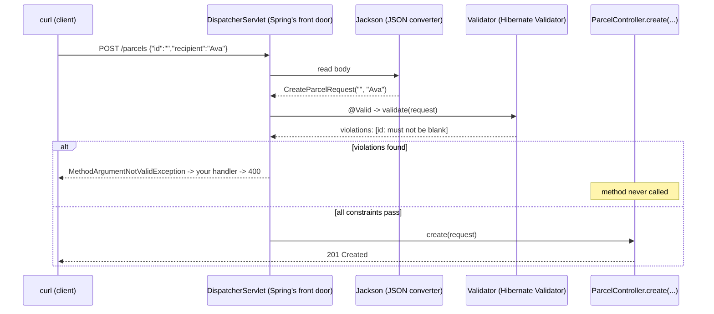

# Bean Validation explained: annotations, the validator, and the request lifecycle

## Problem

You could validate every request by hand — a stack of `if (req.recipient() == null || req.recipient().isBlank())` at the top of every controller method. It works, but the rules drown in boilerplate, every endpoint reinvents the wheel slightly differently, and nothing collects *all* the errors for the client (the first `if` that fails wins). Bean Validation replaces the boilerplate with declarations: each rule is one annotation next to the field it protects, and one engine checks them all and reports every failure at once.

## Key words

| Word | Beginner meaning |
|---|---|
| **`jakarta.validation`** | The standard API package: annotations like `@NotBlank` and interfaces like `ConstraintValidator`. |
| **Hibernate Validator** | The engine that implements the standard — what `spring-boot-starter-validation` actually installs. (Related to, but not the same as, Hibernate the database tool from step 10.) |
| **Validator** | The object that walks a bean's fields, runs each constraint, and collects violations. |
| **Violation** | One broken rule: which field, which constraint, which message. |
| **`BindingResult`** | Spring's container for all violations from one request. |
| **Regular expression (regex)** | A pattern language for text, e.g. `P-\d+` means "P-, then one or more digits". Used by `@Pattern`. |

## How validation fits into the request lifecycle

Spring processes a `POST /parcels` in stages, and validation has an exact slot: **after** JSON is turned into your record, **before** your method body runs.



Three consequences worth remembering:

- If the body isn't even parseable JSON (`{"id":`), Jackson fails **first** — you get a different exception (`HttpMessageNotReadableException`) and Spring's default `400`, not your field map. Validation never got a chance to run. Step 06 unifies these.
- The validator collects **all** violations in one pass, so the client learns about every bad field in a single round-trip.
- Your controller method can trust its input: if it runs at all, every declared constraint passed.

## Tour of the common constraints

### The null/empty/blank trio (most confused, most important)

Three annotations that sound alike and behave differently on a `String`:

| Value | `@NotNull` | `@NotEmpty` | `@NotBlank` |
|---|---|---|---|
| `null` | fails | fails | fails |
| `""` (empty) | passes | fails | fails |
| `"   "` (only spaces) | passes | passes | fails |
| `"Ava"` | passes | passes | passes |

Rule of thumb: for required **text** use `@NotBlank`; for required **collections or arrays** use `@NotEmpty` (a list can't be "blank"); use bare `@NotNull` for required non-text objects like numbers or dates.

### Size, shape, and range

```java
public record ExampleFields(
        @Size(min = 2, max = 100) String recipient,   // string length (or collection size) in range
        @Pattern(regexp = "P-\\d+") String id,        // must match the regex; null passes! pair with @NotBlank
        @Min(1) @Max(50) Integer weightKg,            // numeric bounds, inclusive
        @Email String contactEmail                    // roughly email-shaped text
) {}
```

Two traps:

- Most constraints (including `@Pattern`, `@Size`, `@Email`) treat **`null` as valid** — they only check a value that is present. That's deliberate: it lets you mark a field as *optional but well-formed*. For a required field, always pair with `@NotBlank`/`@NotNull`.
- In Java source, regex backslashes are doubled: the pattern `P-\d+` is written `"P-\\d+"`.

ParcelPilot uses exactly this pairing on `CreateParcelRequest`: `@NotBlank` + `@Pattern` on `id`, `@NotBlank` + `@Size` on `recipient` — see the [step README](README.md#build-it-in-parcelpilot).

## Customizing messages

Every constraint takes a `message`:

```java
@NotBlank(message = "recipient must not be blank")
@Size(max = 100, message = "recipient must be at most 100 characters")
String recipient
```

If you omit it, you get the engine's default (like `must not be blank`) — correct but generic, and it doesn't name valid examples. Guidelines for writing good ones:

- Say what the rule **is**, ideally with an example: `id must look like P-1, P-42, ...` beats `invalid id`.
- Talk about the **field**, never your internals (no class names, no "constraint violated in ParcelValidator").
- Keep the wording **consistent** across endpoints — clients often show your messages to their users verbatim.

(Messages can also live in a `messages.properties` file for translation. File that away; ParcelPilot doesn't need it.)

More on treating messages as part of your API contract: [Validation and API contracts](../../references/validation-and-api-contracts.md).

## Optional stretch: a custom constraint

`@Pattern(regexp = "P-\\d+")` works, but it repeats the regex everywhere a parcel id appears, and the annotation doesn't *say* what it means. Bean Validation lets you define your own annotation backed by your own check. Two small files:

**The annotation:**

```java
package com.parcelpilot;

import jakarta.validation.Constraint;
import jakarta.validation.Payload;
import java.lang.annotation.*;

@Documented
@Constraint(validatedBy = ParcelIdValidator.class)   // links to the logic below
@Target({ElementType.FIELD, ElementType.PARAMETER, ElementType.RECORD_COMPONENT})
@Retention(RetentionPolicy.RUNTIME)
public @interface ValidParcelId {
    String message() default "id must look like P-1, P-42, ...";
    Class<?>[] groups() default {};
    Class<? extends Payload>[] payload() default {};
}
```

(`groups` and `payload` are required boilerplate on every constraint annotation — copy them as-is.)

**The logic:**

```java
package com.parcelpilot;

import jakarta.validation.ConstraintValidator;
import jakarta.validation.ConstraintValidatorContext;

public class ParcelIdValidator implements ConstraintValidator<ValidParcelId, String> {
    @Override
    public boolean isValid(String value, ConstraintValidatorContext context) {
        if (value == null) {
            return true;  // convention: null is @NotNull's job, not ours
        }
        return value.matches("P-\\d+");
    }
}
```

**Use it:**

```java
public record CreateParcelRequest(
        @NotBlank @ValidParcelId String id,
        @NotBlank @Size(max = 100) String recipient
) {}
```

The rule now has a name, one home, and one message. Worth it once the same rule appears in several DTOs; overkill for a rule used once — plain `@Pattern` is fine for ParcelPilot today.

## Validation groups, in one paragraph

Bean Validation also supports **groups** — running different subsets of constraints in different situations (say, stricter rules on create than on update). They exist, they work, and you don't need them yet: ParcelPilot has one create DTO with one set of rules. If you ever find yourself wanting "this field is required *here* but optional *there*", the usually-better first move is two separate DTOs, one per operation.

## Prove it

With the step's constraints in place (app running via `mvn spring-boot:run`):

```bash
# every violation reported at once, not just the first
curl -s -X POST http://localhost:8080/parcels \
  -H 'Content-Type: application/json' \
  -d '{"id":"nope","recipient":""}'
```

```json
{"recipient":"recipient must not be blank","id":"id must look like P-1, P-42, ..."}
```

```bash
# broken JSON never reaches the validator -> Spring's default 400, different shape
curl -i -X POST http://localhost:8080/parcels \
  -H 'Content-Type: application/json' \
  -d '{"id":'
```

That second, differently-shaped `400` is one of the loose ends [step 06](../06-error-handling/README.md) ties up.

## Pros and limits

Declarative constraints keep rules next to the data, report all failures in one response, and are checked by a battle-tested engine instead of hand-rolled `if`s. Their limit: they check **one field at a time, statelessly**. "Recipient must not be blank" — yes. "This status transition is legal given the parcel's current status" — no; that needs the parcel's state, and it stays in the domain (`Parcel`), exactly where step 02 put it.

## Next

- Back to the step: [Step 05 README](README.md) · hands-on: [validation lab](validation-lab.md)
- The philosophy (boundaries, contracts, error message design): [Validation and API contracts](../../references/validation-and-api-contracts.md)
- Where all errors get one shared shape: [Step 06: error handling](../06-error-handling/README.md)
